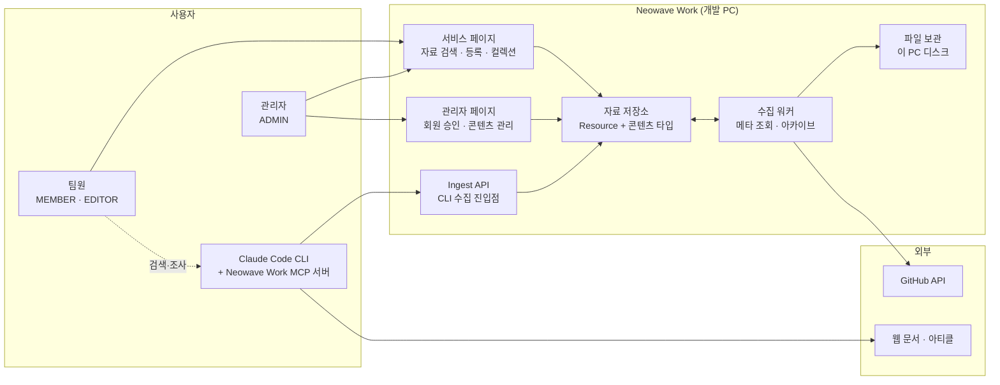

# 01. 프로젝트 개요

| 항목 | 내용 |
| --- | --- |
| 문서 ID | REQ-01 |
| 버전 | v0.4 |
| 상태 | Draft |
| 최종 수정 | 2026-08-28 |

---

## 1.1 배경

**네오웨이브 운영 시스템**입니다. 일하는 사람들이 다음과 같은 정보를 매일 다룹니다.

- 새로 나온 AI 모델·논문·아티클·영상, 사내 적용 검토 자료
- GitHub 오픈소스 저장소 (참고용 코드, 라이브러리, 샘플)
- Claude Code / Cursor 등에서 쓰는 **MCP 서버**와 **Skill** 정의
- 개발 규약, 프롬프트, 설정 스니펫, 사내 가이드 문서

지금은 이 정보들이 **개인 북마크, 메신저 대화, 로컬 폴더**에 흩어져 있습니다. 그 결과:

| 문제 | 구체적인 증상 |
| --- | --- |
| 재사용이 안 된다 | 이미 조사했던 자료를 다른 사람이 다시 조사한다 |
| 찾을 수가 없다 | "그때 공유했던 그 링크"를 메신저에서 스크롤로 찾는다 |
| 원본이 사라진다 | 참고하던 GitHub 저장소가 삭제·비공개 전환되면 복구 불가 |
| 온보딩이 느리다 | 신규 입사자에게 넘겨줄 정리된 자료 묶음이 없다 |
| 환경 세팅이 제각각 | MCP/Skill 설정이 사람마다 달라 문제 재현이 어렵다 |

## 1.2 목적

**개발팀의 정보 자산을 한 곳에 축적하고, 검색 가능한 형태로 유지하며, 필요하면 원본까지 보관한다.**

세부 목표:

1. **수집** — AI 자료와 GitHub 저장소를 URL 하나로 등록하면 메타데이터가 자동으로 채워진다.
2. **보관** — 중요한 GitHub 저장소는 소스 아카이브까지 내려받아 사내 스토리지에 남긴다.
3. **정리** — MCP·Skill 등 개발에 바로 쓰는 정보를 정형화된 구조로 저장한다.
4. **확장** — 나중에 새로운 종류의 자료가 생겨도 **테이블과 폴더를 갈아엎지 않고** 추가할 수 있다.
5. **통제** — 사내 정보이므로 관리자가 승인한 사람만 접근한다.

## 1.3 기대 효과

| 대상 | 기대 효과 |
| --- | --- |
| 개발팀원 | 자료 재조사 시간 감소, 검증된 자료부터 시작 |
| 신규 입사자 | 큐레이션된 컬렉션으로 온보딩 자료 확보 |
| 팀장 | 팀이 무엇을 검토하고 있는지 한눈에 파악 |
| 회사 | 담당자가 바뀌어도 기술 지식이 조직에 남음 |

---

## 1.4 범위

### 포함 (In Scope)

| 구분 | 내용 |
| --- | --- |
| **수집** | **Claude Code CLI + Neowave Work MCP 서버를 통한 자료 수집** (주력 경로 — `DEC-012`) |
| **수집** | 수집 절차·품질 기준을 정의한 `neowave-work-collect` Skill |
| 서비스 | 회원가입 · 로그인 · 승인 대기 안내 (**아이디 + 비밀번호** — `DEC-014`) |
| 서비스 | 개인 API 키 발급·폐기 |
| 서비스 | 자료 목록 / 상세 / 등록 / 수정 / 삭제 |
| 서비스 | 콘텐츠 타입별 뷰 (AI 자료, GitHub, MCP, Skill …) |
| 서비스 | 통합 검색, 카테고리·태그 필터 |
| 서비스 | 북마크, 컬렉션(자료 묶음) |
| 서비스 | GitHub URL 등록 시 메타데이터 자동 수집 |
| 서비스 | GitHub 소스 아카이브 다운로드·보관·재다운로드 |
| 서비스 | 파일 첨부 업로드·다운로드 |
| 관리자 | 회원 승인/거부/정지/역할 변경 |
| 관리자 | 자료 관리(강제 수정·삭제·복구), 카테고리·태그 관리 |
| 관리자 | 콘텐츠 타입 노출 설정 |
| 관리자 | 수집 작업(Job) 모니터링·재실행 |
| 관리자 | 감사 로그, 이용 통계, 시스템 설정 |
| 공통 | 다크 모드, 반응형(데스크톱 우선) |
| **프로젝트** | **프로젝트 생성 · 기획/디자인/개발 문서(마크다운) · 할 일 · 간트 일정** (2차 · `FR-PROJ-*` · `DEC-069`) |

### 제외 (Out of Scope) — 1차 릴리스 기준

| 항목 | 사유 |
| --- | --- |
| **외부(사외) 공개** | **하지 않는다** (`DEC-017`) |
| **이메일 수집·발송** | 로그인은 아이디 기반(`DEC-014`), 알림은 인앱만(`DEC-015`) |
| **사내 메신저(Slack 등) 연동** | 하지 않는다. 용도를 **수집·보관·활용**으로 한정 (`DEC-015`) |
| **부서·프로젝트별 접근 제한** | 두지 않는다. 승인된 회원 전원 열람 (`DEC-018`). **프로젝트 기능이 생긴 뒤에도 그대로입니다** — 운영자 재확인 2026-09-04 |
| 실시간 협업 편집 | 요구 없음 |
| **자료 자동 크롤링(RSS·뉴스레터 정기 수집)** | **하지 않는다.** 수집 판단은 사람이 CLI에서 한다 (`DEC-025`) |
| **GitHub 자료 자동 아카이브** | 하지 않는다. 선택 실행 + 총량 100GB (`DEC-022`) |
| 모바일 전용 앱 | 반응형 웹으로 대응 |
| 다국어(영문) UI | 한국어 단일. 구조만 열어둠 |
| 사내 SSO 연동 | 자체 인증으로 시작 (`DEC-002`) |
| 결제·과금 | 해당 없음 |

---

## 1.5 이해관계자

| 역할 | 관심사 | 시스템에서의 위치 |
| --- | --- | --- |
| 개발팀장 | 팀 지식 축적, 온보딩 비용 절감 | `ADMIN` |
| 개발팀원 | 빠른 자료 검색·등록 | `MEMBER` / `EDITOR` |
| 신규 입사자 | 정리된 학습 경로 | `MEMBER` |
| 시스템 운영자 | 서버·백업·보안 | `ADMIN` |

---

## 1.6 성공 기준

정식 오픈 후 **3개월** 시점에 아래를 측정합니다.

| 지표 | 목표 |
| --- | --- |
| 승인 완료 계정 수 | 개발팀 전원 |
| 등록된 자료 수 | 200건 이상 |
| 주간 활성 사용자(WAU) | 팀 인원의 70% 이상 |
| 자료 등록 소요 시간 (URL 입력 → 저장 완료) | 평균 60초 이내 |
| 검색 결과 도달률 (검색 후 상세 진입) | 50% 이상 |
| 온보딩 컬렉션 | 1개 이상 운영 |

---

## 1.7 제약 조건 및 전제

| 구분 | 내용 |
| --- | --- |
| **운영 환경 (1단계)** | **현재 개발 PC(Windows 11)를 서버로 사용** (`DEC-013`). Docker Desktop + 호스트 실행 |
| 운영 환경 (2단계) | 사내 서버 + Docker Compose (`DEC-001`) — 팀원이 상시 쓰기 시작하면 이관 |
| 접근 범위 | 1단계는 `localhost`, 필요 시 같은 네트워크. **외부 공개 없음** (`DEC-017`) |
| 파일 보관 | 이 PC의 디스크, 로컬 파일시스템 (`DEC-016`·`DEC-019`). 아카이브 총량 100GB 상한 (`DEC-022`) |
| 팀 개방 시점 | **M5(관리자 기능 완료) 후** 사내망 개방 (`DEC-023`) |
| 예상 사용자 규모 | 동시 접속 최대 20명 내외, 총 계정 50개 이하 |
| 개발 인원 | 소수 인원. **유지보수 난이도가 낮은 구조**를 우선한다 |
| 외부 API | GitHub API 사용량 제한(rate limit) 안에서 동작해야 함 |
| 저작권 | 외부 자료는 **링크와 요약 중심**으로 보관. 원문 전체 복제는 사내 열람 목적에 한정 |
| 개인정보 | **아이디·이름·소속**만 수집. 이메일·연락처 등 미수집 (`DEC-014`) |

---

## 1.8 용어 정의

| 용어 | 정의 |
| --- | --- |
| **자료 (Resource)** | 이 시스템이 저장하는 모든 정보의 기본 단위. 모든 콘텐츠는 자료 하나로 표현된다. (04 문서 참조) |
| **콘텐츠 타입 (Content Type)** | 자료의 종류. `AI 자료`, `GitHub 저장소`, `MCP 서버`, `Skill` 등. 확장 가능하다. |
| **MCP (Model Context Protocol)** | AI 에이전트가 외부 도구·데이터에 접근하도록 표준화한 프로토콜. 이 시스템은 사내에서 쓰는 MCP 서버의 설치 방법·설정을 저장한다. |
| **Skill** | AI 에이전트에게 특정 작업 절차를 알려주는 지침 묶음. 이 시스템은 사내에서 쓰는 Skill 정의와 사용법을 저장한다. |
| **아카이브 (Archive)** | GitHub 저장소의 소스 스냅샷(tar/zip)을 사내 스토리지에 내려받아 보관한 것. |
| **컬렉션 (Collection)** | 목적에 따라 자료를 묶은 목록. 예: "신규 입사자 온보딩", "RAG 검토 자료". |
| **승인 (Approval)** | 회원가입 신청자를 관리자가 검토해 서비스 이용을 허가하는 절차. |
| **역할 (Role)** | 사용자가 무엇을 할 수 있는지 결정하는 권한 등급. `MEMBER` / `EDITOR` / `ADMIN`. |
| **계정 상태 (Status)** | 계정의 생애주기 상태. `PENDING` / `ACTIVE` / `REJECTED` / `SUSPENDED` / `WITHDRAWN`. |
| **수집 작업 (Job)** | GitHub 메타 조회, 아카이브 다운로드 등 백그라운드로 처리하는 비동기 작업. |
| **Ingest API** | 외부(주로 Claude Code CLI)에서 자료를 등록·조회하는 HTTP API. 웹 화면과 **같은 서비스 계층**을 쓴다. |
| **Neowave Work MCP 서버** | Claude Code가 Neowave Work을 도구로 쓸 수 있게 해주는 stdio MCP 서버. 개발자 PC에서 실행되며 Ingest API를 호출한다. |
| **API 키** | CLI가 Ingest API를 호출할 때 쓰는 개인 자격 증명(`nw_live_…`). 발급자의 권한을 넘지 못한다. |
| **등록 경로 (source channel)** | 자료가 들어온 입구. `WEB`(웹 화면) 또는 `MCP`(Claude Code CLI). **자료를 따로 검수하지는 않는다** (`DEC-029`). |

---

## 1.9 시스템 한눈에 보기

> 수집 경로가 둘입니다. **CLI(주력)** 와 **웹 폼**. 둘 다 같은 자료 저장소로 들어가고 같은 검증을 거칩니다.

---

## 1.10 변경 이력

| 날짜 | 버전 | 내용 |
| --- | --- | --- |
| 2026-08-28 | v0.1 | 최초 작성 |
| 2026-08-28 | v0.2 | CLI 수집 경로 추가(`DEC-012`), 1단계 실행 환경을 개발 PC로 확정(`DEC-013`·`DEC-016`), 아이디 기반 인증(`DEC-014`), 인앱 알림만(`DEC-015`), 외부 공개 없음(`DEC-017`), 자료 접근 제한 없음(`DEC-018`) 반영 |
| 2026-08-28 | v0.3 | 파일 저장을 로컬 파일시스템으로 변경(`DEC-019`). 미해결 9건 결정 반영 — 자동 크롤링·자동 아카이브를 **제외 항목으로 확정**(`DEC-025`·`DEC-022`), 팀 개방 시점 명시(`DEC-023`) |
| 2026-08-28 | v0.4 | **검수 폐기**(`DEC-029`) — 범위에서 «검수 대기 표시·해제» 삭제, 용어를 `검수 대기` → **`등록 경로`** 로 교체 |
