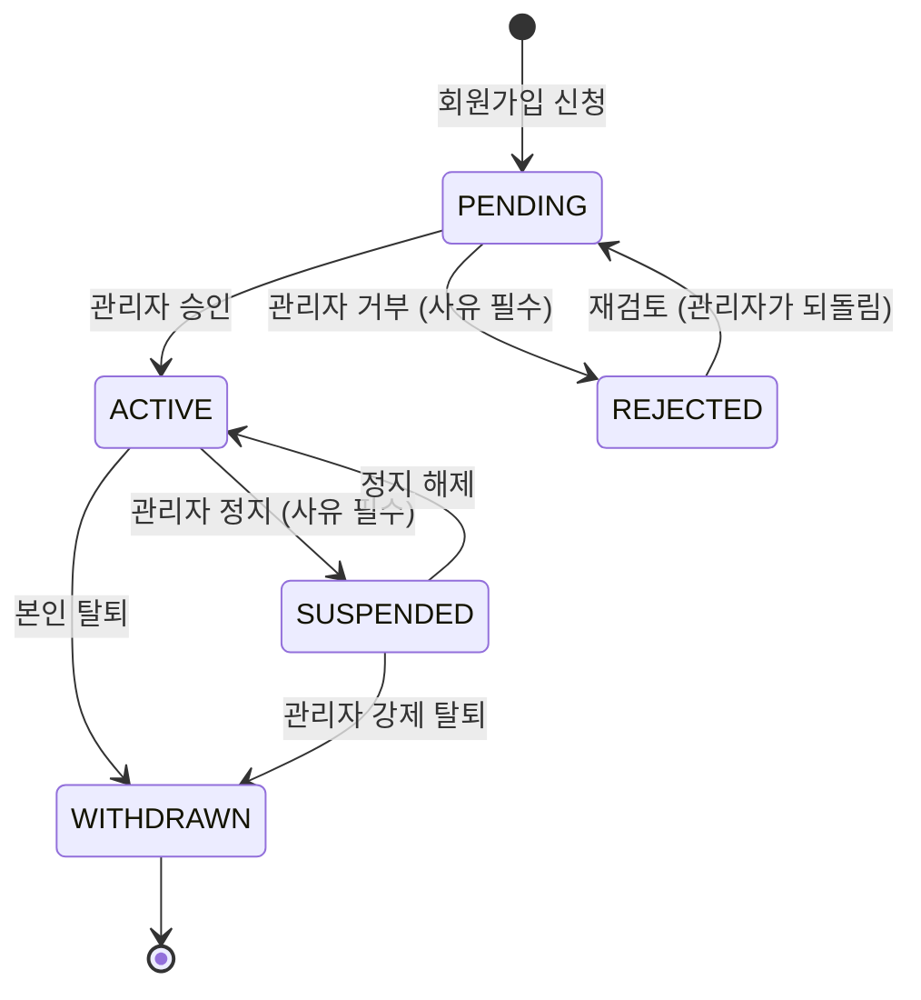
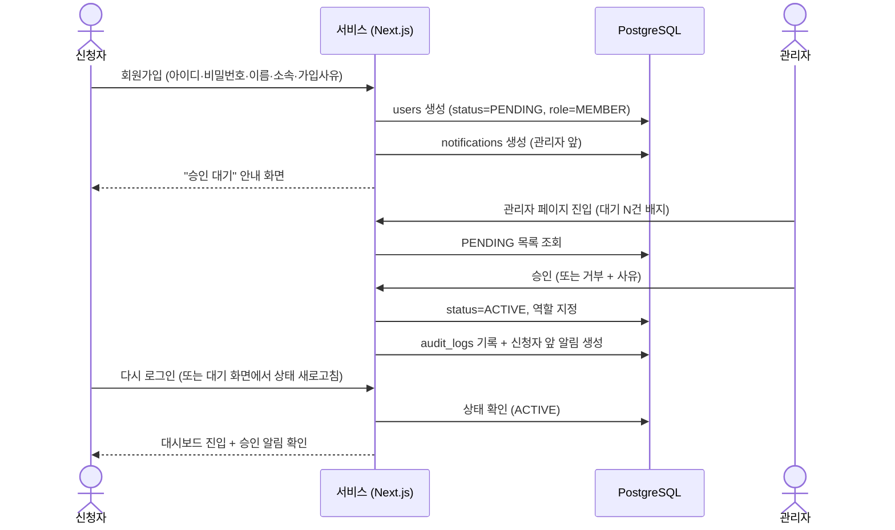
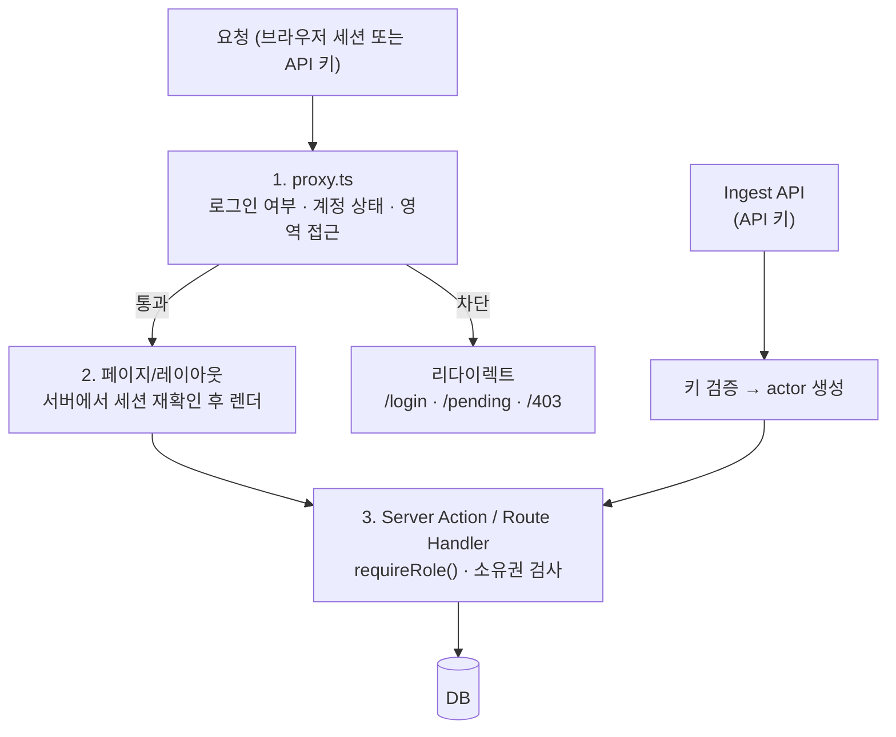

# 02. 사용자 · 권한 정책

| 항목 | 내용 |
| --- | --- |
| 문서 ID | REQ-02 |
| 버전 | v0.5 |
| 상태 | Draft |
| 최종 수정 | 2026-08-28 |

> 이 문서는 **누가 무엇을 할 수 있는가**를 확정합니다.
> 기능 목록은 [REQ-03 기능 요구사항](03_기능_요구사항.md), 화면은 [DEV-03 화면 정의](../02.개발설계/03_화면_정의_IA.md)를 참조합니다.

---

## 2.1 핵심 원칙

1. **기본은 차단.** 명시적으로 허용하지 않은 것은 모두 금지한다.
2. **가입만으로는 아무것도 못 한다.** 관리자가 승인해야 서비스에 들어올 수 있다.
3. **승인된 회원은 모든 자료를 볼 수 있다.** 부서·프로젝트별 접근 제한은 두지 않는다. (`DEC-018`)
4. **권한 판단은 서버에서만.** 화면에서 버튼을 숨기는 것은 UX일 뿐, 인가가 아니다.
5. **상태 변화는 즉시 반영.** 정지·거부된 계정은 다음 요청에서 바로 차단된다. **발급한 API 키도 함께 무효가 된다.**
6. **관리자 행위는 모두 기록.** 승인/거부/정지/역할 변경은 감사 로그에 남는다.

---

## 2.2 사용자 역할 (Role)

| 역할 | 코드 | 설명 | 부여 방법 |
| --- | --- | --- | --- |
| 비로그인 | `GUEST` | 로그인·회원가입 화면만 접근 가능 | — |
| 일반 회원 | `MEMBER` | 자료 열람·검색·북마크, 본인이 등록한 자료 관리 | 승인 시 기본 부여 |
| 편집자 | `EDITOR` | `MEMBER` + 모든 자료 수정, 카테고리·태그 정리, 아카이브 실행 | 관리자가 승격 |
| 관리자 | `ADMIN` | 전체 권한. 회원 승인·정지, 시스템 설정 | 관리자가 승격 (초기 1명은 시드로 생성) |

> **역할은 단일 값**입니다. 상위 역할은 하위 역할의 권한을 모두 포함합니다. (`DEC-010`)

### 최초 관리자

시스템 초기화 시 시드 스크립트로 `ADMIN` 계정 1개를 생성합니다.
아이디·초기 비밀번호는 환경 변수로 주입하고, **최초 로그인 시 비밀번호 변경을 강제**합니다. (`FR-AUTH-011`)

> 메일 발송 수단이 없으므로(`DEC-015`) **관리자가 비밀번호를 잊으면 복구 경로가 시드 스크립트뿐**입니다.
> 재설정 절차를 운영 문서에 반드시 남깁니다. → [DCS-02 · 2.4절](../03.의사결정_및_미해결사항/02_미해결사항.md)

---

## 2.3 계정 상태 (Status)

| 상태 | 코드 | 의미 | 로그인 시 동작 |
| --- | --- | --- | --- |
| 승인 대기 | `PENDING` | 가입 신청 완료, 관리자 검토 중 | 로그인은 되지만 `/pending` 안내 화면으로만 이동 |
| 활성 | `ACTIVE` | 정상 이용 가능 | 서비스 진입 |
| 거부 | `REJECTED` | 관리자가 가입을 거부함 | 로그인 차단 + 거부 사유 안내 |
| 정지 | `SUSPENDED` | 일시적으로 이용 중단 | 로그인 차단 + 정지 안내 |
| 탈퇴 | `WITHDRAWN` | 본인 탈퇴 또는 강제 탈퇴 | 로그인 차단. **아이디는 재사용 불가** |

### 상태 전이도

### 상태 전이 규칙

| 전이 | 실행 주체 | 필수 입력 | 부수 효과 |
| --- | --- | --- | --- |
| `PENDING → ACTIVE` | ADMIN | 역할 선택(기본 `MEMBER`) | 인앱 알림 생성, 감사 로그 |
| `PENDING → REJECTED` | ADMIN | 거부 사유 | 인앱 알림 생성, 감사 로그 |
| `ACTIVE → SUSPENDED` | ADMIN | 정지 사유 | **전 세션 즉시 만료 + 전 API 키 무효**, 감사 로그 |
| `SUSPENDED → ACTIVE` | ADMIN | — | 감사 로그. API 키는 다시 유효해진다 |
| `ACTIVE → WITHDRAWN` | 본인 | 비밀번호 재확인 | 전 세션 만료, 전 API 키 폐기, 개인정보 마스킹 |
| `* → WITHDRAWN` | ADMIN | 사유 | 위와 동일, 감사 로그 |

### 탈퇴 시 데이터 처리 (`DEC-021`)

| 시점 | 처리 |
| --- | --- |
| **탈퇴 즉시** | 이름 마스킹(`홍**`) · 전 세션 만료 · 전 API 키 폐기 · 개인 컬렉션·북마크 삭제 |
| | 등록한 자료는 **유지**하고 작성자 표기만 `탈퇴한 사용자` 로 바꾼다 |
| **1년 후 (배치)** | 아이디를 `reserved_usernames` 로 옮기고 계정을 **익명화**한다 — `username → deleted_{8자}`, `name → 탈퇴한 사용자`, 비밀번호 해시 무효화 |
| **항상** | **아이디는 재사용할 수 없다.** 과거 등록·감사 기록의 주체가 섞이면 안 된다 |

> **왜 계정 행을 지우지 않는가:** 행을 삭제하면 그 사람이 등록한 자료와 감사 로그의 참조가 끊깁니다.
> 개인정보를 없애는 목적은 익명화로 동일하게 달성되고, 기록은 남습니다.
> 감사 로그 보존 기간은 **1년**입니다.

---

## 2.4 회원가입 · 승인 흐름

### 승인 정책

| 항목 | 정책 |
| --- | --- |
| 승인자 | `ADMIN` 만 가능 |
| 승인 SLA | 영업일 기준 1일 이내 처리 목표 |
| 대기 알림 | **메일을 보내지 않는다**(`DEC-015`). 관리자 대시보드·사이드바에 대기 건수 배지를 띄운다 |
| 결과 전달 | 인앱 알림 + 승인 대기 화면의 `상태 새로고침` 버튼 |
| 일괄 처리 | 회원 목록에서 다중 선택 후 일괄 승인 지원 (`FR-ADM-004`) |
| 재신청 | 거부된 계정은 관리자가 `PENDING`으로 되돌려야 재검토 가능 |
| 가입 차단 | 관리자가 시스템 설정에서 신규 가입을 잠글 수 있다 |

---

## 2.5 권한 매트릭스

✅ 허용 · ⚠️ 조건부 허용 · ❌ 금지

### 서비스 영역

| 기능 | GUEST | MEMBER | EDITOR | ADMIN |
| --- | :---: | :---: | :---: | :---: |
| 로그인 / 회원가입 | ✅ | — | — | — |
| 대시보드 조회 | ❌ | ✅ | ✅ | ✅ |
| **모든 자료 목록·상세 조회** | ❌ | ✅ | ✅ | ✅ |
| 자료 검색·필터 | ❌ | ✅ | ✅ | ✅ |
| 자료 등록 | ❌ | ✅ | ✅ | ✅ |
| 자료 수정 | ❌ | ⚠️ 본인 등록분 | ✅ 전체 | ✅ 전체 |
| 자료 삭제(휴지통) | ❌ | ⚠️ 본인 등록분 | ✅ 전체 | ✅ 전체 |
| 자료 영구 삭제 | ❌ | ❌ | ❌ | ✅ |
| 파일 첨부 업로드 | ❌ | ✅ | ✅ | ✅ |
| 첨부·아카이브 다운로드 | ❌ | ✅ | ✅ | ✅ |
| GitHub 아카이브 **실행** | ❌ | ⚠️ 본인 등록분 | ✅ | ✅ |
| 북마크 | ❌ | ✅ | ✅ | ✅ |
| 컬렉션 생성·편집 | ❌ | ⚠️ 본인 컬렉션 | ✅ 전체 | ✅ 전체 |
| 카테고리 생성 | ❌ | ❌ | ✅ | ✅ |
| 태그 생성 | ❌ | ✅ | ✅ | ✅ |
| **API 키 발급·폐기** | ❌ | ⚠️ 본인 키 | ⚠️ 본인 키 | ✅ 전체 |
| 프로필 수정·비밀번호 변경 | ❌ | ✅ | ✅ | ✅ |
| 탈퇴 | ❌ | ✅ | ✅ | ⚠️ 마지막 관리자는 불가 |

> 자료 열람에 조건이 없다는 점이 이 표의 핵심입니다. `DRAFT`(작성 중) 자료만 작성자에게 보입니다.

### 관리자 영역

| 기능 | MEMBER | EDITOR | ADMIN |
| --- | :---: | :---: | :---: |
| 관리자 페이지 진입 | ❌ | ❌ | ✅ |
| 회원 목록·상세 조회 | ❌ | ❌ | ✅ |
| 회원 승인 / 거부 | ❌ | ❌ | ✅ |
| 회원 정지 / 해제 / 강제 탈퇴 | ❌ | ❌ | ✅ |
| 역할 변경 | ❌ | ❌ | ✅ |
| 회원 비밀번호 초기화 | ❌ | ❌ | ✅ |
| 회원 API 키 강제 폐기 | ❌ | ❌ | ✅ |
| 자료 강제 수정·삭제·복구 | ❌ | ⚠️ 삭제·복구만 | ✅ |
| 콘텐츠 타입 노출 설정 | ❌ | ❌ | ✅ |
| 카테고리 체계 관리 | ❌ | ✅ | ✅ |
| 수집 작업(Job) 모니터·재실행 | ❌ | ⚠️ 조회만 | ✅ |
| 감사 로그 조회 | ❌ | ❌ | ✅ |
| 이용 통계 조회 | ❌ | ⚠️ 요약만 | ✅ |
| 시스템 설정 변경 | ❌ | ❌ | ✅ |

> **⚠️ "마지막 관리자" 보호:** `ADMIN` 이 1명뿐이면 본인 역할 강등·탈퇴·정지를 서버에서 거부합니다. (`FR-ADM-009`)

---

## 2.6 인증 정책

인증 방식: **아이디 + 비밀번호** (`DEC-014`) · 소셜 로그인·SSO 미도입 (`DEC-002`)

| 항목 | 정책 |
| --- | --- |
| 인증 라이브러리 | Auth.js(NextAuth) v5 Credentials Provider |
| **로그인 식별자** | **아이디(username).** 이메일은 수집하지 않는다 |
| 아이디 규칙 | 영문 소문자·숫자·`_`·`.` 조합 **4~20자**. 첫 글자는 영문. 대소문자 구분 없이 유일 |
| 아이디 변경 | **불가.** 등록·감사 기록의 주체가 흔들리면 안 된다 |
| 비밀번호 해시 | Argon2id (미지원 환경이면 bcrypt cost 12) |
| 비밀번호 규칙 | 최소 10자, 영문·숫자·특수문자 중 **2종 이상** 조합 |
| 비밀번호 재사용 | 직전 3개 재사용 금지 |
| 비밀번호 변경 주기 | 강제하지 않음 |
| **비밀번호 분실** | 셀프 재설정 없음. **관리자가 임시 비밀번호를 발급**하고 최초 로그인 시 변경을 강제한다 (`FR-ADM-007`) |
| 이메일 인증 | **없음** (이메일을 쓰지 않음) |

### 로그인 시도 제한 (`NFR-SEC-002`)

| 조건 | 조치 |
| --- | --- |
| 동일 계정 5회 연속 실패 | 10분 잠금 |
| 동일 IP 20회/10분 실패 | 해당 IP 15분 차단 |
| 잠금 카운터 저장소 | Redis (`rl:login:{username}`, `rl:login:ip:{ip}`) |
| 잠금 해제 | 시간 경과 또는 관리자 수동 해제 |

> 로그인 실패 메시지는 **아이디/비밀번호를 구분하지 않습니다.** ("아이디 또는 비밀번호가 올바르지 않습니다.")
> 단, 계정 상태로 인한 차단(`PENDING`/`REJECTED`/`SUSPENDED`)은 인증 성공 후 판정하므로 상태별 안내를 보여줍니다.

---

## 2.7 세션 정책

| 항목 | 정책 |
| --- | --- |
| 세션 방식 | **DB 세션** (Auth.js Prisma Adapter) + Redis 캐시 (`DEC-005`) |
| 세션 유효기간 | 7일 (활동 시 갱신) |
| "로그인 상태 유지" 미체크 | 브라우저 종료 시 만료 (세션 쿠키) |
| 유휴 만료 | 12시간 무활동 시 만료 |
| 쿠키 속성 | `HttpOnly`, `SameSite=Lax`. **`Secure` 는 HTTPS 환경에서만** — 1단계 개발 PC(`http://localhost`)에서는 끈다 (`DEC-013`, `NFR-SEC-004`) |
| 동시 로그인 | 허용. 마이페이지에서 활성 세션 목록 확인·개별 종료 가능 |
| 강제 로그아웃 | 정지·거부·역할 변경 시 해당 사용자 세션 전체 삭제 |

---

## 2.8 API 키 정책 (CLI 수집용)

Claude Code CLI가 QueenBee MCP 서버를 통해 접근할 때 쓰는 자격 증명입니다. (`DEC-012`)
상세 명세는 [DEV-08 · 8.6절](../02.개발설계/08_자료수집_파이프라인.md).

| 항목 | 정책 |
| --- | --- |
| 발급 주체 | **개인.** 마이페이지에서 본인이 발급한다. 공용·봇 계정을 만들지 않는다 |
| 형식 | `qb_live_<32자 랜덤>`. 발급 직후 한 번만 표시 |
| 저장 | 해시(SHA-256) + 앞 8자 prefix만 보관. 원문 저장 금지 |
| 개수 | 사용자당 최대 5개. 용도 이름 필수 |
| 스코프 | `resources:read` / `resources:write` / `archive:run` |
| **권한 상한** | **발급자의 역할을 넘지 못한다.** `MEMBER` 키로 남의 자료를 수정할 수 없다 |
| 만료 | 기본 1년. 무기한 없음 |
| 자동 무효화 | 소유자가 `ACTIVE` 가 아니면 즉시 무효 |
| 폐기 | 본인 또는 관리자가 즉시 폐기 |
| 감사 로그 | 키로 수행한 쓰기 작업은 `via=MCP` + `api_key_id` 와 함께 기록 |

> **왜 봇 계정을 안 만드는가:** 자료를 누가 등록했는지가 흐려지면 확인·문의가 막힙니다.
> 에이전트는 도구일 뿐이고, 등록 책임은 키를 발급한 사람에게 있습니다.

---

## 2.9 인가(Authorization) 적용 지점

권한 검사는 **세 겹**으로 둡니다. 아래 계층 중 하나라도 빠지면 취약점이 됩니다.

| 계층 | 책임 | 구현 위치 |
| --- | --- | --- |
| 1. 프록시(미들웨어) | 비로그인 차단, 상태별 리다이렉트, `/admin` 영역 역할 확인 | `proxy.ts` — Next.js 16에서 `middleware.ts` 가 이 이름으로 바뀌었습니다 |
| 2. 페이지/레이아웃 | 서버 컴포넌트에서 세션 재확인 후 UI 분기 | `app/(service)/layout.tsx`, `app/(admin)/layout.tsx` |
| 3. 액션/핸들러 | **실제 인가.** 역할 + 리소스 소유권 확인 | `server/actions/*`, `app/api/*` |
| API 키 경로 | 키 검증 후 **동일한 `actor` 컨텍스트**를 만들어 3계층으로 합류 | `server/auth/api-key.ts` |

> API 키 경로가 별도 인가 로직을 갖지 않는 것이 중요합니다. 검증을 마치면 웹 요청과 같은 길을 지나갑니다.

### 미들웨어 리다이렉트 규칙

| 상태 | `/login`, `/signup` | `/pending` | 서비스 영역 | `/admin` 영역 |
| --- | --- | --- | --- | --- |
| 비로그인 | 통과 | → `/login` | → `/login?next=…` | → `/login?next=…` |
| `PENDING` | → `/pending` | 통과 | → `/pending` | → `/pending` |
| `REJECTED` / `SUSPENDED` / `WITHDRAWN` | 통과(에러 안내) | → `/login` | → `/login?reason=…` | → `/login?reason=…` |
| `ACTIVE` + `MEMBER`/`EDITOR` | → `/dashboard` | → `/dashboard` | 통과 | → `/403` |
| `ACTIVE` + `ADMIN` | → `/dashboard` | → `/dashboard` | 통과 | 통과 |

---

## 2.10 감사 로그 대상 행위

아래 행위는 예외 없이 `audit_logs`에 기록합니다. (`FR-AUDIT-001`)

| 분류 | 행위 |
| --- | --- |
| 인증 | 로그인 성공/실패, 로그아웃, 비밀번호 변경·초기화 |
| 회원 | 가입 신청, 승인, 거부, 정지, 해제, 역할 변경, 강제 탈퇴 |
| API 키 | 발급, 폐기, (관리자에 의한) 강제 폐기 |
| 자료 | 등록, 수정, 삭제, 영구 삭제, 복구 |
| 파일 | 아카이브 실행, 첨부 업로드, 대용량 다운로드 |
| 설정 | 시스템 설정 변경, 콘텐츠 타입 노출 변경 |

기록 항목: `발생시각 / 행위자(아이디) / 경로(WEB·MCP) / 행위 / 대상 유형 / 대상 ID / 변경 전·후 요약 / IP / User-Agent`

---

## 2.11 변경 이력

| 날짜 | 버전 | 내용 |
| --- | --- | --- |
| 2026-08-28 | v0.1 | 최초 작성 |
| 2026-08-28 | v0.2 | 로그인 식별자를 이메일 → **아이디**로 개정(`DEC-014`), 메일 기반 절차 제거(`DEC-015`), **API 키 정책 신설**(`DEC-012`), 자료 접근 제한 없음 명시(`DEC-018`), 개발 PC 환경의 쿠키 `Secure` 예외(`DEC-013`) |
| 2026-08-28 | v0.3 | **탈퇴 데이터 처리 확정**(`DEC-021`) — 즉시 마스킹 / 1년 후 익명화 / 아이디 영구 점유. 감사 로그 보존 1년 명시 |
| 2026-08-28 | v0.4 | 인가 1계층의 구현 위치를 **`proxy.ts`** 로 정정 (Next.js 16에서 `middleware.ts` 가 개명) |
| 2026-08-28 | v0.5 | **검수 폐기 반영**(`DEC-029`) — `EDITOR` 설명·권한 매트릭스·감사 대상에서 «검수 해제» 제거. `EDITOR` 의 존재 이유는 이제 **모든 자료 수정 + 분류 정리 + 아카이브 실행** 셋이다 |
