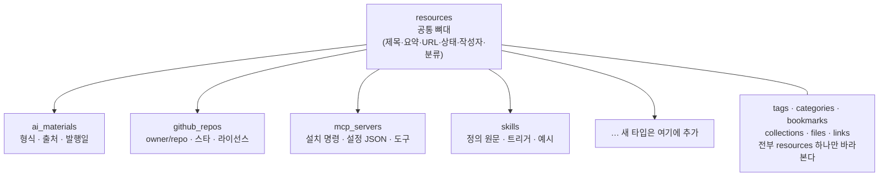
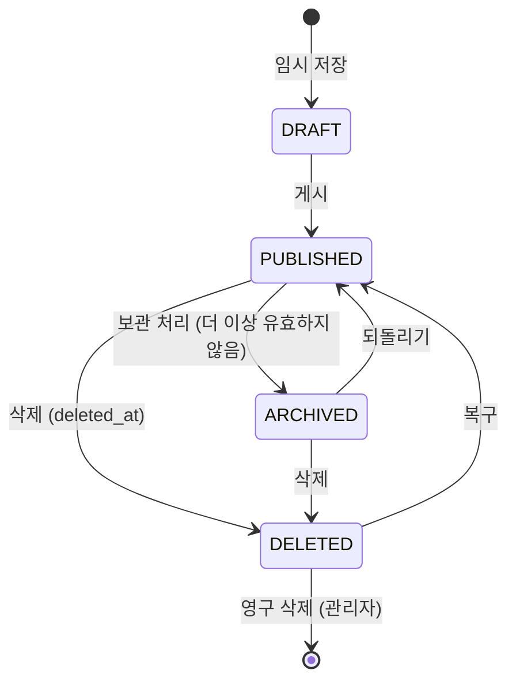
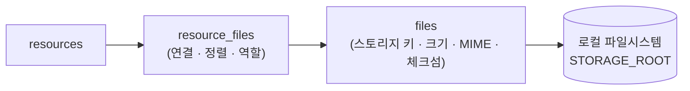
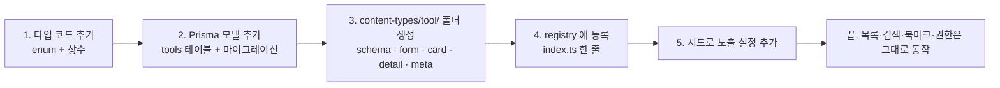

# 04. 콘텐츠 도메인 모델

| 항목 | 내용 |
| --- | --- |
| 문서 ID | REQ-04 |
| 버전 | v0.7 |
| 상태 | Draft |
| 최종 수정 | 2026-08-29 |

> **이 문서가 이 프로젝트에서 가장 중요합니다.**
> "나중에 콘텐츠를 더 추가할 수 있으니 구조를 신경 써 달라"는 요구에 대한 답이 여기에 있습니다.

---

## 4.1 설계 원칙

### 원칙 1 — 모든 것은 자료(Resource)다

AI 자료든 GitHub 저장소든 MCP 서버든, **저장·검색·분류·북마크·권한**은 완전히 같습니다.
다른 것은 "어떤 필드를 더 갖는가"뿐입니다.

그래서 콘텐츠마다 테이블을 새로 만들지 않고, **공통 뼈대 하나(`resources`) + 타입별 상세 하나**로 나눕니다.



**얻는 것:** 검색·목록·북마크·권한·감사 로그를 타입마다 다시 만들지 않아도 됩니다.
새 타입이 생겨도 이 기능들은 **자동으로 따라옵니다.**

### 원칙 2 — 타입은 "등록"하는 것이다

콘텐츠 타입은 코드 여기저기에 `if (type === 'github')` 로 흩어지면 안 됩니다.
타입 하나에 필요한 모든 것(스키마·폼·카드·상세 화면·아이콘·라벨)을 **폴더 하나에 모으고 레지스트리에 등록**합니다.

```
features/resources/content-types/
  index.ts                 ← 레지스트리. 여기에 한 줄 추가하면 끝
  ai-material/
  github-repo/
  mcp-server/
  skill/
```

자세한 폴더 규약은 [DEV-06 폴더 구조 규약](../02.개발설계/06_폴더_구조_규약.md)에 있습니다.

### 원칙 3 — 정형 필드와 비정형 필드를 나눈다

| 종류 | 저장 위치 | 기준 |
| --- | --- | --- |
| 검색·필터·정렬에 쓰는 값 | **전용 컬럼** | 스타 수, 라이선스, 발행일, 자료 형식 |
| 화면에 보여주기만 하는 값 | `metadata` **JSONB** | 저장소 토픽 배열, 원본 API 응답 일부 |

> JSONB로 다 밀어 넣으면 편하지만 인덱스·정합성을 잃습니다. **필터에 쓰이면 컬럼**이라는 기준을 지킵니다.

### 원칙 4 — 원본은 사라진다는 전제로 만든다

외부 링크는 언젠가 깨집니다. 그래서 등록 시점에 **요약·README·스냅샷**을 우리 쪽에 남깁니다.

---

## 4.2 자료(Resource) 공통 필드

| 필드 | 타입 | 필수 | 설명 |
| --- | --- | :---: | --- |
| `id` | cuid | ✅ | 식별자 |
| `type` | enum | ✅ | 콘텐츠 타입 코드 (`CT-*`) |
| `slug` | string | ✅ | URL용 식별자. 제목에서 생성, 중복 시 접미 숫자 |
| `title` | string(200) | ✅ | 제목 |
| `summary` | string(500) | — | 한두 줄 요약. 목록 카드에 노출 |
| `body` | text | — | 상세 설명 (마크다운) |
| `url` | string | — | 원본 링크 |
| `url_normalized` | string | — | 중복 감지용 정규화 URL (**중복 감지용 인덱스** — 유니크가 아니다, `DEC-047`) |
| `thumbnail_url` | string | — | 목록 카드 썸네일 |
| `status` | enum | ✅ | `DRAFT` / `PUBLISHED` / `ARCHIVED` |
| `source_channel` | enum | ✅ | 등록 경로 — `WEB` / `MCP` / `IMPORT` (`DEC-012`). **CLI 등록분을 구분하는 유일한 값** |
| `category_id` | fk | — | 카테고리 (자료당 1개) |
| `author_id` | fk | ✅ | 등록자 (API 키로 등록해도 **키 발급자**가 기록된다) |
| `metadata` | jsonb | — | 타입별 비정형 부가 정보 |
| `search_vector` | tsvector | — | 전문 검색 인덱스 (트리거로 갱신) |
| `view_count` | int | ✅ | 조회수 |
| `bookmark_count` | int | ✅ | 북마크 수 (비정규화 캐시) |
| `source_checked_at` | timestamp | — | 원본 링크 마지막 확인 시각 |
| `source_status` | enum | — | `OK` / `MOVED` / `GONE` |
| `created_at` / `updated_at` | timestamp | ✅ | |
| `deleted_at` | timestamp | — | 소프트 삭제 |

### 자료 상태



| 상태 | 목록 노출 | 검색 노출 | 비고 |
| --- | :---: | :---: | --- |
| `DRAFT` | 본인만 | ❌ | 작성 중 |
| `PUBLISHED` | ✅ | ✅ | 기본 |
| `ARCHIVED` | 필터 시에만 | ✅(표시 구분) | 낡았지만 기록 가치가 있는 자료 |
| 삭제됨 | ❌ | ❌ | 휴지통에서 30일 보관 |

> **자료별 공개 범위는 없습니다.** 승인된 회원은 `PUBLISHED`·`ARCHIVED` 자료를 모두 봅니다 (`DEC-018`).
> 작성자에게만 보이는 것은 `DRAFT` 뿐입니다.
> **검수 상태 같은 것은 없습니다.** 자료를 따로 검수하지 않기로 했습니다 (`DEC-029`).

---

## 4.3 콘텐츠 타입 카탈로그

### 1차 오픈 대상

| ID | 코드 | 라벨 | 목적 | 우선순위 |
| --- | --- | --- | --- | :---: |
| `CT-AI_MATERIAL` | `AI_MATERIAL` | AI 자료 | 논문·아티클·영상·모델·서비스 소개 등 AI 관련 정보 | P0 |
| `CT-GITHUB_REPO` | `GITHUB_REPO` | GitHub 저장소 | 오픈소스 저장소 메타 + 소스 아카이브 | P0 |
| `CT-MCP_SERVER` | `MCP_SERVER` | MCP 서버 | 사내에서 쓰는 MCP 서버 설치·설정 정보 | P0 |
| `CT-SKILL` | `SKILL` | Skill | AI 에이전트 Skill 정의와 사용법 | P0 |
| `CT-DEV_NOTE` | `DEV_NOTE` | 개발 노트 | 사내 규약·팁·트러블슈팅 기록 | P1 |
| `CT-PROMPT` | `PROMPT` | 프롬프트 | 잘 동작한 프롬프트 템플릿 (대상 모델·용도·변수) | P1 |

> `PROMPT` 는 원래 확장 후보였습니다. **4.9절의 «타입 하나 추가» 절차가 실제로 그 분량인지**
> 확인하려고 UI 우선 단계에서 6번째 타입으로 붙여 봤고, 목록·검색·메뉴·관리자 화면은
> 손대지 않아도 자동으로 붙었습니다. 그대로 1차 대상에 남깁니다.

### 확장 후보 (구조만 열어둠)

| 코드 | 라벨 | 비고 |
| --- | --- | --- |
| `TOOL` | 개발 도구 | SaaS·CLI 등 도구 소개와 사내 사용 현황 |
| `DATASET` | 데이터셋 | 공간정보·영상 학습 데이터 |
| `MODEL` | 모델 | 사내 학습 모델 카드 |
| `SNIPPET` | 코드 스니펫 | 짧은 재사용 코드 |
| `GUIDE` | 가이드 | 절차 문서 |

> 이 목록은 **코드 상수**입니다. 관리자 화면에서는 노출 여부·라벨·순서만 바꿉니다. (`FR-ADM-014`)

---

## 4.4 타입별 상세 필드

### CT-AI_MATERIAL — AI 자료

| 필드 | 타입 | 필수 | 설명 |
| --- | --- | :---: | --- |
| `material_kind` | enum | ✅ | `PAPER` 논문 / `ARTICLE` 아티클 / `VIDEO` 영상 / `MODEL` 모델 / `SERVICE` 서비스·제품 / `COURSE` 강의 |
| `source_name` | string | — | 출처 (arXiv, Anthropic Blog, YouTube 채널 등) |
| `authors` | string[] | — | 저자·발표자 |
| `published_at` | date | — | 발행일 |
| `language` | enum | — | `KO` / `EN` / `ETC` |
| `reading_time` | int | — | 예상 소요 시간(분) |
| `key_points` | text | — | 핵심 요약 (등록자가 직접 정리) |
| `applicability` | text | — | **사내 적용 아이디어** |

> `key_points` 와 `applicability` 가 이 시스템의 실제 가치입니다. 링크만 모으는 북마크와 구분되는 지점입니다.

### CT-GITHUB_REPO — GitHub 저장소

| 필드 | 타입 | 필수 | 설명 |
| --- | --- | :---: | --- |
| `owner` | string | ✅ | 소유자/조직 |
| `repo` | string | ✅ | 저장소명 |
| `default_branch` | string | — | 기본 브랜치 |
| `stars` / `forks` | int | — | 스타·포크 수 |
| `primary_language` | string | — | 주 언어 |
| `license` | string | — | 라이선스 SPDX ID |
| `topics` | string[] | — | 토픽. **`github_repos.topics` 컬럼**이다 (`text[]`). JSONB 안에 두면 GIN 인덱스로 검색되지 않는다 |
| `pushed_at` | timestamp | — | 최근 커밋일 |
| `readme_content` | text | — | README 원문 |
| `readme_fetched_at` | timestamp | — | README 수집 시각 |
| `latest_release` | string | — | 최신 릴리스 태그 |
| `archive_status` | enum | ✅ | `NONE` / `QUEUED` / `RUNNING` / `DONE` / `FAILED` |
| `archived_sha` | string | — | 아카이브 기준 커밋 |
| `archive_size_bytes` | bigint | — | 아카이브 크기(표시용 캐시). 정본은 `files.size_bytes` |
| `is_gone` | bool | ✅ | 원본 소실 여부 |

> **보관 파일 참조는 `resource_files (role = ARCHIVE)` 하나뿐입니다.**
> 초안에 있던 `archive_file_id` 는 같은 연결을 두 번 표현한 것이라 제거했습니다
> ([DEV-02 · 2.7절](../02.개발설계/02_데이터_모델.md)).

저장소는 **하나만** 둡니다. 다만 그 제약은 `github_repos(owner, repo)` 가 아니라 **`resources(url_normalized) WHERE deleted_at IS NULL AND type = 'GITHUB_REPO'` 부분 유니크**입니다 (`DEC-050`) — `github_repos` 에는 `deleted_at` 이 없어 **소프트 삭제를 볼 수 없기** 때문입니다(지웠다 다시 등록하면 30일간 `P2002`). `normalizeUrl` 이 `/tree/main`·`.git`·`www.` 을 `owner/repo` 로 접으므로 그 값이 곧 정체성입니다. (`FR-RES-011` 중복 감지)

### CT-MCP_SERVER — MCP 서버

| 필드 | 타입 | 필수 | 설명 |
| --- | --- | :---: | --- |
| `package_name` | string | — | 패키지명 (`@scope/name`) |
| `transport` | enum | ✅ | `STDIO` / `SSE` / `HTTP` |
| `install_command` | string | — | 설치 명령 (`npx -y @scope/name`) |
| `config_json` | text | ✅ | 클라이언트 설정 JSON 예시 |
| `env_vars` | jsonb | — | `[{key, description, required, example}]` — **값은 저장하지 않음** |
| `provided_tools` | jsonb | — | `[{name, description}]` 제공 도구 목록 |
| `client_support` | string[] | — | 지원 클라이언트 (Claude Code, Cursor 등) |
| `usage_status` | enum | ✅ | `REVIEWING` 검토 중 / `ADOPTED` 사내 사용 / `DEPRECATED` 사용 중단 |
| `owner_user_id` | fk | — | 사내 담당자 |

> **비밀값 금지 규칙:** `env_vars` 에는 키 이름과 설명만 넣습니다. 실제 토큰·비밀번호 입력은 서버에서 패턴 검사로 차단합니다. (`NFR-SEC-008`)

### CT-SKILL — Skill

| 필드 | 타입 | 필수 | 설명 |
| --- | --- | :---: | --- |
| `skill_name` | string | ✅ | Skill 식별명 (kebab-case) |
| `definition` | text | ✅ | Skill 정의 원문 (마크다운) |
| `trigger_condition` | text | ✅ | 언제 발동하는지 |
| `target_clients` | string[] | — | 적용 대상 도구 |
| `usage_example` | text | ✅ | 사용 예시 |
| `usage_status` | enum | ✅ | `REVIEWING` / `ADOPTED` / `DEPRECATED` |
| `version` | string | — | 버전 표기 |

### CT-DEV_NOTE — 개발 노트

| 필드 | 타입 | 필수 | 설명 |
| --- | --- | :---: | --- |
| `note_kind` | enum | ✅ | `CONVENTION` 규약 / `TROUBLESHOOT` 문제해결 / `TIP` 팁 / `RETRO` 회고 |
| `related_project` | string | — | 관련 사내 프로젝트명 |
| `occurred_at` | date | — | 발생일 |

### CT-PROMPT — 프롬프트

| 필드 | 타입 | 필수 | 설명 |
| --- | --- | :---: | --- |
| `prompt_text` | text | ✅ | 프롬프트 본문. 상세 화면에서 **전체 복사 버튼**과 함께 보여준다 |
| `use_case` | string | ✅ | 어떤 상황에서 쓰는가 |
| `target_model` | string | — | 대상 모델 (예: `Claude Opus 5`) |
| `variables` | json | — | 치환 변수 목록 `[{ name, description }]` |
| `usage_status` | enum | ✅ | `REVIEWING` / `ADOPTED` / `DEPRECATED` |

---

## 4.5 분류 체계

### 카테고리 (2단계 트리)

초기 안입니다. 운영하면서 관리자가 조정합니다.

| 대분류 | 소분류 예시 |
| --- | --- |
| AI · 모델 | LLM, 비전, 음성, 멀티모달, 파인튜닝 |
| AI 도구 | 에이전트, MCP, Skill, 프롬프트, 코딩 도구 |
| 공간정보 | 드론 촬영, 포인트클라우드, GIS, 사진측량, 지도 |
| 개발 | 프론트엔드, 백엔드, 인프라, 데이터 |
| 사내 | 규약, 온보딩, 회고 |

규칙:
- 자료당 카테고리는 **1개**
- 깊이는 **2단계까지** (대분류 → 소분류)
- 소분류를 지우면 자료는 대분류로 자동 이관하거나, 이관 대상을 선택하게 한다
- 카테고리에는 정렬 순서와 아이콘을 둔다

### 태그

- 자유 입력, 자료당 최대 10개
- 소문자·공백은 하이픈으로 정규화 (`Point Cloud` → `point-cloud`)
- 표시용 원문(`label`)과 정규화 키(`slug`)를 함께 보관
- 관리자가 태그 **병합**을 지원한다 (`FR-ADM-013`)

---

## 4.6 자료 간 관계

자료끼리 연결합니다. 예: MCP 서버 자료 ↔ 그 서버의 GitHub 저장소 자료.

| 관계 유형 | 의미 | 방향 |
| --- | --- | --- |
| `RELATED` | 관련 자료 | 양방향 |
| `SOURCE_OF` | A가 B의 원본/출처 | 단방향 |
| `SUPERSEDES` | A가 B를 대체함 | 단방향 |
| `PART_OF` | A가 B의 일부 | 단방향 |

`resource_relations(from_id, to_id, relation_type)` 한 테이블로 처리하고, 양방향 관계는 조회 시 합칩니다.

---

## 4.7 첨부 · 아카이브 모델



- **`files`** — 실제 저장된 파일 하나. 스토리지 키, 원본 파일명, MIME, 크기, SHA-256, 업로더
- **`resource_files`** — 자료와 파일의 연결. `role` 로 용도를 구분한다
  - `ATTACHMENT` 일반 첨부
  - `ARCHIVE` GitHub 소스 아카이브
  - `THUMBNAIL` 썸네일
- 같은 파일(동일 SHA-256)은 재업로드 시 재사용한다
- 자료를 영구 삭제하면 참조가 0이 된 파일만 스토리지에서 지운다

### 스토리지 키 규칙

| 용도 | 키 형식 |
| --- | --- |
| 첨부 | `attachments/{yyyy}/{mm}/{fileId}/{원본파일명}` |
| GitHub 아카이브 | `archives/{owner}/{repo}/{sha}.tar.gz` |
| 썸네일 | `thumbnails/{fileId}.webp` |
| 프로필 이미지 | `avatars/{userId}.webp` |
| 업로드 중 | `tmp/{uuid}` — 검증 후 정식 경로로 옮긴다 |

> 키는 `STORAGE_ROOT` 아래의 **상대 경로**가 됩니다 (`DEC-019`).
> **키는 서버만 만듭니다.** 사용자가 올린 파일명을 경로에 쓰지 않습니다 — 원본 파일명은 DB에만 보관합니다. (`NFR-SEC-019`)

---

## 4.8 수집 작업(Job) 모델

외부 호출은 요청 흐름에서 분리해 큐로 넘깁니다. 사용자를 기다리게 하지 않기 위해서입니다.

| 작업 유형 | 트리거 | 하는 일 |
| --- | --- | --- |
| `FETCH_URL_META` | URL 빠른 등록 | 제목·설명·og 이미지 수집 |
| `FETCH_GITHUB_META` | GitHub 자료 등록·갱신 | 저장소 메타 + README |
| `ARCHIVE_GITHUB` | 아카이브 실행 | tarball 다운로드 → 스토리지 저장 |
| `REFRESH_GITHUB_META` | 스케줄(주 1회) | 등록된 저장소 메타 갱신, 소실 감지 |
| `CHECK_LINK` | 스케줄(월 1회) | 원본 링크 생존 확인 |
| `GENERATE_THUMBNAIL` | 이미지 업로드 | 썸네일 생성 |
| `CLEANUP_TRASH` | 스케줄(일 1회) | 30일 지난 삭제 자료 정리 |

작업 상태: `QUEUED` → `RUNNING` → `DONE` / `FAILED`
실패 시 최대 3회 지수 백오프 재시도, 이후 관리자 화면에서 수동 재실행 가능. (`SCR-241`)

---

## 4.9 새 콘텐츠 타입을 추가하는 절차

새 타입(예: `TOOL`)을 붙일 때 해야 하는 일 **전부**입니다. 이 목록이 길어지면 구조가 잘못된 것입니다.

> 아래 절차는 **말로만 정한 것이 아닙니다.** UI 우선 단계에서 `PROMPT` 타입을 이 순서대로
> 실제로 추가해 확인했고, 목록·검색·사이드바·관리자 타입 목록은 한 줄도 고치지 않았습니다.



| # | 할 일 | 파일 |
| --- | --- | --- |
| 1 | 타입 코드 추가 | `prisma/schema.prisma` 의 `ResourceType` enum |
| 2 | 상세 테이블 + 마이그레이션 | `prisma/schema.prisma`, `prisma/migrations/` |
| 3 | 입력 검증 스키마 (zod) | `features/resources/content-types/tool/schema.ts` |
| 4 | 등록·수정 폼 | `.../tool/form.tsx` |
| 5 | 목록 카드 | `.../tool/card.tsx` |
| 6 | 상세 화면 | `.../tool/detail.tsx` |
| 7 | 메타(코드·slug·라벨·아이콘·색·순서·노출) | `.../tool/meta.ts` |
| 8 | **행 매핑** (zod 출력 → 상세 테이블 행) | `.../tool/write.ts` |
| 9 | 타입 정의 조립 | `.../tool/index.ts` |
| 10 | **레지스트리마다 한 줄** | 아래 네 파일 |
| 11 | 델리게이트 한 줄 (`tx.tool.upsert`) | `server/services/resource.write.ts` 의 `DETAIL_UPSERT` |
| 12 | 노출 설정 시드 | `prisma/seed.ts` |

**「폴더 하나 + 레지스트리 «한 줄»」이 아니라 「폴더 하나 + 레지스트리마다 한 줄」입니다** (`DEC-051`).
레지스트리는 **그래프 경계마다 하나**입니다 — 하나로 합치면 서버 코드가 React 컴포넌트를,
화면 코드가 Prisma 타입을 끌고 오게 됩니다.

| 레지스트리 | 무엇 | 누가 읽나 |
| --- | --- | --- |
| `content-types/index.ts` | 라벨·아이콘·`Card`·`Detail`·`Form` | 화면 |
| `content-types/operational.ts` | 노출·순서 (import 없음) | 서버·화면 |
| `content-types/schemas.ts` | zod 입력 스키마 | 폼 · service · `P7` 의 `API-100` |
| `content-types/writers.ts` | zod 출력 → 상세 테이블 행 | `resource.write` |

**네 표와 `DETAIL_UPSERT` 가 전부 `Record<ResourceType, …>` 이고 `| null` 같은 탈출구가
없습니다** — 하나라도 빠뜨리면 **컴파일이 실패합니다.** 「목록이 길어지면 구조가 잘못된
것」이라는 이 절의 전제를 **기계가 지킵니다.**

**이 12개 외의 파일은 건드리지 않아야 합니다.** 목록 화면, 검색, 필터, 북마크, 권한,
감사 로그는 공통 코드가 처리합니다. 그리고 **타입 폴더는 `@prisma/client` 를 import
할 수 없습니다** — `check-deps` 가 막습니다(`DEC-051`).

### 레지스트리 인터페이스 (초안)

```ts
// features/resources/content-types/types.ts
export interface ContentTypeDefinition<TDetail = unknown> {
  code: ResourceType;            // 'PROMPT'
  slug: string;                  // 'prompt' — URL 세그먼트
  label: string;                 // '프롬프트'
  description: string;
  icon: LucideIcon;
  badgeClass: string;            // 배지 색 (테마 토큰 기반)
  showInNav: boolean;            // 사이드바 노출
  sortOrder: number;
  isActive: boolean;
  schema: z.ZodType<TDetail>;    // 등록·수정 검증
  Form: ComponentType<ContentTypeFormProps<TDetail>>;
  Card: ComponentType<ContentTypeCardProps<TDetail>>;
  Detail: ComponentType<ContentTypeDetailProps<TDetail>>;
  detectFromUrl?: (url: string) => boolean;   // URL 빠른 등록용 타입 추정
  onBeforeSave?: (input: TDetail) => Promise<TDetail>;  // 메타 자동 수집 훅
}

/** 컴포넌트를 뺀 «직렬화 가능한» 부분. 서버 → 클라이언트로는 이것만 넘긴다. */
export type ContentTypeMeta = Omit<ContentTypeDefinition, 'Card' | 'Detail' | 'Form'>;
```

> **`ContentTypeMeta` 를 따로 두는 이유:** `icon` 과 `Card`·`Detail`·`Form` 은 함수입니다.
> 서버 컴포넌트에서 클라이언트 컴포넌트로 함수를 prop 으로 넘길 수 없으므로,
> 메뉴·목록처럼 경계를 넘는 자리에서는 **메타만** 넘기고 조립은 클라이언트에서 합니다.
>
> **`icon` 은 `ContentTypeMeta` 안에 있지만 그 자체가 함수라 경계를 넘지 못합니다.**
> 즉 «메타만 넘긴다»는 표현은 정확히는 **아이콘을 뺀 메타**를 뜻합니다. 아래 병합 규칙을 보세요.

### 코드 레지스트리 ↔ `content_type_settings` 병합 (`DEC-032`)

같은 값을 두 곳에 두지 않기 위해 **출처를 나눕니다.**

| 값 | 단일 출처 | 이유 |
| --- | --- | --- |
| `label` · `description` · `icon` · `badgeClass` · `slug` | **코드 레지스트리** | 표현은 코드와 함께 배포된다. DB에 두면 어긋났을 때 판단 근거가 없다 |
| `isActive` · `showInNav` · `sortOrder` | **DB `content_type_settings`** | 관리자가 런타임에 바꾼다 (`FR-ADM-014`) |

레지스트리의 `isActive`·`showInNav`·`sortOrder` 는 **DB 값이 오기 전까지 쓰는 기본값**이며,
시드가 이 값으로 `content_type_settings` 를 채웁니다.

**병합은 클라이언트에서 합니다.**

```
서버 레이아웃            → { code, isActive, showInNav, sortOrder }[]   ← 직렬화 가능
   (content_type_settings 조회)          │
                                          ▼
app/_shell/sidebar.tsx (클라이언트)  → 레지스트리의 icon · label 과 code 로 매칭해 조립
```

아이콘이 React 컴포넌트라 서버에서 완성할 수 없기 때문입니다. **설정은 서버가, 아이콘은
클라이언트가** 갖고 있고, 만나는 지점은 `code` 하나입니다.

```ts
// features/resources/content-types/index.ts
export const CONTENT_TYPES = {
  AI_MATERIAL: aiMaterial,
  GITHUB_REPO: githubRepo,
  MCP_SERVER: mcpServer,
  SKILL: skill,
  DEV_NOTE: devNote,
  PROMPT: prompt,          // ← 새 타입은 여기 한 줄
} satisfies Record<ResourceType, ContentTypeDefinition>;

export function getContentType(code: ResourceType): ContentTypeDefinition;
export function listContentTypes(): ContentTypeDefinition[];   // isActive + sortOrder
export function getContentTypeBySlug(slug: string): ContentTypeDefinition | undefined;
export function detectTypeFromUrl(url: string): ResourceType;
```

**이 네 함수 밖에서 타입을 분기하지 않습니다.** 사이드바 메뉴, 명령 팔레트, 목록 필터,
관리자 타입 목록이 모두 `listContentTypes()` 하나를 봅니다.

---

## 4.10 하지 말아야 할 것

| 안티패턴 | 왜 안 되는가 |
| --- | --- |
| 타입마다 목록·검색 화면을 따로 만든다 | 타입이 늘 때마다 화면이 배로 늘고 필터 로직이 갈라진다 |
| 모든 필드를 `metadata` JSONB에 넣는다 | 인덱스·정합성을 잃고 필터 성능이 무너진다 |
| 화면 컴포넌트에 `if (type === 'GITHUB_REPO')` 를 쓴다 | 타입 분기가 코드 전체로 번진다. 레지스트리로 위임한다 |
| 관리자 화면에서 콘텐츠 타입 스키마를 직접 만들게 한다 | 타입 안정성을 잃는다. 스키마는 코드, 운영 설정만 DB |
| GitHub 정보를 매 조회마다 API로 가져온다 | rate limit에 걸리고 느리다. 저장 후 주기 갱신한다 |

---

## 4.11 변경 이력

| 날짜 | 버전 | 내용 |
| --- | --- | --- |
| 2026-08-28 | v0.1 | 최초 작성 |
| 2026-08-28 | v0.2 | `visibility` 제거(`DEC-018`), `source_channel`·`needs_review` 추가(`DEC-012`·`FR-RES-017`) |
| 2026-08-28 | v0.3 | 파일 저장을 **로컬 파일시스템**으로 변경(`DEC-019`). 키 생성 주체·`tmp/` 규칙 명시 |
| 2026-08-28 | v0.4 | **`CT-PROMPT` 를 1차 오픈 대상으로 승격** — 4.9절 절차가 실제로 그 분량인지 UI 단계에서 검증했다. 레지스트리 인터페이스를 구현에 맞게 갱신(`slug`·`badgeClass`·`showInNav`·`sortOrder`·`isActive`), **`ContentTypeMeta`** 분리 이유 명시(서버→클라이언트로 함수를 넘길 수 없음), 조회 함수 4개를 공개 API로 고정 |
| 2026-08-28 | v0.5 | **`needs_review` 컬럼 제거**(`DEC-029`) — 자료는 따로 검수하지 않는다. CLI 등록분 구분은 `source_channel` 이 맡는다 |
| 2026-08-28 | v0.6 | 착수 전 검토 반영 — **4.9절에 «레지스트리 ↔ `content_type_settings` 병합» 절 신설**(`DEC-032`): 표현은 코드, 운영 설정은 DB, 만나는 지점은 `code` 하나. `CT-GITHUB_REPO` 의 `topics` 를 **JSONB → `text[]` 컬럼**으로 정정하고, `resource_files(role=ARCHIVE)` 와 중복이던 `archive_file_id` 를 **`archive_size_bytes`** 로 교체 |
| 2026-08-29 | v0.7 | **4.9 를 「폴더 하나 + 레지스트리마다 한 줄」로 개정**(`DEC-051`) — 레지스트리는 그래프 경계마다 하나(React·순수·zod·행 매핑)이고 전부 탈출구 없는 `Record<ResourceType, …>` 라 **빠뜨리면 컴파일이 실패**한다. `write.ts`·델리게이트 한 줄 추가로 10단계 → 12단계. **`CT-GITHUB_REPO` 의 「`owner + repo` 유니크」를 `resources(url_normalized) WHERE type=GITHUB_REPO` 부분 유니크로 정정**(`DEC-050`) — `github_repos` 에는 `deleted_at` 이 없어 소프트 삭제를 볼 수 없었다 |
