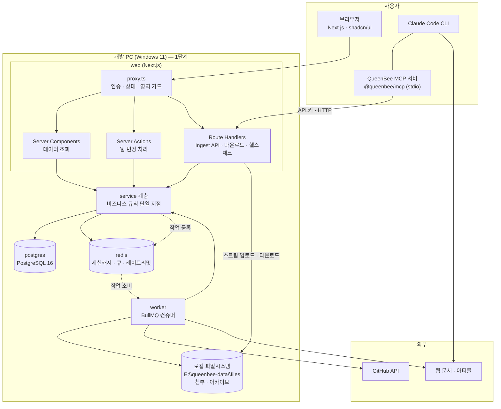
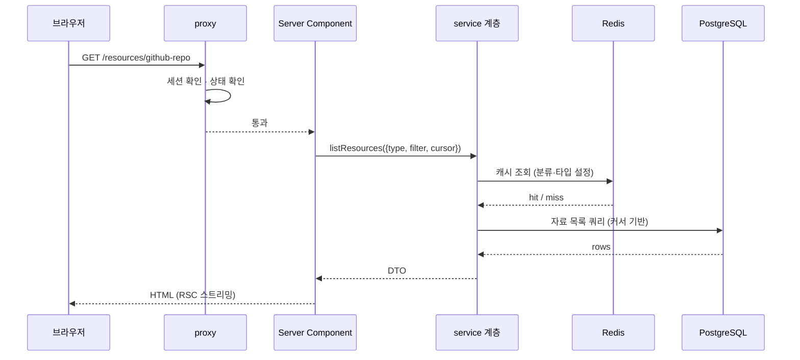
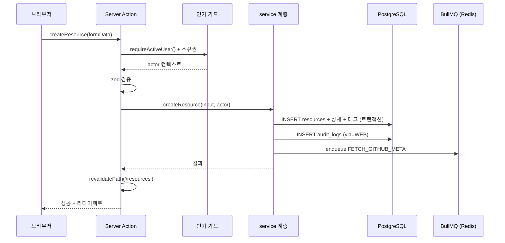
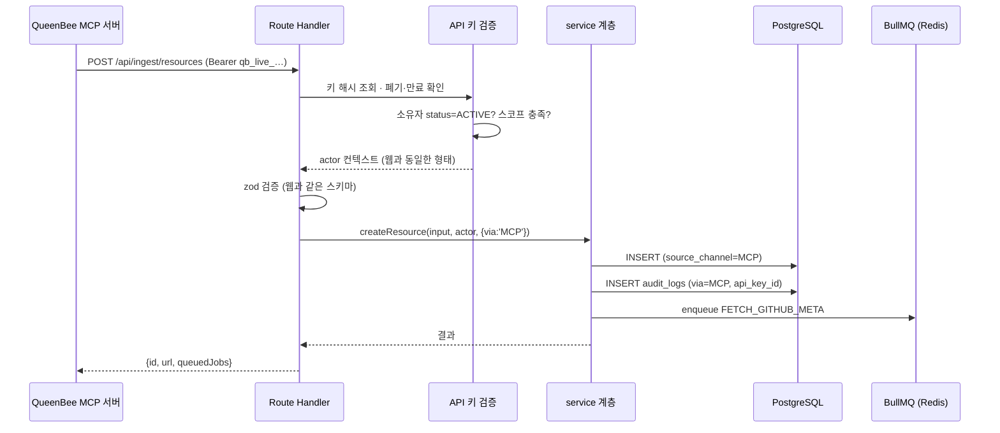

# 01. 시스템 아키텍처

| 항목 | 내용 |
| --- | --- |
| 문서 ID | DEV-01 |
| 버전 | v0.5 |
| 상태 | Draft |
| 최종 수정 | 2026-08-28 |

---

## 1.1 아키텍처 개요

단일 Next.js 애플리케이션 + 백그라운드 워커 구성입니다.
사내 소규모 시스템이므로 **마이크로서비스로 쪼개지 않습니다.** 대신 코드 안에서 계층을 나눕니다.

자료가 들어오는 입구는 **둘**입니다 — 웹 화면과 CLI(MCP). 둘은 같은 service 계층으로 합류합니다.



> **핵심:** `ACT`(웹)와 `API`(CLI)가 각자 로직을 갖지 않습니다. 둘 다 `SVC` 를 호출합니다.
> 그래야 검증·중복 감지·감사 로그가 한 곳에만 존재합니다. (`NFR-SEC-018`)

---

## 1.2 기술 스택

| 계층 | 선택 | 비고 |
| --- | --- | --- |
| 프레임워크 | **Next.js (App Router)** | 15 이상. 프로젝트 생성 시 버전 고정 |
| 언어 | TypeScript (strict) | |
| UI 라이브러리 | React 19 | |
| 스타일 | Tailwind CSS | shadcn/ui 요구 버전에 맞춤 |
| UI 컴포넌트 | **shadcn/ui** | `login-03`, `dashboard-01` 블록 사용 (`DEC-006`) |
| 아이콘 | lucide-react | shadcn 기본 |
| 폼 | react-hook-form + zod | |
| 테이블 | TanStack Table | 회원·자료 관리 목록 |
| 차트 | Recharts | dashboard-01 기본 포함 |
| 테마 | next-themes | 라이트/다크/시스템 |
| 인증 | **Auth.js (NextAuth) v5** | Credentials(**아이디+비밀번호**) + Prisma Adapter (`DEC-002`·`DEC-014`) |
| 비밀번호 해시 | @node-rs/argon2 | |
| ORM | **Prisma** | (`DEC-004`) |
| DB | **PostgreSQL 16** | `pg_trgm`, `unaccent` 확장 사용 |
| 캐시·큐 | **Redis 7** | ioredis |
| 잡 큐 | BullMQ | |
| 스토리지 | **로컬 파일시스템** | `node:fs` 스트림. `StorageDriver` 인터페이스 뒤에 둔다 (`DEC-019`) |
| 업로드 파싱 | busboy (또는 동등한 스트리밍 멀티파트 파서) | 메모리에 통째로 올리지 않는다 |
| **MCP 서버** | **@modelcontextprotocol/sdk** | `packages/mcp-server` — stdio 전송 (`DEC-012`) |
| 스키마 → JSON Schema | zod-to-json-schema | 콘텐츠 타입 스키마를 CLI에 내려줄 때 사용 |
| 마크다운 | react-markdown + remark-gfm + rehype-sanitize + shiki | |
| 로깅 | pino | |
| 테스트 | Vitest + Playwright | |
| 품질 | ESLint + Prettier + lint-staged | |
| 실행 | Docker Desktop (1단계) → Docker Compose (2단계) | (`DEC-013`·`DEC-001`) |

> **메일 라이브러리는 쓰지 않습니다.** 알림은 인앱만 (`DEC-015`).

---

## 1.3 요청 처리 흐름

### 조회 (읽기)



### 변경 — 웹 (Server Action)



### 변경 — CLI (Ingest API)



> 두 번째와 세 번째 다이어그램의 **`S` 이후가 완전히 같습니다.** 그게 이 설계의 핵심입니다.

### 계층 규칙

```
app/ (라우트·화면)
  └→ server/actions, app/api      ← 인가 · 입력 검증 · 캐시 무효화
       └→ server/services         ← 비즈니스 규칙. 여기에만 로직을 둔다
            └→ server/repositories ← Prisma 쿼리
                 └→ lib/db, lib/redis, lib/storage
```

- **Server Component 에서 Prisma를 직접 호출하지 않습니다.** 반드시 service를 거칩니다.
- **service 는 `next/headers`·`cookies` 같은 요청 컨텍스트에 의존하지 않습니다.** 그래야 워커와 Ingest API에서도 재사용됩니다.
- 인가는 action/handler 진입부에서 끝냅니다. 소유권 검사는 데이터를 봐야 하므로 service에서 판단합니다.

---

## 1.4 Redis 사용 계획

| 용도 | 키 패턴 | TTL | 비고 |
| --- | --- | --- | --- |
| 세션 캐시 | `sess:{sessionToken}` | 15분 | 원본은 DB. 조회 부하만 줄인다 |
| 사용자 세션 인덱스 | `user:sessions:{userId}` (Set) | — | 강제 로그아웃 시 일괄 삭제용 |
| API 키 캐시 | `apikey:{prefix}` | 5분 | 검증 결과 캐시. 폐기 시 즉시 무효화 |
| 로그인 시도 | `rl:login:{username}` / `rl:login:ip:{ip}` | 10분 | 카운터 |
| API 레이트리밋 | `rl:api:{userId}:{route}` | 1분 | |
| **Ingest 레이트리밋** | `rl:ingest:{apiKeyId}` | 1분 | 키 단위 |
| 카테고리 트리 | `cache:categories` | 1시간 | 변경 시 즉시 무효화 |
| 태그 목록 | `cache:tags:popular` | 10분 | |
| 콘텐츠 타입 설정 | `cache:content-types` | 1시간 | 변경 시 즉시 무효화 |
| 타입 JSON Schema | `cache:content-types:schema` | 1시간 | CLI가 자주 요청한다 |
| 대시보드 통계 | `cache:stats:dashboard` | 5분 | |
| 조회수 버퍼 | `views:{resourceId}` | — | 1분마다 DB 반영 |
| 중복 조회 방지 | `viewed:{resourceId}:{userId}` | 30분 | |
| BullMQ | `bull:{queueName}:*` | — | 라이브러리 관리 |

**Redis 장애 시:** 캐시 조회는 미스로 처리하고 DB로 폴백합니다. 큐 등록만 실패로 처리하고 사용자에게 재시도를 안내합니다. (`NFR-AVAIL-004`)

---

## 1.5 큐 · 워커

| 큐 이름 | 작업 | 동시 실행 | 재시도 |
| --- | --- | :---: | --- |
| `meta` | `FETCH_URL_META`, `FETCH_GITHUB_META` | 4 | 3회 지수 백오프 |
| `archive` | `ARCHIVE_GITHUB` | 1 | 3회 (긴 백오프) |
| `media` | `GENERATE_THUMBNAIL` | 2 | 2회 |
| `schedule` | `REFRESH_GITHUB_META`, `CHECK_LINK`, `CLEANUP_TRASH` | 1 | 1회 |

> 메일 큐는 없습니다 (`DEC-015`).

### 스케줄 (BullMQ repeatable job)

| 작업 | 주기 |
| --- | --- |
| GitHub 메타 갱신 | 매주 월요일 04:00 |
| 링크 생존 확인 | 매월 1일 04:30 |
| 휴지통 정리 (30일 경과) | 매일 05:00 |
| **`tmp/` 미완료 업로드 정리** | 매일 05:30 (24시간 경과분) |
| **탈퇴 계정 익명화** | 매일 05:45 — 탈퇴 후 1년 경과분 (`DEC-021`) |
| **감사 로그 정리** | 매일 06:00 — 1년 경과분 |
| 조회수 플러시 | 1분마다 |
| 디스크 여유 · 아카이브 총량 확인 | 1시간마다 (`NFR-BACKUP-007`, `DEC-022`) |
| **GitHub 토큰 만료 확인** | 매일 09:00 — 만료 30일 전부터 경고 (`DEC-020`) |

> **개발 PC에서는 스케줄이 PC가 켜져 있을 때만 돕니다.** 놓친 주기는 다음 기동 때 한 번만 실행합니다.

**아카이브 큐를 동시 실행 1로 둔 이유:** 대용량 다운로드가 겹치면 대역과 디스크를 함께 잡아먹습니다.
개발 PC를 서버로 쓰는 1단계에서는 더 중요합니다 — 작업 중인 PC가 느려지면 안 됩니다.

---

## 1.6 스토리지 (로컬 파일시스템)

MinIO를 쓰지 않습니다. 파일을 앱 서버가 직접 디스크에 읽고 씁니다. (`DEC-019`)

| 항목 | 값 |
| --- | --- |
| 루트 경로 | `STORAGE_ROOT` — 기본 `E:\queenbee-data\files` (`DEC-016`) |
| 키 규칙 | [REQ-04 · 4.7절](../01.요구사항/04_콘텐츠_도메인_모델.md) 그대로. 키가 루트 아래 **상대 경로**가 된다 |
| 접근 | 웹에서 직접 접근 불가. **모든 요청이 권한 검사를 거친다** (`public/` 아래에 두지 않는다) |
| 업로드 | 클라이언트 → `POST /api/files` (multipart) → **스트리밍으로 `tmp/` 에 기록** → 검증 → 정식 경로로 `rename` |
| 다운로드 | `GET /api/files/:id` → 권한 확인 → `createReadStream` 응답. `Range` 지원 |
| 원자성 | 같은 볼륨 안에서 `rename` 하므로 원자적이다. 부분 업로드가 정식 경로에 남지 않는다 |
| 중복 제거 | SHA-256이 같으면 기존 파일을 재사용하고 새로 쓰지 않는다 |
| 임시 파일 정리 | `tmp/` 는 스케줄 작업이 24시간마다 청소한다 |
| 용량 관리 | 디스크 여유를 헬스 체크·대시보드에 노출. 임계치 미만이면 업로드·아카이브 차단 |
| **아카이브 총량** | 상한 **100GB**, 80GB 경고 (`DEC-022`). `role = ARCHIVE` 크기 합으로 계산하고 5분 캐시 |
| 백업 | **폴더 동기화**(robocopy 등). 1단계는 같은 PC의 다른 드라이브 (`DEC-024`) |

### 디렉터리 구조

```
E:\queenbee-data\
├─ postgres\                    Docker 볼륨 (DB)
└─ files\                       STORAGE_ROOT
   ├─ tmp\                      업로드 중인 파일 (24시간 후 정리)
   ├─ attachments\2026\08\…     첨부
   ├─ archives\{owner}\{repo}\  GitHub 소스 아카이브
   ├─ thumbnails\
   └─ avatars\
```

### StorageDriver 인터페이스

지금은 `local` 구현 하나만 둡니다. **호출부는 드라이버를 모릅니다.**

```ts
// lib/storage/types.ts
export interface StorageDriver {
  put(key: string, stream: Readable, meta: { size: number; mime: string }): Promise<void>;
  get(key: string, range?: { start: number; end: number }): Promise<Readable>;
  stat(key: string): Promise<{ size: number } | null>;
  move(fromKey: string, toKey: string): Promise<void>;
  delete(key: string): Promise<void>;
}
```

나중에 오브젝트 스토리지가 필요해지면 `s3.ts` 를 추가하고 팩토리만 바꿉니다.

### 보안 — 경로 이탈 방어 (`NFR-SEC-009`)

키를 파일 경로로 쓰므로 **경로 이탈이 새 위험**입니다. 아래를 강제합니다.

| 규칙 | 내용 |
| --- | --- |
| 키 생성 주체 | **서버만.** 사용자 입력 파일명을 경로에 쓰지 않는다 (원본 파일명은 DB에만 보관) |
| 키 문자 제한 | `[A-Za-z0-9/_.-]` 만 허용. `..` 포함 시 거부 |
| 경로 검증 | `path.resolve(root, key)` 결과가 **`root` 아래인지 매번 확인** |
| 심볼릭 링크 | 따라가지 않는다 |
| 응답 헤더 | `Content-Disposition: attachment` + `X-Content-Type-Options: nosniff` — 브라우저에서 실행되지 않게 |

---

## 1.7 검색 전략

1차는 **PostgreSQL 내장 검색**만 씁니다. 별도 검색 엔진을 붙이지 않습니다. (`DEC-007`)

| 요소 | 구현 |
| --- | --- |
| 전문 검색 | `tsvector` 컬럼 + GIN 인덱스. 트리거로 `title`·`summary`·`body` 를 합쳐 갱신 |
| 한국어 부분 일치 | `pg_trgm` 확장 + `gin_trgm_ops` 인덱스 |
| 랭킹 | `ts_rank_cd` + 제목 가중치(A) > 요약(B) > 본문(C) |
| 하이라이트 | `ts_headline` |
| 필터 | 타입·카테고리·태그·작성자·기간·등록 경로는 일반 WHERE 절 |

CLI의 `queenbee_search` 도 **같은 검색 서비스**를 씁니다.

**한계와 전환 기준:** 자료가 5만 건을 넘거나 검색 P95가 1초를 계속 넘으면 재검토합니다. → `DEC-007`·`DEC-027`

---

## 1.8 환경 변수

앱 기동 시 `lib/env.ts` 에서 zod로 검증하고, 실패하면 **즉시 종료**합니다. (`NFR-MAINT-006`)

| 변수 | 1단계 예시 | 설명 |
| --- | --- | --- |
| `NODE_ENV` | `development` | |
| `APP_URL` | `http://localhost:3100` | 절대 URL 생성 기준 |
| `DATABASE_URL` | `postgresql://queenbee:…@localhost:5432/queenbee` | Prisma 접속 |
| `REDIS_URL` | `redis://localhost:6379` | |
| `AUTH_SECRET` | (32바이트 랜덤) | Auth.js 서명 키 |
| `AUTH_TRUST_HOST` | `true` | |
| `COOKIE_SECURE` | `false` | 1단계는 HTTP 라 끈다 (`NFR-SEC-005`) |
| `STORAGE_DRIVER` | `local` | 지금은 `local` 만 있다 (`DEC-019`) |
| `STORAGE_ROOT` | `E:\queenbee-data\files` | 파일 저장 루트. **저장소 밖에 둔다** |
| `GITHUB_TOKEN` | `github_pat_…` | 메타 수집용. **조직 fine-grained PAT** (`DEC-020`) |
| `ADMIN_SEED_ID` / `ADMIN_SEED_PASSWORD` | | 최초 관리자 시드 (**아이디** 기반) |
| `MAX_UPLOAD_MB` | `50` | |
| `MAX_ARCHIVE_MB` | `500` | |
| `DISK_MIN_FREE_GB` | `20` | 이 미만이면 아카이브 차단 |
| `LOG_LEVEL` | `debug` | |

### MCP 서버 쪽 환경 변수 (개발자 PC)

| 변수 | 예시 | 설명 |
| --- | --- | --- |
| `QUEENBEE_URL` | `http://localhost:3100` | Ingest API 주소 |
| `QUEENBEE_API_KEY` | `qb_live_…` | 개인 API 키 ([DEV-08 · 8.6절](08_자료수집_파이프라인.md)) |

> SMTP 관련 변수는 없습니다 (`DEC-015`).

---

## 1.9 실행 환경 — 1단계: 개발 PC

**현재 개발 PC(Windows 11)를 그대로 서버로 씁니다.** (`DEC-013`)

### 구성

| 구성 요소 | 실행 방식 | 이유 |
| --- | --- | --- |
| `postgres` | Docker Desktop 컨테이너 | 설치·초기화가 간단하고 버전을 고정할 수 있다 |
| `redis` | Docker Desktop 컨테이너 | 위와 같음 |
| **파일 저장소** | **컨테이너 없음 — 로컬 폴더** | MinIO 제외 (`DEC-019`). 앱이 디스크에 직접 쓴다 |
| **Next.js (web)** | **호스트에서 `npm run dev`** | 핫 리로드가 필요하다. 컨테이너 안에서는 Windows 파일 감시가 불안정하다 |
| **worker** | **호스트에서 `npm run worker:dev`** | 위와 같음. 앱과 코드를 공유한다 |
| reverse proxy | **없음** | HTTPS를 쓰지 않으므로 불필요 (`DEC-017`) |

```
개발 PC (Windows 11)
├─ Docker Desktop (WSL2)          ← 컨테이너는 2개뿐
│   ├─ postgres  :5432   → E:\queenbee-data\postgres
│   └─ redis     :6379
├─ node (호스트)
│   ├─ next dev  :3100   ← 브라우저 · MCP 서버가 접속
│   └─ worker
├─ E:\queenbee-data\files          ← 첨부 · 아카이브 (앱이 직접 읽고 쓴다)
└─ Claude Code + @queenbee/mcp  → http://localhost:3100
```

> **포트를 3100 으로 고정한 이유:** 이 PC에서 다른 프로젝트가 이미 `3000` 을 쓰고 있습니다.
> Next.js 는 포트가 막히면 조용히 다음 번호로 옮겨가는데, 그러면 MCP 설정(`QUEENBEE_URL`)과
> 실제 주소가 어긋납니다. `package.json` 의 `dev`·`start` 스크립트에 `-p 3100` 을 박아 고정했습니다.

### 접속

| 대상 | 주소 |
| --- | --- |
| 본인 | `http://localhost:3100` (`package.json` 의 `next dev -p 3100` 으로 고정) |
| 같은 네트워크의 팀원 | `http://<이 PC의 IP>:3100` — Windows 방화벽 인바운드 허용 필요. **M5 완료 후 개방** (`DEC-023`) |
| 외부 | **없음** (`DEC-017`) |

### 1단계에서 감수하는 것

| 항목 | 상태 | 대응 |
| --- | --- | --- |
| PC를 끄면 서비스 중단 | 감수 | 2단계 이관 시 해소 |
| HTTPS 없음 | 감수 | 외부에 노출하지 않는 것이 전제 |
| 무중단 배포 없음 | 감수 | 개발 중이라 재시작이 자연스럽다 |
| 백업이 같은 PC | 부분 대응 | 다른 드라이브/외장으로 주 1회 (`NFR-BACKUP-003`) |
| 디스크 용량 제한 | 대응 필요 | 여유 감시 + 아카이브 총량 100GB 상한 (`DEC-022`) |

### Windows 환경 주의사항

| 항목 | 내용 |
| --- | --- |
| 볼륨 | DB 데이터는 **named volume 또는 전용 경로**를 쓴다. 프로젝트 폴더에 바인드 마운트하면 느리고 권한 문제가 생긴다 |
| 파일 경로 | `STORAGE_ROOT` 는 **저장소 폴더 밖**에 둔다. Git에 섞이지 않고, 백업 대상이 명확해진다 |
| 파일 잠금 | Windows는 열린 파일을 삭제할 수 없다. 삭제 전에 스트림을 반드시 닫는다 |
| 경로 구분자 | 키는 항상 `/` 로 다루고, 디스크 접근 직전에만 `path.join` 으로 변환한다 |
| 줄바꿈 | `.gitattributes` 로 `* text=auto eol=lf` 고정. `core.autocrlf=false` |
| 포트 충돌 | `5432`·`6379`·`3100` 사용 중인지 먼저 확인 |
| 경로 길이 | `node_modules` 깊이 문제 대비 — 프로젝트를 짧은 경로에 둔다 |
| 절전 | 서버로 쓰는 동안 절전·최대 절전을 끈다 |

---

## 1.10 실행 환경 — 2단계: 사내 서버 (예정)

M5 사내망 개방(`DEC-023`) 후 불편이 반복되거나 백업 분리가 필요해지면 이관합니다. (`DEC-001`)

| 서비스 | 역할 |
| --- | --- |
| `reverse-proxy` (Caddy) | HTTPS 종단, 요청 전달 |
| `web` | Next.js (SSR + Server Actions + Ingest API) |
| `worker` | BullMQ 컨슈머 — `web` 과 **같은 이미지**, 커맨드만 다름 |
| `postgres` / `redis` | 1단계와 동일 구성 |
| 파일 저장소 | 서버의 볼륨을 계속 씁니다. 필요해지면 `StorageDriver` 에 `s3` 구현을 추가합니다 (`DEC-019`) |
| `backup` | 일 단위 `pg_dump` + 파일 폴더 동기화 |

이관 시 확정할 것: 접속 주소·인증서(`DEC-028` 에서 이관 시점 결정으로 미뤄 둠) · 백업 분리 보관(`DEC-024` 재검토)

**이관이 쉬운 이유:** DB·Redis는 이미 컨테이너이고, 파일 접근은 `StorageDriver` 뒤에 숨어 있습니다.
바뀌는 것은 `APP_URL`·`COOKIE_SECURE`·`STORAGE_ROOT` 와 프록시 추가뿐입니다.

---

## 1.11 헬스 체크

```json
{
  "status": "ok",
  "checks": { "db": "ok", "redis": "ok", "storage": "ok", "disk": "ok" },
  "diskFreeGb": 412,
  "version": "0.1.0",
  "uptime": 38412
}
```

하나라도 실패하면 HTTP 503과 함께 실패 항목을 반환합니다.
`storage` 는 `STORAGE_ROOT` 의 존재·쓰기 권한을, `disk` 는 `DISK_MIN_FREE_GB` 기준 여유 용량을 확인합니다.

### 운영 점검 주기 (1단계)

| 주기 | 항목 |
| --- | --- |
| 매일 | 실패 Job 수, 디스크 여유 |
| 매주 | 백업 실행 여부, 승인 대기 계정 |
| 매월 | `npm audit`, 스토리지 사용량 추이 |

---

## 1.12 변경 이력

| 날짜 | 버전 | 내용 |
| --- | --- | --- |
| 2026-08-28 | v0.1 | 최초 작성 |
| 2026-08-28 | v0.2 | **Ingest API·MCP 경로 반영**(`DEC-012`), 실행 환경을 1단계 개발 PC / 2단계 사내 서버로 분리(`DEC-013`), 스토리지 데이터 경로 명시(`DEC-016`), 메일 관련 제거(`DEC-015`), 아이디 기반 시드로 변경(`DEC-014`) |
| 2026-08-28 | v0.3 | **MinIO 제외 → 로컬 파일시스템 저장**(`DEC-019`). 1.6절 재작성(StorageDriver 인터페이스·경로 이탈 방어), 컨테이너 2개로 축소, `S3_*` 환경 변수를 `STORAGE_ROOT` 로 교체 |
| 2026-08-28 | v0.4 | 보존·정리 스케줄 추가(탈퇴 계정 익명화·감사 로그 정리·GitHub 토큰 만료 경고 — `DEC-021`·`DEC-020`), 아카이브 총량 상한 반영(`DEC-022`) |
| 2026-08-28 | v0.5 | Next.js 16 반영 — 가드 계층 이름을 **`middleware` → `proxy`** 로 정정 |
