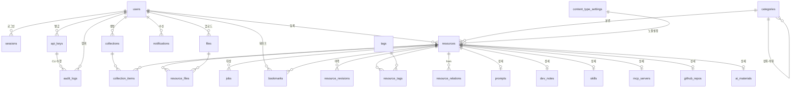

# 02. 데이터 모델

| 항목 | 내용 |
| --- | --- |
| 문서 ID | DEV-02 |
| 버전 | v0.7 |
| 상태 | Draft |
| 최종 수정 | 2026-08-29 |

> ORM: **Prisma** (`DEC-004`) / DB: **PostgreSQL 16**
> 개념 정의는 [REQ-04 콘텐츠 도메인 모델](../01.요구사항/04_콘텐츠_도메인_모델.md)을 먼저 읽으세요.

---

## 2.1 명명 규칙

| 대상 | 규칙 | 예 |
| --- | --- | --- |
| 테이블 | snake_case, 복수형 | `resource_files` |
| 컬럼 | snake_case | `created_at` |
| Prisma 모델 | PascalCase 단수 | `ResourceFile` |
| Prisma 필드 | camelCase + `@map` | `createdAt @map("created_at")` |
| 기본키 | `id` (cuid) | |
| 외래키 | `{대상단수}_id` | `resource_id` |
| enum | 대문자 SNAKE_CASE | `GITHUB_REPO` |
| 인덱스 | `idx_{테이블}_{컬럼들}` | `idx_resources_type_created` |
| 공통 타임스탬프 | `created_at`, `updated_at` | 모든 테이블 |
| 소프트 삭제 | `deleted_at` (nullable) | 자료·컬렉션 |

---

## 2.2 ERD



---

## 2.3 테이블 명세

### TBL-users — 회원

| 컬럼 | 타입 | 제약 | 설명 |
| --- | --- | --- | --- |
| `id` | text | PK | cuid |
| `username` | text | UNIQUE, NOT NULL | **로그인 아이디.** 영문 소문자·숫자·`_`·`.` 4~20자. **소문자로 정규화해 저장** (`DEC-014`) |
| `password_hash` | text | NOT NULL | Argon2id |
| `name` | text | NOT NULL | 이름 |
| `department` | text | | 소속 팀 |
| `avatar_url` | text | | 프로필 이미지 |
| `bio` | text | | 자기소개 |
| `role` | enum | NOT NULL, default `MEMBER` | `MEMBER`/`EDITOR`/`ADMIN` |
| `status` | enum | NOT NULL, default `PENDING` | `PENDING`/`ACTIVE`/`REJECTED`/`SUSPENDED`/`WITHDRAWN` |
| `signup_reason` | text | | 가입 사유 |
| `status_reason` | text | | 거부·정지 사유 |
| `status_changed_at` | timestamptz | | |
| `status_changed_by` | text | FK users | 처리한 관리자 |
| `must_change_password` | boolean | default false | 초기화 후 변경 강제 |
| `password_changed_at` | timestamptz | | |
| `last_login_at` | timestamptz | | |
| `created_at` / `updated_at` | timestamptz | NOT NULL | |

인덱스: `idx_users_status`, `idx_users_role`, `UNIQUE(username)`

> 이메일 컬럼은 없습니다. 이메일을 수집하지 않습니다 (`DEC-014`).
> 탈퇴해도 행은 남으므로 **아이디가 자동으로 점유되어 재사용이 막힙니다.**

### TBL-sessions — 세션 (자체 구현 — `DEC-030`)

| 컬럼 | 타입 | 설명 |
| --- | --- | --- |
| `id` | text | PK |
| `token_hash` | text | UNIQUE. **세션 토큰의 SHA-256.** 원문은 쿠키에만 있고 DB에 남기지 않는다 |
| `user_id` | text | FK users, ON DELETE CASCADE |
| `expires` | timestamptz | 만료 시각 |
| `ip` / `user_agent` | text | 활성 세션 관리용 (`FR-USER-006`) |
| `last_seen_at` | timestamptz | 마지막 사용 시각. 세션 목록에서 "현재 기기" 판별용 |
| `created_at` | timestamptz | |

> **왜 원문이 아니라 해시인가:** DB 덤프가 유출돼도 그것만으로 남의 세션을 위조할 수 없어야 합니다.
> API 키(`api_keys.key_hash`)와 같은 원칙입니다 (`NFR-SEC-017`).
> 조회는 `sha256(쿠키값)` 으로 `token_hash` 를 찾습니다 — 유니크 인덱스라 한 번에 끝납니다.

### TBL-api_keys — CLI 수집용 개인 API 키

Claude Code CLI가 MCP 서버를 통해 접근할 때 쓰는 자격 증명입니다. (`DEC-012`, [REQ-02 · 2.8절](../01.요구사항/02_사용자_권한_정책.md))

| 컬럼 | 타입 | 제약 | 설명 |
| --- | --- | --- | --- |
| `id` | text | PK | cuid |
| `user_id` | text | FK users, CASCADE | 발급자 |
| `name` | text | NOT NULL | 용도 이름 (예: "노트북 Claude Code") |
| `key_prefix` | text | NOT NULL, INDEX | `qb_live_a1b2c3d4` — 조회·표시용 앞 자리 |
| `key_hash` | text | NOT NULL | SHA-256. **원문은 저장하지 않는다** |
| `scopes` | text[] | NOT NULL | `resources:read` / `resources:write` / `archive:run` |
| `last_used_at` | timestamptz | | 마지막 사용 시각 |
| `expires_at` | timestamptz | NOT NULL | 기본 발급일 + 1년 |
| `revoked_at` | timestamptz | | 폐기 시각 |
| `revoked_by` | text | FK users | 폐기 주체 (본인 또는 관리자) |
| `created_at` | timestamptz | NOT NULL | |

인덱스: `UNIQUE(key_prefix)`, `idx_api_keys_user (user_id)`

> **비밀번호 재설정 토큰 테이블은 없습니다.** 메일을 쓰지 않으므로 셀프 재설정 경로가 없고,
> 비밀번호 분실은 관리자 초기화로 처리합니다 (`DEC-014`·`DEC-015`, `FR-ADM-007`).

### TBL-reserved_usernames — 점유된 아이디

탈퇴한 계정의 아이디를 재사용하지 못하게 막습니다. (`DEC-021`)

| 컬럼 | 타입 | 제약 | 설명 |
| --- | --- | --- | --- |
| `username` | text | PK | 점유된 아이디 |
| `reserved_at` | timestamptz | NOT NULL | 점유 시각 |
| `reason` | text | | `WITHDRAWN` / `FORCED` 등 |

> **아이디 중복 검사는 `users` 와 이 테이블을 함께 봅니다** (`FR-AUTH-002`).
> 계정을 익명화할 때 원래 아이디가 여기로 옮겨집니다.

### TBL-password_histories — 비밀번호 재사용 방지

| 컬럼 | 타입 | 설명 |
| --- | --- | --- |
| `id` / `user_id` / `password_hash` / `created_at` | | 사용자별 최근 3개만 보관 |

### TBL-categories — 카테고리

| 컬럼 | 타입 | 설명 |
| --- | --- | --- |
| `id` | text | PK |
| `parent_id` | text | FK categories (2단계까지) |
| `name` / `slug` | text | `slug` UNIQUE |
| `description` | text | |
| `icon` | text | lucide 아이콘명 |
| `sort_order` | int | |
| `is_active` | boolean | |

### TBL-tags — 태그

| 컬럼 | 타입 | 설명 |
| --- | --- | --- |
| `id` | text | PK |
| `slug` | text | UNIQUE, 정규화 키 |
| `label` | text | 표시용 원문 |
| `usage_count` | int | 비정규화 카운트 |

### TBL-resources — 자료 (공통 뼈대)

필드 정의는 [REQ-04 · 4.2절](../01.요구사항/04_콘텐츠_도메인_모델.md)과 동일합니다.

주요 제약·인덱스:

**판정 근거와 측정값은 `2.5.1 인덱스` 절에 있습니다.** 여기는 목록입니다.

| 종류 | 대상 |
| --- | --- |
| UNIQUE | `(slug)` |
| INDEX | `idx_resources_url_normalized (url_normalized) WHERE deleted_at IS NULL` — **유니크가 아니다** (`DEC-047`): `FR-RES-011` 이 「그래도 등록」을 수용 기준으로 두므로 DB 가 막으면 안 된다. 중복 정책은 진입점에 있다(웹=허용 · MCP=`409`) |
| **UNIQUE** | `idx_resources_github_url_unique (url_normalized) WHERE deleted_at IS NULL AND type = 'GITHUB_REPO'` — 저장소는 **URL 이 정체성**이다 (`DEC-050`). `github_repos(owner, repo)` 로는 표현할 수 없다: 그 테이블에 `deleted_at` 이 없어 **소프트 삭제를 볼 수 없다** |
| INDEX | `resources_type_created_at_idx (type, created_at DESC)` |
| INDEX | `resources_category_id_idx (category_id)` |
| INDEX | `resources_author_id_idx (author_id)` |
| INDEX | `resources_status_idx (status)` — **부분 인덱스가 아니다.** 전에 이 표가 `WHERE deleted_at IS NULL` 을 달아 뒀는데 마이그레이션에는 그 술어가 없었다 |
| INDEX | `resources_source_channel_idx (source_channel)` — 수집 경로별 통계 |
| **INDEX ×4** | `resources_live_{recent,popular,bookmarked,title}_idx` — 정렬 4축, `WHERE deleted_at IS NULL AND status = 'PUBLISHED'` **부분 인덱스** (`DEC-052`). `dir=asc` 는 같은 인덱스를 **거꾸로 훑어** 쓴다 |
| GIN | `idx_resources_search (search_vector)` |
| GIN trgm | `idx_resources_title_trgm (title gin_trgm_ops)` |

### TBL-ai_materials / TBL-github_repos / TBL-mcp_servers / TBL-skills / TBL-dev_notes / TBL-prompts

각 테이블은 `resource_id` 를 **PK 겸 FK**로 갖습니다 (1:1). 필드는 [REQ-04 · 4.4절](../01.요구사항/04_콘텐츠_도메인_모델.md) 참조.

> 자료 삭제 시 상세 행은 `ON DELETE CASCADE`.

### TBL-resource_tags — 자료-태그 (N:M)

PK `(resource_id, tag_id)` · INDEX `(tag_id, resource_id)`

> **두 번째 인덱스가 필요한 이유:** PK 는 `resource_id` 로 «시작»하므로
> 태그 필터와 `findRelated`(상세 화면의 관련 자료)처럼 **`tag_id` 로 들어가는**
> 질의는 탈 인덱스가 없었습니다. 10만 건에서 상세 화면이 여기에 **164ms** 를
> 썼고, 인덱스 뒤 **43ms** 입니다 (`DEC-052`).

### TBL-resource_relations — 자료 간 관계

| 컬럼 | 설명 |
| --- | --- |
| `from_resource_id` / `to_resource_id` | FK resources |
| `relation_type` | `RELATED`/`SOURCE_OF`/`SUPERSEDES`/`PART_OF` |
| `created_by` / `created_at` | |

UNIQUE `(from_resource_id, to_resource_id, relation_type)`, CHECK `from != to`

### TBL-files — 파일

| 컬럼 | 타입 | 설명 |
| --- | --- | --- |
| `id` | text | PK |
| `storage_key` | text | UNIQUE. `STORAGE_ROOT` 아래 상대 경로. **서버가 생성한다** (`DEC-019`·`NFR-SEC-019`) |
| `original_name` | text | 원본 파일명 |
| `mime_type` | text | |
| `size_bytes` | bigint | |
| `checksum_sha256` | text | 중복 제거 키 |
| `uploaded_by` | text | FK users |
| `created_at` | timestamptz | |

INDEX `idx_files_checksum (checksum_sha256)`

### TBL-resource_files — 자료-파일 연결

| 컬럼 | 설명 |
| --- | --- |
| `resource_id` / `file_id` | FK |
| `role` | `ATTACHMENT`/`ARCHIVE`/`THUMBNAIL` |
| `sort_order` | 표시 순서 |

PK `(resource_id, file_id, role)`

### TBL-bookmarks

PK `(user_id, resource_id)` + `created_at`

### TBL-collections / TBL-collection_items

| collections | 설명 |
| --- | --- |
| `id` / `name` / `slug` / `description` | |
| `owner_id` | FK users |
| `visibility` | `PRIVATE` / `TEAM` |
| `cover_url` | |
| `deleted_at` | 소프트 삭제 |

| collection_items | 설명 |
| --- | --- |
| `collection_id` / `resource_id` | PK 조합 |
| `sort_order` / `note` | 순서, 담은 이유 메모 |

### TBL-resource_revisions — 자료 변경 이력

| 컬럼 | 설명 |
| --- | --- |
| `id` / `resource_id` / `editor_id` |  |
| `changed_fields` | jsonb — `{ field: {before, after} }` |
| `created_at` | |

> 전체 스냅샷이 아니라 **변경된 필드만** 저장합니다. 용량을 아끼면서 "누가 무엇을 바꿨는지"는 남습니다.

### TBL-jobs — 수집 작업

| 컬럼 | 타입 | 설명 |
| --- | --- | --- |
| `id` | text | PK |
| `type` | enum | [REQ-04 · 4.8절](../01.요구사항/04_콘텐츠_도메인_모델.md) 작업 유형 |
| `status` | enum | `QUEUED`/`RUNNING`/`DONE`/`FAILED` |
| `resource_id` | text | FK resources (nullable) |
| `payload` | jsonb | 입력 파라미터 |
| `result` | jsonb | 결과 요약 |
| `error_message` | text | 실패 사유 |
| `attempts` | int | 시도 횟수 |
| `started_at` / `finished_at` | timestamptz | |
| `requested_by` | text | FK users |
| `created_at` | timestamptz | |

INDEX `idx_jobs_status_created (status, created_at DESC)`

> BullMQ가 실제 큐를 관리하고, 이 테이블은 **관리자 화면에서 보기 위한 기록**입니다. 큐가 비워져도 이력은 남습니다.

### TBL-notifications — 알림

| 컬럼 | 설명 |
| --- | --- |
| `id` / `user_id` | 수신자 |
| `type` | `SIGNUP_REQUEST`/`APPROVED`/`REJECTED`/`JOB_DONE`/`JOB_FAILED`/`SYSTEM` |
| `title` / `body` / `link_url` | |
| `read_at` | 읽음 시각 |
| `created_at` | |

INDEX `idx_notifications_user_unread (user_id, read_at)`

### TBL-audit_logs — 감사 로그

| 컬럼 | 설명 |
| --- | --- |
| `id` | PK |
| `actor_id` | FK users (nullable — 로그인 실패는 NULL) |
| `actor_username` | 스냅샷 (계정이 지워져도 추적 가능) |
| `via` | `WEB` / `MCP` — 어느 경로로 수행했는지 |
| `api_key_id` | FK api_keys (nullable). `via=MCP` 일 때 어떤 키였는지 |
| `action` | `USER_APPROVE`, `RESOURCE_DELETE` 등 |
| `target_type` / `target_id` | 대상 |
| `summary` | 사람이 읽는 한 줄 |
| `diff` | jsonb — 변경 전후 |
| `ip` / `user_agent` | |
| `created_at` | |

INDEX `idx_audit_created (created_at DESC)`, `idx_audit_actor (actor_id)`, `idx_audit_action (action)`

### TBL-content_type_settings — 콘텐츠 타입 운영 설정

| 컬럼 | 설명 |
| --- | --- |
| `type` | PK. enum `ResourceType` |
| `is_active` | 비활성화 시 목록·검색에서 숨김 |
| `show_in_nav` | 사이드바 노출 |
| `sort_order` | |

> **스키마도 표현도 아닌 «운영 설정»만** 담습니다. 필드 구조도 라벨·아이콘도 코드에 있습니다.
> ([REQ-04 · 4.9절](../01.요구사항/04_콘텐츠_도메인_모델.md), `DEC-032`)
>
> 초안에는 `label`·`description`·`icon` 컬럼이 있었지만 **코드 레지스트리와 같은 값을 두 곳에 두는 것**이라
> 제거했습니다. 어긋났을 때 어느 쪽이 맞는지 판단할 근거가 없습니다.

### TBL-system_settings — 시스템 설정

| 컬럼 | 설명 |
| --- | --- |
| `key` | PK |
| `value` | jsonb |
| `updated_by` / `updated_at` | |

키 예:

| 키 | 기본값 | 근거 |
| --- | --- | --- |
| `signup.enabled` | `true` | 신규 가입 허용 여부 |
| `upload.max_mb` | `50` | `FR-FILE-004` |
| `archive.max_mb` | `500` | 단일 아카이브 상한 |
| `archive.total_limit_gb` | `100` | 총량 상한 (`DEC-022`) |
| `archive.warn_pct` | `80` | 경고 임계치 |
| `disk.min_free_gb` | `20` | `NFR-BACKUP-007` |
| `github.token_set` | `false` | 토큰 설정 여부(값은 저장하지 않음) |
| `github.token_expires_at` | — | 만료 30일 전 경고 (`DEC-020`) |
| `retention.account_days` | `365` | 탈퇴 계정 익명화 시점 (`DEC-021`) |
| `retention.audit_days` | `365` | 감사 로그 보존 |
| `notice.banner` | — | 전체 공지 |

---

## 2.4 Prisma 스키마 초안

> **정본은 이제 `project/prisma/schema.prisma` 입니다** (`P1` 에서 실제로 만들었습니다).
> 아래는 읽기용 발췌이며, 어긋나면 **코드 쪽이 맞습니다.**

### Prisma 7 에서 달라진 것 (`DEC-034`)

| 항목 | Prisma 6 이하 | **Prisma 7** |
| --- | --- | --- |
| 접속 URL | `datasource { url = env(...) }` | **스키마에 두지 않는다.** CLI 는 `prisma.config.ts`, 런타임은 **driver adapter** |
| 클라이언트 생성 | `new PrismaClient()` | `new PrismaClient({ adapter: new PrismaPg({ connectionString }) })` |
| `.env` 로딩 | CLI 가 자동으로 읽음 | **읽지 않는다.** `process.loadEnvFile()` 로 직접 읽는다 |
| 시드 실행 | `ts-node` 등 | **`tsx`** (Node 내장 타입 스트리퍼는 쓰지 않는다) |

```ts
// project/prisma.config.ts — CLI 전용. 런타임은 이 값을 쓰지 않는다.
import { defineConfig, env } from "prisma/config";

try {
  process.loadEnvFile(".env");
} catch {
  /* CI 처럼 환경 변수가 이미 주입된 경우 */
}

export default defineConfig({
  schema: "prisma/schema.prisma",
  datasource: { url: env("DATABASE_URL") },
  migrations: { seed: "tsx prisma/seed.ts" },
});
```

```prisma
generator client {
  provider        = "prisma-client-js"
  // ↓ 이 줄이 없으면 아래 datasource 의 `extensions` 가 유효하지 않아
  //   `prisma validate` 가 바로 실패한다. 빠뜨리기 쉬운 자리다.
  previewFeatures = ["postgresqlExtensions"]
}

// Prisma 7 부터 `url` 은 스키마에 두지 않는다 (DEC-034).
datasource db {
  provider   = "postgresql"
  extensions = [pgTrgm(map: "pg_trgm"), unaccent]
}

// ───────── enum ─────────
enum Role          { MEMBER EDITOR ADMIN }
enum UserStatus    { PENDING ACTIVE REJECTED SUSPENDED WITHDRAWN }
enum ResourceType  { AI_MATERIAL GITHUB_REPO MCP_SERVER SKILL DEV_NOTE PROMPT }
enum ResourceStatus{ DRAFT PUBLISHED ARCHIVED }
enum SourceChannel { WEB MCP IMPORT }   // 자료가 들어온 경로
enum ActorVia      { WEB MCP }          // 감사 로그의 수행 경로
enum Visibility    { TEAM PRIVATE }     // 컬렉션 전용. 자료에는 쓰지 않는다 (DEC-018)
enum SourceStatus  { OK MOVED GONE }
enum FileRole      { ATTACHMENT ARCHIVE THUMBNAIL }
enum RelationType  { RELATED SOURCE_OF SUPERSEDES PART_OF }
enum ArchiveStatus { NONE QUEUED RUNNING DONE FAILED }
enum JobType       { FETCH_URL_META FETCH_GITHUB_META ARCHIVE_GITHUB REFRESH_GITHUB_META CHECK_LINK GENERATE_THUMBNAIL CLEANUP_TRASH }
enum JobStatus     { QUEUED RUNNING DONE FAILED }
enum UsageStatus   { REVIEWING ADOPTED DEPRECATED }
enum MaterialKind  { PAPER ARTICLE VIDEO MODEL SERVICE COURSE }
enum Language      { KO EN ETC }        // REQ-04 · 4.4 는 enum 인데 초안이 String 이었다
enum McpTransport  { STDIO SSE HTTP }
enum NoteKind      { CONVENTION TROUBLESHOOT TIP RETRO }

// ───────── 계정 ─────────
model User {
  id                 String     @id @default(cuid())
  username           String     @unique          // 로그인 아이디 (소문자 정규화)
  passwordHash       String     @map("password_hash")
  name               String
  department         String?
  avatarUrl          String?    @map("avatar_url")
  bio                String?
  role               Role       @default(MEMBER)
  status             UserStatus @default(PENDING)
  signupReason       String?    @map("signup_reason")
  statusReason       String?    @map("status_reason")
  statusChangedAt    DateTime?  @map("status_changed_at")
  statusChangedById  String?    @map("status_changed_by")
  mustChangePassword Boolean    @default(false) @map("must_change_password")
  passwordChangedAt  DateTime?  @map("password_changed_at")
  lastLoginAt        DateTime?  @map("last_login_at")
  createdAt          DateTime   @default(now()) @map("created_at")
  updatedAt          DateTime   @updatedAt @map("updated_at")

  sessions      Session[]
  apiKeys       ApiKey[]
  resources     Resource[]     @relation("ResourceAuthor")
  bookmarks     Bookmark[]
  collections   Collection[]
  auditLogs     AuditLog[]
  notifications Notification[]
  uploadedFiles File[]

  @@index([status])
  @@index([role])
  @@map("users")
}

model ReservedUsername {
  username   String   @id
  reservedAt DateTime @default(now()) @map("reserved_at")
  reason     String?

  @@map("reserved_usernames")
}

model ApiKey {
  id         String    @id @default(cuid())
  userId     String    @map("user_id")
  name       String
  keyPrefix  String    @unique @map("key_prefix")
  keyHash    String    @map("key_hash")
  scopes     String[]
  lastUsedAt DateTime? @map("last_used_at")
  expiresAt  DateTime  @map("expires_at")
  revokedAt  DateTime? @map("revoked_at")
  revokedBy  String?   @map("revoked_by")
  createdAt  DateTime  @default(now()) @map("created_at")

  user      User       @relation(fields: [userId], references: [id], onDelete: Cascade)
  auditLogs AuditLog[]

  @@index([userId])
  @@map("api_keys")
}

model Session {
  id         String   @id @default(cuid())
  tokenHash  String   @unique @map("token_hash")   // SHA-256. 원문은 쿠키에만 (DEC-030)
  userId     String   @map("user_id")
  expires    DateTime
  ip         String?
  userAgent  String?  @map("user_agent")
  lastSeenAt DateTime? @map("last_seen_at")
  createdAt  DateTime @default(now()) @map("created_at")

  user User @relation(fields: [userId], references: [id], onDelete: Cascade)

  @@index([userId])
  @@map("sessions")
}

// ───────── 분류 ─────────
model Category {
  id          String  @id @default(cuid())
  parentId    String? @map("parent_id")
  name        String
  slug        String  @unique
  description String?
  icon        String?
  sortOrder   Int     @default(0) @map("sort_order")
  isActive    Boolean @default(true) @map("is_active")

  parent    Category?  @relation("CategoryTree", fields: [parentId], references: [id])
  children  Category[] @relation("CategoryTree")
  resources Resource[]

  @@map("categories")
}

model Tag {
  id         String @id @default(cuid())
  slug       String @unique
  label      String
  usageCount Int    @default(0) @map("usage_count")

  resources ResourceTag[]

  @@map("tags")
}

// ───────── 자료 ─────────
model Resource {
  id              String         @id @default(cuid())
  type            ResourceType
  slug            String         @unique
  title           String
  summary         String?
  body            String?
  url             String?
  urlNormalized   String?        @map("url_normalized")
  thumbnailUrl    String?        @map("thumbnail_url")
  status          ResourceStatus @default(PUBLISHED)
  sourceChannel   SourceChannel  @default(WEB) @map("source_channel")
  categoryId      String?        @map("category_id")
  authorId        String         @map("author_id")
  metadata        Json?
  viewCount       Int            @default(0) @map("view_count")
  bookmarkCount   Int            @default(0) @map("bookmark_count")
  sourceStatus    SourceStatus?  @map("source_status")
  sourceCheckedAt DateTime?      @map("source_checked_at")
  createdAt       DateTime       @default(now()) @map("created_at")
  updatedAt       DateTime       @updatedAt @map("updated_at")
  deletedAt       DateTime?      @map("deleted_at")

  author   User      @relation("ResourceAuthor", fields: [authorId], references: [id])
  category Category? @relation(fields: [categoryId], references: [id])

  aiMaterial AiMaterial?
  githubRepo GithubRepo?
  mcpServer  McpServer?
  skill      Skill?
  devNote    DevNote?
  prompt     Prompt?

  tags          ResourceTag[]
  files         ResourceFile[]
  bookmarks     Bookmark[]
  revisions     ResourceRevision[]
  jobs          Job[]
  relationsFrom ResourceRelation[] @relation("RelFrom")
  relationsTo   ResourceRelation[] @relation("RelTo")
  collectionItems CollectionItem[]

  @@index([type, createdAt(sort: Desc)])
  @@index([categoryId])
  @@index([authorId])
  @@index([status])
  @@index([sourceChannel])
  @@map("resources")
}

// search_vector 컬럼과 GIN 인덱스는 Prisma가 표현하지 못하므로
// migration SQL 에 직접 작성한다. (2.5절 참조)

// ───────── 타입별 상세 ─────────
model AiMaterial {
  resourceId    String       @id @map("resource_id")
  materialKind  MaterialKind @map("material_kind")
  sourceName    String?      @map("source_name")
  authors       String[]
  publishedAt   DateTime?    @map("published_at")
  language      Language?
  readingTime   Int?         @map("reading_time")
  keyPoints     String?      @map("key_points")
  applicability String?

  resource Resource @relation(fields: [resourceId], references: [id], onDelete: Cascade)

  @@map("ai_materials")
}

model GithubRepo {
  resourceId      String        @id @map("resource_id")
  owner           String
  repo            String
  defaultBranch   String?       @map("default_branch")
  stars           Int?
  forks           Int?
  primaryLanguage String?       @map("primary_language")
  license         String?
  topics          String[]      // GitHub 토픽. metadata JSONB 가 아니라 컬럼이다 (아래 주석)
  pushedAt        DateTime?     @map("pushed_at")
  readmeContent   String?       @map("readme_content")
  readmeFetchedAt DateTime?     @map("readme_fetched_at")
  latestRelease   String?       @map("latest_release")
  archiveStatus   ArchiveStatus @default(NONE) @map("archive_status")
  archivedSha     String?       @map("archived_sha")
  archiveSizeBytes BigInt?      @map("archive_size_bytes")  // 아카이브 job 이 채우는 비정규화 값
  isGone          Boolean       @default(false) @map("is_gone")

  resource Resource @relation(fields: [resourceId], references: [id], onDelete: Cascade)

  @@unique([owner, repo])
  @@map("github_repos")
}

// `topics` 를 컬럼으로 둔 이유: REQ-04 초안은 metadata JSONB 라고 적었지만,
//   ① 타입별 상세는 상세 테이블에 둔다는 원칙(REQ-04 · 4.1)과 어긋나고
//   ② text[] 는 GIN 인덱스로 바로 검색되지만 JSONB 안의 배열은 그렇지 않다.
// `archive_size_bytes` 를 둔 이유: 상세 화면이 매번 resource_files→files 를 조인하지 않게
//   아카이브 job 이 완료 시점에 써 넣는다. 정본은 files.size_bytes 이고 이 값은 캐시다.
//   **아카이브 파일 참조는 resource_files(role=ARCHIVE) 하나뿐이다** — REQ-04 에 있던
//   `archive_file_id` 는 같은 연결을 두 번 표현한 것이라 제거했다.

model McpServer {
  resourceId     String       @id @map("resource_id")
  packageName    String?      @map("package_name")
  transport      McpTransport
  installCommand String?      @map("install_command")
  configJson     String       @map("config_json")
  envVars        Json?        @map("env_vars")
  providedTools  Json?        @map("provided_tools")
  clientSupport  String[]     @map("client_support")
  usageStatus    UsageStatus  @default(REVIEWING) @map("usage_status")
  ownerUserId    String?      @map("owner_user_id")

  resource Resource @relation(fields: [resourceId], references: [id], onDelete: Cascade)

  @@map("mcp_servers")
}

model Skill {
  resourceId       String      @id @map("resource_id")
  skillName        String      @map("skill_name")
  definition       String
  triggerCondition String      @map("trigger_condition")
  targetClients    String[]    @map("target_clients")
  usageExample     String      @map("usage_example")
  usageStatus      UsageStatus @default(REVIEWING) @map("usage_status")
  version          String?

  resource Resource @relation(fields: [resourceId], references: [id], onDelete: Cascade)

  @@map("skills")
}

model DevNote {
  resourceId     String   @id @map("resource_id")
  noteKind       NoteKind @map("note_kind")
  relatedProject String?  @map("related_project")
  occurredAt     DateTime? @map("occurred_at")

  resource Resource @relation(fields: [resourceId], references: [id], onDelete: Cascade)

  @@map("dev_notes")
}

model Prompt {
  resourceId  String      @id @map("resource_id")
  promptText  String      @map("prompt_text")
  useCase     String      @map("use_case")
  targetModel String?     @map("target_model")
  variables   Json?       // [{ name, description }]
  usageStatus UsageStatus @default(REVIEWING) @map("usage_status")

  resource Resource @relation(fields: [resourceId], references: [id], onDelete: Cascade)

  @@map("prompts")
}

// ───────── 연결 테이블 ─────────
model ResourceTag {
  resourceId String @map("resource_id")
  tagId      String @map("tag_id")

  resource Resource @relation(fields: [resourceId], references: [id], onDelete: Cascade)
  tag      Tag      @relation(fields: [tagId], references: [id], onDelete: Cascade)

  @@id([resourceId, tagId])
  @@map("resource_tags")
}

model ResourceRelation {
  id           String       @id @default(cuid())
  fromId       String       @map("from_resource_id")
  toId         String       @map("to_resource_id")
  relationType RelationType @map("relation_type")
  createdById  String?      @map("created_by")   // 2.3 표에는 있는데 초안 모델에 빠져 있었다
  createdAt    DateTime     @default(now()) @map("created_at")

  from Resource @relation("RelFrom", fields: [fromId], references: [id], onDelete: Cascade)
  to   Resource @relation("RelTo", fields: [toId], references: [id], onDelete: Cascade)

  @@unique([fromId, toId, relationType])
  @@map("resource_relations")
}

model File {
  id             String   @id @default(cuid())
  storageKey     String   @unique @map("storage_key")
  originalName   String   @map("original_name")
  mimeType       String   @map("mime_type")
  sizeBytes      BigInt   @map("size_bytes")
  checksumSha256 String   @map("checksum_sha256")
  uploadedById   String   @map("uploaded_by")
  createdAt      DateTime @default(now()) @map("created_at")

  uploadedBy User           @relation(fields: [uploadedById], references: [id])
  resources  ResourceFile[]

  @@index([checksumSha256])
  @@map("files")
}

model ResourceFile {
  resourceId String   @map("resource_id")
  fileId     String   @map("file_id")
  role       FileRole
  sortOrder  Int      @default(0) @map("sort_order")

  resource Resource @relation(fields: [resourceId], references: [id], onDelete: Cascade)
  file     File     @relation(fields: [fileId], references: [id])

  @@id([resourceId, fileId, role])
  @@map("resource_files")
}

model Bookmark {
  userId     String   @map("user_id")
  resourceId String   @map("resource_id")
  createdAt  DateTime @default(now()) @map("created_at")

  user     User     @relation(fields: [userId], references: [id], onDelete: Cascade)
  resource Resource @relation(fields: [resourceId], references: [id], onDelete: Cascade)

  @@id([userId, resourceId])
  @@map("bookmarks")
}

model Collection {
  id          String     @id @default(cuid())
  name        String
  slug        String     @unique
  description String?
  ownerId     String     @map("owner_id")
  visibility  Visibility @default(PRIVATE)
  coverUrl    String?    @map("cover_url")
  createdAt   DateTime   @default(now()) @map("created_at")
  updatedAt   DateTime   @updatedAt @map("updated_at")
  deletedAt   DateTime?  @map("deleted_at")

  owner User             @relation(fields: [ownerId], references: [id])
  items CollectionItem[]

  @@map("collections")
}

model CollectionItem {
  collectionId String @map("collection_id")
  resourceId   String @map("resource_id")
  sortOrder    Int    @default(0) @map("sort_order")
  note         String?

  collection Collection @relation(fields: [collectionId], references: [id], onDelete: Cascade)
  resource   Resource   @relation(fields: [resourceId], references: [id], onDelete: Cascade)

  @@id([collectionId, resourceId])
  @@map("collection_items")
}

model ResourceRevision {
  id            String   @id @default(cuid())
  resourceId    String   @map("resource_id")
  editorId      String   @map("editor_id")
  changedFields Json     @map("changed_fields")
  createdAt     DateTime @default(now()) @map("created_at")

  resource Resource @relation(fields: [resourceId], references: [id], onDelete: Cascade)

  @@index([resourceId, createdAt(sort: Desc)])
  @@map("resource_revisions")
}

// ───────── 운영 ─────────
model Job {
  id            String    @id @default(cuid())
  type          JobType
  status        JobStatus @default(QUEUED)
  resourceId    String?   @map("resource_id")
  payload       Json?
  result        Json?
  errorMessage  String?   @map("error_message")
  attempts      Int       @default(0)
  startedAt     DateTime? @map("started_at")
  finishedAt    DateTime? @map("finished_at")
  requestedById String?   @map("requested_by")
  createdAt     DateTime  @default(now()) @map("created_at")

  resource Resource? @relation(fields: [resourceId], references: [id], onDelete: SetNull)

  @@index([status, createdAt(sort: Desc)])
  @@map("jobs")
}

model Notification {
  id        String    @id @default(cuid())
  userId    String    @map("user_id")
  type      String
  title     String
  body      String?
  linkUrl   String?   @map("link_url")
  readAt    DateTime? @map("read_at")
  createdAt DateTime  @default(now()) @map("created_at")

  user User @relation(fields: [userId], references: [id], onDelete: Cascade)

  @@index([userId, readAt])
  @@map("notifications")
}

model AuditLog {
  id            String    @id @default(cuid())
  actorId       String?   @map("actor_id")
  actorUsername String?   @map("actor_username")   // 스냅샷
  via           ActorVia  @default(WEB)            // WEB | MCP
  apiKeyId      String?   @map("api_key_id")       // via=MCP 일 때
  action        String
  targetType    String?   @map("target_type")
  targetId      String?   @map("target_id")
  summary       String?
  diff          Json?
  ip            String?
  userAgent     String?   @map("user_agent")
  createdAt     DateTime  @default(now()) @map("created_at")

  actor  User?   @relation(fields: [actorId], references: [id], onDelete: SetNull)
  apiKey ApiKey? @relation(fields: [apiKeyId], references: [id], onDelete: SetNull)

  @@index([createdAt(sort: Desc)])
  @@index([actorId])
  @@index([action])
  @@map("audit_logs")
}

// 운영 설정만 담는다. 라벨·설명·아이콘은 코드 레지스트리가 단일 출처다 (DEC-032).
// 표현을 DB에도 두면 코드와 어긋났을 때 어느 쪽이 맞는지 판단할 근거가 없다.
model ContentTypeSetting {
  type      ResourceType @id
  isActive  Boolean      @default(true) @map("is_active")
  showInNav Boolean      @default(true) @map("show_in_nav")
  sortOrder Int          @default(0) @map("sort_order")

  @@map("content_type_settings")
}

model SystemSetting {
  key         String   @id
  value       Json
  updatedById String?  @map("updated_by")
  updatedAt   DateTime @updatedAt @map("updated_at")

  @@map("system_settings")
}
```

---

## 2.5 Prisma로 표현할 수 없는 것 (수동 마이그레이션 SQL)

아래는 `prisma migrate dev --create-only` 로 마이그레이션을 만든 뒤 SQL을 직접 추가합니다.

> **확장 생성(`CREATE EXTENSION`)은 Prisma 가 자동으로 넣어 줍니다** — `datasource` 의
> `extensions` 선언 덕분입니다. 직접 쓸 필요가 없습니다.
>
> **스키마를 바꿔 마이그레이션을 다시 만들 때 아래 블록을 옮겨 붙는 것을 잊지 마세요.**
> `P1` 의 `20260828081541_init` 에는 이 블록이 파일 끝에 주석 구분선과 함께 들어가 있습니다.

```sql
-- 1) 확장 — Prisma 가 자동 생성하므로 직접 쓰지 않는다
-- CREATE EXTENSION IF NOT EXISTS pg_trgm;
-- CREATE EXTENSION IF NOT EXISTS unaccent;

-- 2) 전문 검색 컬럼
ALTER TABLE resources ADD COLUMN search_vector tsvector;

CREATE INDEX idx_resources_search ON resources USING GIN (search_vector);
CREATE INDEX idx_resources_title_trgm ON resources USING GIN (title gin_trgm_ops);

-- 3) search_vector 갱신 트리거
CREATE OR REPLACE FUNCTION resources_search_update() RETURNS trigger AS $$
BEGIN
  NEW.search_vector :=
      setweight(to_tsvector('simple', unaccent(coalesce(NEW.title, ''))),   'A')
    || setweight(to_tsvector('simple', unaccent(coalesce(NEW.summary, ''))), 'B')
    || setweight(to_tsvector('simple', unaccent(coalesce(NEW.body, ''))),    'C');
  RETURN NEW;
END;
$$ LANGUAGE plpgsql;

CREATE TRIGGER trg_resources_search
  BEFORE INSERT OR UPDATE OF title, summary, body ON resources
  FOR EACH ROW EXECUTE FUNCTION resources_search_update();

-- 4) 삭제되지 않은 자료만 URL 유니크
-- 4-1) URL 중복 «감지»용 인덱스. **UNIQUE 가 아닙니다** (`DEC-047`)
--      같은 글을 다른 관점으로 두 번 정리하는 것을 DB 가 막지 않습니다.
--      막으면 사람이 URL 을 살짝 바꿔 우회하고, 그러면 중복 감지 자체가
--      무의미해집니다. 정책은 진입점(웹은 허용, MCP 는 409)에 둡니다.
CREATE INDEX idx_resources_url_normalized
  ON resources (url_normalized)
  WHERE deleted_at IS NULL AND url_normalized IS NOT NULL;

-- 4-2) GitHub 저장소는 **URL 이 정체성**이라 하나만 둡니다 (`DEC-050`)
--      `github_repos(owner, repo)` 유니크로는 이것을 표현할 수 없습니다 —
--      그 테이블에 `deleted_at` 이 없어 **소프트 삭제를 볼 수 없기** 때문입니다
--      (지웠다 다시 등록하면 30일간 영원히 `P2002`).
CREATE UNIQUE INDEX idx_resources_github_url_unique
  ON resources (url_normalized)
  WHERE deleted_at IS NULL AND type = 'GITHUB_REPO';

-- 5) 자기 참조 관계 방지
ALTER TABLE resource_relations
  ADD CONSTRAINT chk_relation_not_self CHECK (from_resource_id <> to_resource_id);

-- 6) 카테고리 깊이 2단계 제한 (부모의 부모가 있으면 거부)
CREATE OR REPLACE FUNCTION categories_depth_check() RETURNS trigger AS $$
BEGIN
  IF NEW.parent_id IS NOT NULL AND EXISTS (
    SELECT 1 FROM categories c WHERE c.id = NEW.parent_id AND c.parent_id IS NOT NULL
  ) THEN
    RAISE EXCEPTION '카테고리는 2단계까지만 허용합니다';
  END IF;
  RETURN NEW;
END;
$$ LANGUAGE plpgsql;

CREATE TRIGGER trg_categories_depth
  BEFORE INSERT OR UPDATE ON categories
  FOR EACH ROW EXECUTE FUNCTION categories_depth_check();
```

> **`'simple'` 사전을 쓰는 이유:** PostgreSQL 기본 설치에는 한국어 형태소 사전이 없습니다.
> `simple` + `pg_trgm` 조합으로 시작하고, 정확도가 부족하면 검색 엔진 도입을 검토합니다. (`DEC-007` 재검토 조건)

---

## 2.5.1 인덱스 — 무엇을 만들고 무엇을 만들지 «않았나»

> `REQ-05 · 5.1` 의 「성능 확보 수단」 표가 이 절을 가리킵니다.
> **`P5` 이전에는 이 절이 없었습니다** — 가리키는 곳이 비어 있었습니다.

### 판정 기준 — 계획의 «모양»

밀리초로는 못 고릅니다. 두 기준 모두 못 씁니다:

| 기준 | 왜 못 쓰나 |
| --- | --- |
| **500ms 이내** (`NFR-PERF-001`) | 출시 게이트이지 설계 신호가 아닙니다. 1만 건에서 **전부 통과**하고, 그러면 인덱스를 하나도 안 넣습니다. 25만 건을 만드는 것은 `P7` 의 에이전트 수집인데 **신호가 도착할 때는 이미 늦습니다** |
| **「인덱스를 안 탄다」** | 오탐이 납니다. 1만 행에서 Postgres 는 **일부러** 순차 스캔을 고르고 그게 옳습니다. 그때 `EXPLAIN` 이 말하는 것은 **계획기의 비용 모형에 대한 사실**이지 질의 모양에 대한 사실이 아닙니다 |

> **출력이 `LIMIT 24` 로 묶여 있는데 어느 노드가 «읽는 행 수가 N 에 비례»하는가.**
> 비례하면 인덱스를 받고, 아니면 안 받는다.

확증은 **두 크기(1만·10만)에서 재는 것**입니다. 비율 ≈1 이면 크기 무관,
≈10 이면 선형입니다. 확인은 `npm run bench:list` (`BENCH_N` 으로 크기 지정).

### 측정 (`npm run bench:list`, 6종 고루 심고 초안 10%·삭제 10% 섞음)

| 축 | 1만 | 10만 | 비 | 계획 | 판정 |
| --- | ---: | ---: | ---: | --- | --- |
| 타입 필터 | 4ms | 4ms | **1.0** | Index | **대조군** — 인덱스가 이미 있음 |
| 북마크 목록 | 5ms | 5ms | **1.0** | Index | **대조군** |
| 최신·조회·북마크·제목순 | 8~9ms | 27ms | 3.4 | `Seq Scan + Sort` | 부분 인덱스 4개 |
| 태그 필터 | 10ms | 57ms | 5.7 | 탈 인덱스 없음 | `resource_tags(tag_id, …)` |
| **관련 자료 (상세)** | 11ms | **164ms** | **15** | 같은 원인 | 같은 인덱스 |
| `count` (오프셋) | 2ms | 22ms | 11 | 전량 집계 | **안 만듦** (아래) |
| 검색 FTS | 60ms | 92ms | 1.5 | GIN | 이미 있음 |

**대조군 둘이 1.0 으로 나온 것이 이 방법이 작동한다는 증거입니다** —
모든 축이 자랐다면 측정이 아니라 잡음을 본 것입니다.

### 넣은 뒤 — **두 갈래로 갈립니다**

| 축 | 전 (10만) | 후 | |
| --- | ---: | ---: | --- |
| 관련 자료 | 164ms | **43ms** | 3.8배 |
| 태그 필터 | 57ms | **30ms** | 1.9배 |
| 정렬 4축 | 27ms | **28ms** | **안 바뀜** |
| 정렬 계획 | `Seq Scan + Sort` | `Index` | 바뀜 |

**정렬 인덱스는 계획을 고쳤지만 시간을 못 줄였습니다.** 숨기지 않고 적습니다.
목록 질의는 정렬 말고도 **상세 6개 LEFT JOIN + 북마크 확인 질의 + 24행 매핑**을
합니다. 10만에서 그쪽이 대부분이고 정렬은 그 안의 작은 몫이었습니다.

그래도 남기는 이유는 **자라는 노드를 없앴기** 때문입니다 — 전에는 24건을
내려고 전량을 훑었고, 100만에서는 다른 이야기가 됩니다. 부분 인덱스라
초안·휴지통 행이 안 들어가 쓰기 비용도 작습니다.

> **한계.** `EXPLAIN` 은 `SELECT id … ORDER BY … LIMIT` 이라는 **거울**에 대고
> 봅니다(벤치가 결과 id 를 Prisma 경로와 대조해 거울이 맞는지 «증명»합니다).
> 실제 목록 질의는 7개 테이블을 조인하므로 계획기가 다르게 고를 수 있습니다.
> **「`Index` 라고 찍혔으니 목록 질의가 인덱스만 쓴다」로 읽지 마십시오** —
> 정렬 경로가 그렇다는 뜻입니다. 조인까지 포함한 계획을 보려면 Prisma 로거가
> 필요하고 그건 `P8` 몫입니다.

### 만든 것 (`migrations/20260829120000_list_indexes`)

| 인덱스 | 왜 |
| --- | --- |
| `resource_tags (tag_id, resource_id)` | PK 가 `(resource_id, tag_id)` 라 **`tag_id` 로 시작하는 인덱스가 없었습니다.** 「안 탄다」가 아니라 **탈 인덱스가 없는** 경우. `resource_id` 를 함께 넣어 커버링 |
| `resources (created_at DESC, id DESC)` `WHERE live` | 탐색 목록은 **항상** `deleted_at IS NULL AND status='PUBLISHED'` 로 좁히므로 부분 인덱스가 정확히 맞습니다 |
| `resources (view_count DESC, id DESC)` `WHERE live` | 위와 같음 |
| `resources (bookmark_count DESC, id DESC)` `WHERE live` | 위와 같음 |
| `resources (title ASC, id ASC)` `WHERE live` | 위와 같음 |

`dir=asc` 를 위한 인덱스는 **따로 만들지 않습니다.** `orderByFor` 가 축과 `id` 를
같은 방향으로 뒤집으므로 같은 인덱스를 **거꾸로 훑어** 씁니다.

### 만들지 **않은** 것 — 다음 사람이 다시 묻지 않도록

「필요할 것 같아서 만들어 둔 것」이 이 저장소에 넷 있었고 **넷 다 틀렸습니다**
(`MemberFilter`·`check-deps` 규칙·`effectiveScopes`·`scopesAllowedFor`).
그래서 **안 만든 것도 줄로 남깁니다.**

| 안 만든 것 | 이유 |
| --- | --- |
| `count(*)` 용 인덱스 | 조건에 맞는 **전부**를 세는 일이라 인덱스로 줄지 않습니다. 10만에서 22ms 이고 **오프셋 경로에만** 듭니다. 커지면 근사 개수(`reltuples`)나 「1000+ 건」 표기로 갑니다 |
| `deleted_at` 단독 | 위 부분 인덱스의 술어가 그 일을 겸합니다 |
| `tags.usage_count` | 「인기 태그」가 1ms 입니다(태그 수가 적음). `FR-ADM-013`(태그 정리)이 수천 개를 만들면 그때 |
| 커버링 인덱스(`INCLUDE`) | 목록이 40개 넘는 컬럼을 7개 테이블에서 읽습니다. 커버링이 성립할 모양이 아닙니다 |

---

## 2.6 시드 데이터

`prisma/seed.ts` 에서 다음을 생성합니다.

| 대상 | 내용 |
| --- | --- |
| 관리자 계정 | `ADMIN_SEED_ID` / `ADMIN_SEED_PASSWORD`, `status=ACTIVE`, `mustChangePassword=true` — **`P2`(인증)에서 Argon2id 해시와 함께 넣습니다** |
| 콘텐츠 타입 설정 | **6개 타입**(`PROMPT` 포함)의 운영 설정 3개(`is_active`·`show_in_nav`·`sort_order`)만. 라벨·아이콘은 넣지 않는다 (`DEC-032`) |
| 카테고리 | [REQ-04 · 4.5절](../01.요구사항/04_콘텐츠_도메인_모델.md) 초기 안 |
| 시스템 설정 | 업로드 제한, 가입 도메인 등 기본값 |
| (개발 전용) 샘플 자료 | 타입별 3건씩. `NODE_ENV !== 'production'` 일 때만 |

> **시드는 여러 번 돌려도 결과가 같아야 합니다.** 전부 `upsert` 로 쓰고, **이미 있으면 건드리지
> 않습니다**(`update: {}`) — 관리자가 바꿔 둔 운영 설정을 시드가 되돌리면 안 됩니다.
>
> `system_settings.value` 는 **NOT NULL 인 jsonb** 라 «값 없음»은 JS `null` 이 아니라
> **`Prisma.JsonNull`** 로 써야 합니다. `undefined` 를 넘기면 Prisma 가 «필드를 지정하지 않았다»로
> 보고 거부합니다.

---

## 2.7 데이터 정합성 규칙

| 규칙 | 적용 방법 |
| --- | --- |
| 자료 1건에 상세 행은 정확히 1개 | 등록·수정 서비스에서 트랜잭션으로 함께 처리 |
| 타입 변경 금지 | 등록 후 `type` 변경 불가. 필요하면 새로 등록하고 `SUPERSEDES` 로 연결 |
| `bookmark_count` 동기화 | 북마크 토글과 같은 트랜잭션에서 증감 |
| `usage_count` 동기화 | 태그 연결·해제 시 증감. 일 1회 배치로 정합성 보정 |
| 소프트 삭제 필터 | 조회는 항상 `deletedAt: null`. Prisma 확장(`$extends`)으로 기본 필터를 강제 |
| 파일 고아 방지 | 자료 영구 삭제 시 참조 0인 파일만 스토리지에서 삭제 |
| API 키 유효성 | `revokedAt IS NULL AND expiresAt > now()` **그리고** 소유자 `status = ACTIVE` — 세 조건을 매번 함께 본다 |
| 아이디 재사용 금지 | 탈퇴 직후에는 `users` 행이 남아 막고, 1년 후 익명화 시 `reserved_usernames` 로 옮겨 계속 막는다 (`DEC-021`) |
| 아이디 중복 검사 | **`users` 와 `reserved_usernames` 를 모두** 조회한다. 한쪽만 보면 재사용이 뚫린다 |
| 계정 익명화 | 물리 삭제하지 않는다. `username → deleted_{8자}`, `name → 탈퇴한 사용자`, `password_hash → 무효값` 으로 치환해 자료·감사 로그 참조를 보존한다 |
| 아카이브 총량 | `role = ARCHIVE` 파일 크기 합이 상한(기본 100GB)을 넘지 않게 실행 전 확인한다 (`DEC-022`) |
| 등록 경로 기록 | `source_channel` 은 생성 시에만 정한다. 이후 수정으로 바뀌지 않는다 |
| **세션 유효성** | `expires > now()` **그리고** 소유자 `status ∉ {REJECTED, SUSPENDED, WITHDRAWN}` (`DEC-040`). **`PENDING` 은 유효한 세션**이다 — 「로그인은 되지만 들어오지 못하는」 상태이고, 그 판정은 세션 계층이 아니라 **DAL** 이 한다. 차단 3상태는 여전히 세션 계층에서 즉사한다 |
| **세션 무효화** | 상태·역할 변경 시 `sessions` 행을 **전부 삭제**하고 **사용자별 세대(`user:gen:{userId}`)를 올린다.** 키를 지우는 대신 세대를 올리는 이유는, 늦게 도착한 캐시 쓰기가 **삭제된 세션을 다시 깔아 놓는 경합**을 막기 위해서다 (`DEC-035`) |
| **세션 재발급** | 로그인 성공 시 기존 토큰을 버리고 **새로 발급**한다. 같은 토큰을 이어 쓰면 세션 고정 공격에 노출된다 |
| **회원 상태·역할 변경** | `member.service` 의 **전이 함수 하나**로만 한다 (`DEC-036`). 트랜잭션 + `pg_advisory_xact_lock` 안에서 마지막 관리자를 재판정한다. **활성 관리자 수는 `status = ACTIVE` 인 것만 센다** — 정지된 관리자를 세면 남은 활성 관리자를 강등해도 통과한다 |
| **API 키 권한** | 키는 역할을 복제하지 않는다 (`DEC-037`). 실제 권한 = `키 스코프 ∩ 현재 역할`, 매 요청 계산. 강등 시 키를 폐기하지 않는다 |
| **아카이브 크기** | 정본은 `files.size_bytes`(`role=ARCHIVE`)다. `github_repos.archive_size_bytes` 는 **표시용 캐시**이며 아카이브 job 완료 시점에만 쓴다 |
| **콘텐츠 타입 설정** | 표현(라벨·아이콘·배지색)은 **코드 레지스트리**, 운영(`is_active`·`show_in_nav`·`sort_order`)은 **DB**. 한 값을 양쪽에 두지 않는다 (`DEC-032`) |

---

## 2.8 변경 이력

| 날짜 | 버전 | 내용 |
| --- | --- | --- |
| 2026-08-28 | v0.1 | 최초 작성 |
| 2026-08-28 | v0.2 | `users.email` → `users.username` (`DEC-014`), `verification_tokens` 제거 후 **`api_keys` 신설**(`DEC-012`), `resources.visibility` 제거·`source_channel`·`needs_review` 추가(`DEC-018`·`FR-RES-017`), 감사 로그에 `via`·`api_key_id` 추가 |
| 2026-08-28 | v0.3 | `files.storage_key` 의미를 **로컬 경로**로 변경 (`DEC-019`). 스키마 변경은 없음 |
| 2026-08-28 | v0.4 | **`reserved_usernames` 테이블 신설**(`DEC-021`), 계정 익명화·아카이브 총량 정합성 규칙 추가(`DEC-022`), `system_settings` 기본 키 목록 정리 |
| 2026-08-28 | v0.5 | `ResourceType` 에 **`PROMPT`** 추가하고 **`prompts` 상세 테이블** 신설 (`REQ-04 · CT-PROMPT`) |
| 2026-08-28 | v0.6 | **`resources.needs_review` 컬럼과 `idx_resources_review` 인덱스 제거**(`DEC-029`) — 자료는 따로 검수하지 않는다. 마이그레이션 전이라 되돌릴 부담은 없다 |
| 2026-08-28 | v0.8 | **`P1` 에서 실제로 만들었습니다.** 정본을 `project/prisma/schema.prisma` 로 옮기고 2.4 는 발췌로 전환. **Prisma 7 차이표 신설**(`DEC-034`) — `datasource.url` 제거·driver adapter·`.env` 수동 로딩·`tsx` 시드. 2.5 에 «확장은 Prisma 가 자동 생성»과 «마이그레이션 재생성 시 블록을 옮겨 붙일 것» 명시. 2.6 에 **멱등성**과 `Prisma.JsonNull` 주의 추가 |
| 2026-08-28 | v0.7 | **착수 전 검토 반영.** ① `generator` 에 **`previewFeatures = ["postgresqlExtensions"]`** 추가 — 없으면 `extensions` 가 무효라 초안 그대로는 `prisma validate` 가 실패했다 ② `sessions` 를 자체 세션 스펙으로 교체(`session_token` → **`token_hash`**, `last_seen_at` 추가 — `DEC-030`) ③ `content_type_settings` 에서 `label`·`description`·`icon` 제거(`DEC-032`) ④ UI 타입과 어긋나던 5건 정합 — `github_repos.topics`·`archive_size_bytes` 추가, `Language` enum 신설, `Prompt.usageStatus` 기본값, `ResourceRelation.createdById` 추가 ⑤ REQ-04 의 `archive_file_id` 는 `resource_files(role=ARCHIVE)` 와 중복이라 제거 ⑥ 시드 «5개» → **6개** |
| 2026-08-29 | v0.7 | **2.5.1 인덱스 절 신설**(`DEC-052`) — `REQ-05 · 5.1` 이 가리키는데 **없던 절**이다. 판정 기준(계획의 «모양» · 두 크기 시간비)·측정표·**만들지 않은 것과 그 이유**. `idx_resources_url_unique` 의 SQL 이 아직 `CREATE UNIQUE INDEX` 였던 것을 `DEC-047` 대로 정정하고, `DEC-050` 의 GitHub 부분 유니크 추가 |
