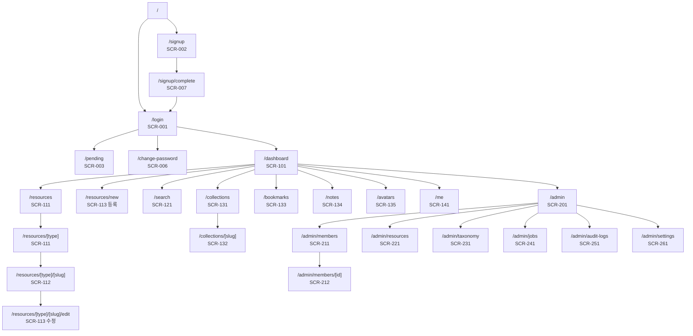
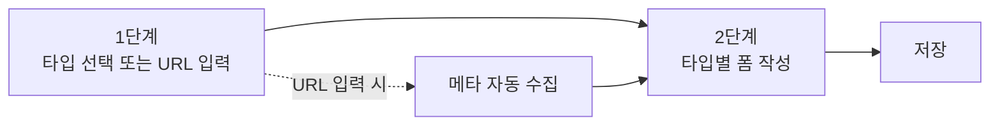

# 03. 화면 정의 · IA

| 항목 | 내용 |
| --- | --- |
| 문서 ID | DEV-03 |
| 버전 | v0.7 |
| 상태 | Draft |
| 최종 수정 | 2026-09-02 |

> UI 컴포넌트 규약과 shadcn 블록 도입 절차는 [DEV-04 UI 디자인 가이드](04_UI_디자인_가이드.md)에 있습니다.
> 이 문서는 **어떤 화면이 있고 각 화면에 무엇이 있는가**만 정의합니다.

---

## 3.1 영역 구분

시스템은 세 영역으로 나뉩니다. 영역마다 레이아웃과 접근 조건이 다릅니다.

| 영역 | 라우트 그룹 | 레이아웃 | 접근 조건 |
| --- | --- | --- | --- |
| 공개 | `(public)` | 중앙 정렬 단일 카드 | 비로그인 허용 |
| 서비스 | `(service)` | 사이드바 + 헤더 (`dashboard-01`) | `ACTIVE` 회원 |
| 관리자 | `(admin)` | 사이드바 + 헤더 (관리자 메뉴) | `ACTIVE` + `ADMIN` |

---

## 3.2 사이트맵



---

## 3.3 라우트 표

| 화면 ID | 경로 | 화면명 | 권한 | 렌더링 |
| --- | --- | --- | --- | --- |
| — | `/` | 진입점 (로그인 여부에 따라 리다이렉트) | 전체 | 서버 리다이렉트 |
| SCR-001 | `/login` | 로그인 | GUEST | 서버 + 클라이언트 폼 |
| SCR-002 | `/signup` | 회원가입 | GUEST | 서버 + 클라이언트 폼 |
| SCR-007 | `/signup/complete` | **가입 신청 완료** | GUEST | 서버 |
| SCR-003 | `/pending` | 승인 대기 안내 | PENDING | 서버 |
| SCR-006 | `/change-password` | 초기 비밀번호 변경 | 로그인 + 강제 플래그 | 클라이언트 폼 |
| SCR-101 | `/dashboard` | 서비스 대시보드 | MEMBER+ | 서버 |
| SCR-111 | `/resources`, `/resources/[type]` | 자료 목록 | MEMBER+ | 서버 + 클라이언트 필터 |
| SCR-112 | `/resources/[type]/[slug]` | 자료 상세 | MEMBER+ | 서버 |
| SCR-113 | `/resources/new`, `/resources/[type]/[slug]/edit` | 자료 등록·수정 | MEMBER+ (수정은 소유·EDITOR+) | 클라이언트 폼 |
| SCR-121 | `/search` | 검색 결과 | MEMBER+ | 서버 |
| SCR-131 | `/collections` | 컬렉션 목록 | MEMBER+ | 서버 |
| SCR-132 | `/collections/[slug]` | 컬렉션 상세 | MEMBER+ | 서버 |
| SCR-133 | `/bookmarks` | 내 북마크 | MEMBER+ | 서버 |
| SCR-134 | `/notes` | 나의 노트 (`FR-NOTE-001`) | MEMBER+ | 서버 + 클라이언트 레이어 |
| SCR-135 | `/avatars` | 아바타 | MEMBER+ | 서버 |
| SCR-141 | `/me` | 마이페이지 | MEMBER+ | 서버 + 탭 |
| SCR-201 | `/admin` | 관리자 대시보드 | ADMIN | 서버 |
| SCR-211 | `/admin/members` | 회원 관리 | ADMIN | 서버 + 테이블 |
| SCR-212 | `/admin/members/[id]` | 회원 상세 | ADMIN | 서버 |
| SCR-221 | `/admin/resources` | 자료 관리 · 휴지통 | ADMIN | 서버 + 테이블 |
| SCR-231 | `/admin/taxonomy` | 분류 · 콘텐츠 타입 관리 | ADMIN | 서버 + 탭 |
| SCR-241 | `/admin/jobs` | 수집 작업 모니터 | ADMIN | 서버 (자동 갱신) |
| SCR-251 | `/admin/audit-logs` | 감사 로그 | ADMIN | 서버 + 테이블 |
| SCR-261 | `/admin/settings` | 시스템 설정 | ADMIN | 클라이언트 폼 |
| SCR-901 | `/403` | 접근 권한 없음 | 전체 | 정적 |
| SCR-902 | `/404`, `/error` | 오류 | 전체 | 정적 |

---

## 3.4 공통 레이아웃

### 서비스 영역 (`dashboard-01` 기반)

```
┌───────────────────────────────────────────────────────────────┐
│ [메뉴]│ 대시보드 › 자료 › MCP 서버 ›  Filesystem MCP Server    │  헤더 (한 줄)
│       │                        [ 검색 Ctrl+K ] [알림] [테마]  │
├──────────────┬────────────────────────────────────────────────┤
│ 사이드바      │                                                │
│              │  ┌──────────────────────────────────────────┐  │
│ 대시보드     │  │                                          │  │
│              │  │           페이지 콘텐츠                    │  │
│ 자료         │  │                                          │  │
│  · 전체      │  │                                          │  │
│  · AI 자료   │  └──────────────────────────────────────────┘  │
│  · GitHub    │                                                │
│  · MCP 서버  │                                                │
│  · Skill     │                                                │
│  · 개발 노트 │                                                │
│  · 프롬프트  │                                                │
│              │                                                │
│ 내 서재      │                                                │
│  · 컬렉션    │                                                │
│  · 북마크    │                                                │
│ ─────────    │                                                │
│ 관리자*      │                                                │
├──────────────┤                                                │
│ [사용자 카드] │                                                │
└──────────────┴────────────────────────────────────────────────┘
```

| 요소 | 동작 |
| --- | --- |
| 사이드바 자료 메뉴 | `content_type_settings.show_in_nav = true` 인 타입만 `sort_order` 순으로 렌더 |
| **빵부스러기 + 타이틀** | **모든 로그인 화면 공통.** 사이드바 토글 오른쪽, **헤더 한 줄**에 둔다. 경로에서 자동으로 만들고, 자료 제목·회원 이름 같은 동적 세그먼트는 라벨 맵으로 치환한다 ([DEV-06 · 6.7절](06_폴더_구조_규약.md)). 목록 화면도 예외가 아니다 |
| 타이틀 = 마지막 조각 | **빵부스러기의 마지막 조각이 곧 페이지 타이틀이며 그 문서의 유일한 `<h1>`** 이다. 본문에 같은 제목을 다시 두지 않는다 (같은 글자가 두 번 나오고 `h1` 이 둘이 된다) |
| 본문 첫 줄 | 타이틀을 뺀 나머지 — **설명 · 건수 · 액션 버튼**만 남는다 (`PageHeader`) |
| 좁은 화면 | `md` 미만에서는 조상 조각을 감추고 **현재 페이지 이름만** 남긴다. 긴 이름은 잘리고 `title` 로 전체를 본다 |
| 관리자 메뉴 | `ADMIN` 에게만 노출 |
| 검색 | 헤더 클릭 또는 `Ctrl+K` (⌘K) → 커맨드 팔레트 |
| 알림 벨 | 안 읽은 개수 배지 |
| 테마 토글 | 라이트 / 다크 / 시스템 |
| 사용자 카드 | 이름·역할 표시. 클릭 시 마이페이지·로그아웃 |
| 사이드바 접기 | 상태를 쿠키에 저장해 새로고침 후에도 유지 |
| 모바일 | 사이드바는 Sheet(오버레이)로 전환 |

### 관리자 영역

같은 골격에 사이드바 메뉴만 교체합니다.
`대시보드 / 회원 관리 / 자료 관리 / 분류 관리 / 작업 모니터 / 감사 로그 / 시스템 설정` + 최상단 **"서비스로 돌아가기"**.
관리자 영역임을 알리는 상단 색상 띠를 둡니다.

> **관리자 영역은 아직 타이틀이 본문에 있습니다.** 헤더 한 줄 규칙은 서비스 영역에만 적용했습니다.
> 관리자도 옮기면 `SiteHeader` 의 `title` prop 과 `PageHeader` 의 `title` prop 을 함께 제거합니다.

---

## 3.5 공개 영역 화면

### SCR-001 로그인

- **기반:** shadcn `login-03` 블록
- **구성:** 로고 · "QueenBee" 타이틀 / **아이디** / 비밀번호 / 로그인 상태 유지 체크박스 / 로그인 버튼 / "계정이 없으신가요? 회원가입"
- **소셜 로그인 버튼은 제거합니다.** (자체 인증만 사용 — `DEC-002`)
- **"비밀번호를 잊으셨나요?" 링크는 두지 않습니다.** 대신 하단에 안내 문구를 둡니다 —
  *"비밀번호를 잊으셨다면 관리자에게 초기화를 요청하세요."* (`DEC-014`·`DEC-015`)
- 아이디 입력에 `autocomplete="username"`, 비밀번호에 `autocomplete="current-password"` 를 지정합니다

| 상태 | 표시 |
| --- | --- |
| 인증 실패 | Alert(destructive) — "아이디 또는 비밀번호가 올바르지 않습니다." |
| 승인 대기 | 로그인 성공 후 `/pending` 이동 |
| 거부됨 | Alert — "가입이 거부되었습니다." + 사유 |
| 정지됨 | Alert — "이용이 정지된 계정입니다." + 문의 안내 |
| 잠금 | Alert — "로그인 시도가 너무 많습니다. N분 후 다시 시도해 주세요." |
| 제출 중 | 버튼 스피너 + 비활성화 |

### SCR-002 회원가입

- **기반:** `login-03` 레이아웃 재사용 (카드 폭만 확대)
- **필드:** **아이디\*** / 비밀번호\* / 비밀번호 확인\* / 이름\* / 소속 팀\* / 가입 사유(200자) / 개인정보 수집·이용 동의\*
- 아이디 입력 아래에 규칙 안내: *"영문 소문자·숫자·`_`·`.` 4~20자"*
- 아이디 중복 검사는 blur 시점에 수행하고 `사용 가능` / `이미 사용 중` 을 인라인 표시
- 비밀번호 강도 표시기
- 제출 성공 → **`/signup/complete`** (`SCR-007`)

### SCR-007 가입 신청 완료

가입 폼 제출 직후에 보여줍니다. **바로 `/pending` 으로 보내지 않는 이유**는, 신청이 접수됐다는
사실과 다음에 무슨 일이 일어나는지를 한 번 짚어주기 위해서입니다.

| 요소 | 내용 |
| --- | --- |
| 헤드라인 | "가입 신청이 접수되었습니다" |
| 진행 단계 | ① 가입 신청(완료) → ② 관리자 승인(영업일 1일 이내) → ③ 이용 시작 |
| 안내 박스 | **"승인 결과는 메일로 보내지 않습니다. 로그인해서 확인해 주세요"** (`DEC-015`) |
| 버튼 | `로그인 화면으로`(주) · `상태 확인`(→ `/pending`) |

> 메일을 쓰지 않으므로(`DEC-015`) **사용자가 직접 확인해야 한다는 점을 여기서 분명히 알립니다.**
> 이 안내가 없으면 "메일이 안 온다"는 문의가 생깁니다.

### SCR-003 승인 대기

- 큰 아이콘 + "관리자 승인을 기다리고 있습니다"
- 신청 일시, 신청 **아이디** 표시
- 안내 문구: *"승인되면 이 화면에서 바로 이용할 수 있습니다. 아래 버튼으로 상태를 확인하세요."*
  (메일을 보내지 않으므로 사용자가 직접 확인해야 합니다 — `DEC-015`)
- 버튼: `상태 새로고침`(주 액션), `로그아웃`
- 거부 상태로 바뀌면 이 화면 대신 사유를 안내

---

## 3.6 서비스 영역 화면

### SCR-101 대시보드

- **기반:** shadcn `dashboard-01` 블록의 통계 카드 + 차트 + 테이블 골격
- 사이드바 메뉴 이름도 **"대시보드"** 입니다 (구 "홈")
- **이 화면의 목적은 «팀이 뭘 모았는지 훑는 것» 하나입니다.** 할 일 배너와 입력창을 얹지 않습니다

| 영역 | 내용 |
| --- | --- |
| 인사말 | "안녕하세요, {이름}님" + 전체 자료 건수 한 줄. **제목이 아니라 인사이므로 heading 으로 두지 않는다** (이 화면의 `h1` 은 헤더의 «대시보드») |
| 통계 카드 4개 | 전체 자료 / 이번 주 신규 / 내 북마크 / 내가 등록한 자료 |
| 차트 | 최근 14일 자료 등록 추이 (**수집 경로별** WEB · MCP) |
| 인기 자료 | 최근 30일 조회 상위 5건 |
| 최근 자료 | 최신 등록 6건 (카드 그리드) + `전체 보기` |

**여기에 두지 않는 것**

| 뺀 것 | 간 곳 · 이유 |
| --- | --- |
| URL 빠른 등록 (`FR-RES-005`) | **`SCR-113` 등록 화면 상단으로 옮겼습니다.** 등록하러 온 사람만 보면 되는 입력창입니다 |
| 승인 대기 N건 배너 | **`SCR-201` 관리자 대시보드에만** 둡니다. 서비스 화면에서 관리자 할 일을 알릴 이유가 없습니다 |
| 최근 본 자료 5건 | 조회 이력 저장이 필요합니다. **M3 이후** 로 미룹니다 |

### SCR-111 자료 목록

경로: `/resources` (전체) · `/resources/[type]` (타입별)

| 영역 | 내용 |
| --- | --- |
| 헤더 | 타입 라벨 + 설명 + 총 건수 + `자료 등록` 버튼 |
| 필터 바 | 검색어 / 카테고리 Select / 태그 멀티 Select / 작성자 / 기간 / 상태(EDITOR+) |
| 정렬 | 최신순 · 조회순 · 북마크순 · 제목순 |
| 뷰 전환 | 카드 ↔ 테이블 (선택 유지) |
| 목록 | 카드 그리드 (3열 / 반응형) 또는 데이터 테이블 |
| 페이지네이션 | 커서 기반 `더 보기` — 남은 건수를 버튼에 함께 적는다 (한 번에 9건) |

**자료 카드 구성**

```
┌────────────────────────────────┐
│ [타입 배지]           [북마크]  │
│ 제목 (2줄까지)                  │
│ 요약 (2줄까지)                  │
│ #태그 #태그 #태그               │
│ ─────────────────────────────  │
│ 등록자 · 3일 전 · 조회 24       │
└────────────────────────────────┘
```

배지는 **콘텐츠 타입 하나뿐**입니다. 검수 상태 같은 것은 두지 않습니다 (`DEC-029`).

타입별로 카드 하단 한 줄이 달라집니다. (레지스트리의 `Card` 컴포넌트 — [REQ-04 · 4.9절](../01.요구사항/04_콘텐츠_도메인_모델.md))

| 타입 | 카드 추가 정보 |
| --- | --- |
| AI 자료 | 자료 형식 배지 · 출처 · 발행일 |
| GitHub | ⭐ 스타 수 · 주 언어 · 라이선스 · 아카이브 배지 |
| MCP 서버 | transport 배지 · 사용 상태 배지 |
| Skill | 대상 클라이언트 · 사용 상태 배지 |
| 개발 노트 | 노트 종류 배지 · 관련 프로젝트 |
| 프롬프트 | 대상 모델 · 용도 배지 |

**빈 상태:** "아직 등록된 자료가 없습니다" + `첫 자료 등록하기` 버튼
**필터 결과 없음:** "조건에 맞는 자료가 없습니다" + `필터 초기화`
**검색어가 있는데 결과 없음:** "«{검색어}» 로 찾은 자료가 없습니다. 직접 등록해 두면 다음 사람이 찾습니다." + `이 주제로 자료 등록하기`
— 빈 화면을 **등록 동선으로 되돌리는 것**이 이 시스템의 목적에 맞습니다.

### SCR-112 자료 상세

2단 레이아웃 (본문 2/3 + 사이드 1/3).

| 영역 | 내용 |
| --- | --- |
| 상단 | **제목과 경로는 헤더 빵부스러기가 담당** (3.4절). 본문 상단에는 타입 배지 / 요약만 둔다 |
| 액션 | 원본 열기 · 북마크 · 컬렉션에 담기 · 공유(링크 복사) · 수정 · 삭제 |
| 본문 | 마크다운 렌더링 (목차 자동 생성) |
| 타입별 블록 | 레지스트리의 `Detail` 컴포넌트 |
| 첨부 | 파일 목록 + 다운로드 |
| 관련 자료 | 연결된 자료 카드 |
| 사이드 | 메타 정보(등록자·등록일·수정일·조회수·카테고리·태그), 변경 이력, 같은 태그 자료 |

**타입별 상세 블록**

| 타입 | 블록 |
| --- | --- |
| GitHub | 저장소 정보 표(스타·포크·언어·라이선스·최근 커밋) / README 렌더링 / **아카이브 카드**(상태·크기·다운로드·다시 받기) / 원본 소실 경고 |
| MCP 서버 | 설치 명령(복사 버튼) / 설정 JSON(복사 버튼) / 환경변수 표 / 제공 도구 목록 / 클라이언트별 설치 탭 |
| Skill | Skill 정의 코드 블록(전체 복사 · `.md` 다운로드) / 트리거 조건 / 사용 예시 |
| AI 자료 | 핵심 요약 / **사내 적용 아이디어** 강조 박스 / 저자 · 발행일 · 예상 소요 시간 |
| 개발 노트 | 노트 종류 / 관련 프로젝트 / 발생일 |

### SCR-113 자료 등록 · 수정

**2단계 흐름**



| 단계 | 내용 |
| --- | --- |
| 0단계 | **URL 빠른 등록 카드** — 붙여넣으면 타입을 추정해 보여준다 (`FR-RES-005`). 등록 화면 최상단 |
| 1단계 | 타입 카드 선택 (아이콘 + 라벨 + 설명) / 또는 URL 입력 후 자동 판별 |
| 2단계 공통 | 제목* / 요약 / 본문(마크다운 에디터, 미리보기 탭) / 원본 URL / 카테고리 / 태그 / 공개 범위 / 첨부 |
| 2단계 타입별 | 레지스트리의 `Form` 컴포넌트 |
| 하단 | `임시 저장` / `취소` / `등록` |

- 중복 URL 감지 시 다이얼로그로 기존 자료를 보여주고 이동/계속 선택
- 미저장 상태로 이탈 시 확인 다이얼로그
- 검증 오류는 필드 하단에 텍스트로 표시 + 첫 오류 필드로 스크롤

### SCR-121 검색 결과

- 상단 검색 입력 + 결과 건수
- 좌측 패싯 필터: 타입별 건수 / 카테고리별 건수 / 상위 태그
- 결과 목록: 제목·요약에 검색어 하이라이트
- 결과 없음: "검색 결과가 없습니다" + 추천 태그 + `이 주제로 자료 등록하기`

### SCR-131 / SCR-132 컬렉션

| 화면 | 내용 |
| --- | --- |
| 목록 | 내 컬렉션 + 팀 공개 컬렉션 탭. 카드에 커버·이름·자료 수·소유자 |
| 상세 | 컬렉션 설명 + 담긴 자료 목록(순서대로) + 자료별 메모 + 순서 변경(소유자) |

### SCR-133 내 북마크

자료 목록과 동일한 UI. 필터·정렬 그대로 사용, 대상만 북마크한 자료로 한정.

### SCR-134 나의 노트 (`FR-NOTE-001`~`005`)

나만 보는 메모. 목록은 카드 격자, 여는 것은 `?note=<id>` 레이어입니다.
「노트 / 휴지통」 두 탭이고, **휴지통은 자동으로 비우지 않습니다** —
「30일 뒤 조용히 사라지는 것」이 이 기능이 생긴 이유이기 때문입니다.

### SCR-135 아바타

만들어 둔 캐릭터를 모아 보는 화면. 카드마다 그림 · 이름 · 한 줄 설명 ·
쓰인 색 셋 · 만든 날입니다.

| 항목 | 내용 |
| --- | --- |
| 목록의 정본 | **코드** — `features/avatars/catalog.ts` 와 `public/avatars/*`. DB 표를 두지 않습니다 (`DEC-032` 와 같은 이유: 표현물은 코드) |
| 그림 규칙 | [`ip-as-logo`](https://github.com/s1dashu/ip-as-logo-skill) 스킬 — 큰 도형 4~7개 · 색 둘 · 뾰족한 끝과 윤곽선 없음 · **32px 로 줄여도 알아볼 것** |
| **배경·테두리 없음** | 스킬은 「배경색으로 정사각형을 꽉 채우라」고 하지만 **여기서는 벗어납니다.** 아바타는 «색 원판에 든 그림»이 아니라 **캐릭터 모양 그 자체**입니다. 따라서 그림은 배경 없이 전신을 담고, 화면은 자르지 않고(`object-contain`) 링도 두르지 않습니다 — `ui/avatar` 를 **쓰지 않는** 이유입니다(그 컴포넌트의 일이 동그랗게 자르고 테두리를 두르는 것이므로) |
| 밝고 어두운 화면 | 배경이 없으므로 그림이 두 테마 위에 그대로 놓입니다. **새까만 덩어리를 크게 두지 않습니다** — 다크 모드에서 그 부분이 사라집니다 |
| 움직임 | **그림 파일 «안»에** 둡니다(SVG 의 CSS). 화면 쪽에 두면 이 그림을 다른 데 쓸 때 움직임이 안 따라옵니다. 넷뿐입니다 — 깡충 · 귀 · 꼬리 · 깜빡임. `prefers-reduced-motion` 을 켠 사람에게는 **전부 정지**하고, 그때도 «가만히 서 있는 강아지»로 온전해야 합니다 |
| **잡아서 던지기** | 카드의 그림 자리가 곧 **물리 놀이터**입니다 (`DEC-066`, matter-js). 잡아 끌면 따라오고, 놓으면 떨어져 벽·바닥에 부딪히고, **오뚝이처럼 다시 일어섭니다.** 큰 놀이터를 화면 위에 따로 두지 않는 이유는 아바타가 늘었을 때 「누가 거기 있는가」를 또 골라야 하기 때문입니다 |
| **화면 전체로** | 상자에서 꺼내 **브라우저 창 전체**를 무대로 씁니다(포털 + `fixed inset-0`). 그 판은 `pointer-events: none` 이라 **밑에 있는 앱은 그대로 쓸 수 있고**, 강아지 그림에만 포인터를 되살립니다. 「모니터 전체」는 `requestFullscreen` 입니다 — **다른 프로그램 위로까지 나가는 것은 웹 페이지가 할 수 없습니다**(그건 데스크톱 앱의 영역) |
| 아직 없는 것 | 「내 프로필로 쓰기」. 지금은 **보여 주기만** 합니다 — 프로필에 붙이는 것은 `users` 에 열이 생기는 일이라 그때 요구사항으로 답니다 |

### SCR-141 마이페이지

탭 구성:

| 탭 | 내용 |
| --- | --- |
| 프로필 | 이름·소속·자기소개·프로필 이미지 수정 (**아이디는 읽기 전용**) |
| 보안 | 비밀번호 변경, 활성 세션 목록·개별 로그아웃, **API 키 관리** |
| 내 활동 | 내가 등록한 자료 / 내 컬렉션 / 북마크 |
| 알림 | 인앱 알림 수신 설정 + 최근 알림 목록 (**계정 탭과 합치지 않는다**) |
| 계정 | 가입일·역할·상태 표시, 탈퇴 |

- 알림 탭에는 **"메일이나 메신저로는 보내지 않는다"** 는 문장을 둡니다 (`DEC-015`)
- 탈퇴 카드에는 결과를 미리 적습니다 — *"등록한 자료는 남고 작성자 표기만 «탈퇴한 사용자»로 바뀝니다.
  아이디는 재사용할 수 없습니다."* (`DEC-021`)

**보안 탭 — API 키 관리** (`FR-USER-008`, [DEV-08 · 8.6절](08_자료수집_파이프라인.md))

| 요소 | 내용 |
| --- | --- |
| 안내 | "Claude Code에서 QueenBee에 자료를 등록하려면 API 키가 필요합니다" + 설정 방법 링크 |
| 목록 | 이름 · `qb_live_a1b2…` prefix · 스코프 배지 · 생성일 · 마지막 사용 · 만료일 · `폐기` |
| 발급 | 이름 입력 + 스코프 체크박스 → 발급 |
| 발급 결과 | **전체 키를 한 번만** 보여주는 다이얼로그. 복사 버튼 + "다시 볼 수 없습니다" 경고 + MCP 설정 JSON 스니펫 |
| 제한 | 5개 초과 시 발급 버튼 비활성 + 사유 표시 |
| 폐기 | `AlertDialog` 확인 후 즉시 적용 |
| 미사용 경고 | 90일 이상 미사용 키에 `사용 안 함` 배지 |

---

## 3.7 관리자 영역 화면

### SCR-201 관리자 대시보드

| 영역 | 내용 |
| --- | --- |
| 경고 배너 | 승인 대기 N건 / 실패 작업 N건 / **디스크 여유 부족** (`NFR-BACKUP-007`) |
| 통계 카드 | 전체 회원 · 승인 대기 · 전체 자료 · 스토리지 사용량 + **디스크 여유** |
| 차트 | 최근 30일 가입 추이 / 자료 등록 추이 (**경로별 WEB·MCP 구분**) |
| 최근 활동 | 감사 로그 최신 10건 |
| 작업 현황 | 큐 대기·실행·실패 건수 |

### SCR-211 회원 관리

| 영역 | 내용 |
| --- | --- |
| 탭 | 승인 대기 (배지) / 전체 / 정지 / 탈퇴 |
| 필터 | 검색(이름·이메일) / 역할 / 상태 / 가입일 |
| 테이블 | 체크박스 · 이름 · 이메일 · 소속 · 역할 · 상태 · 가입일 · 최근 로그인 · 액션 |
| 일괄 처리 | 선택 후 `일괄 승인` (최대 50건) |
| 행 액션 | 승인 / 거부 / 정지 / 해제 / 역할 변경 / 비밀번호 초기화 / 상세 |

- **탈퇴 탭**에는 이름을 가린 채(`최**`) 보여주고, *"아이디는 재사용할 수 없습니다"* 를 함께 적습니다 (`DEC-021`)
- 거부·정지는 사유 입력 다이얼로그(10자 이상)를 거칩니다
- 처리 결과는 토스트로 알리고 테이블을 갱신합니다
- 마지막 관리자 보호에 걸리면 사유를 담은 오류 토스트를 띄웁니다

### SCR-212 회원 상세

- 프로필 요약(아이디·이름·소속) / 상태·역할 변경 패널
- 활동: 등록한 자료 수(**경로별 WEB·MCP**), 최근 등록 자료, 컬렉션
- **API 키**: 발급 목록(prefix·스코프·마지막 사용) + `전체 강제 폐기` (`FR-ADM-016`)
- 이력: 상태 변경 이력, 로그인 이력(최근 20건), 관련 감사 로그

### SCR-221 자료 관리 · 휴지통

| 탭 | 내용 |
| --- | --- |
| 전체 자료 | 타입·작성자·상태 필터, 강제 수정·삭제 |
| 휴지통 | 삭제일·삭제자 표시, 복구 / 영구 삭제 (확인 다이얼로그에 제목 입력 요구) |

### SCR-231 분류 · 콘텐츠 타입 관리

| 탭 | 내용 |
| --- | --- |
| 카테고리 | 트리 편집(드래그 정렬), 생성·수정·삭제(자료 이관 선택) |
| 태그 | 사용 횟수 정렬, 이름 변경, **병합**, 미사용 태그 일괄 삭제 |
| 콘텐츠 타입 | 활성 여부 · 라벨 · 아이콘 · 사이드바 노출 · 순서 (스키마는 코드에 있음을 안내 문구로 표시) |

### SCR-241 수집 작업 모니터

| 영역 | 내용 |
| --- | --- |
| 요약 | 큐별 대기·실행·완료·실패 건수 |
| 필터 | 유형 / 상태 / 기간 |
| 목록 | 유형 · 대상 자료 · 상태 · 시도 횟수 · 소요 시간 · 요청자 · 오류 |
| 액션 | 실패 작업 재실행 / 대기 작업 취소 |
| GitHub | 남은 API 호출 수와 리셋 시각 표시 |
| 갱신 | 10초 간격 자동 새로고침 (토글 가능) |

### SCR-251 감사 로그

- 필터: 기간 · 행위자 · 행위 유형 · 대상 유형 · **경로(WEB / MCP)**
- 목록: 시각 · 행위자 · 경로 배지 · 행위 · 대상 · 요약 · IP
- **변경 전후(diff)가 기록된 행만** 펼칠 수 있게 하고, 펼침 아이콘으로 구분합니다.
  전(빨강·취소선) → 후(초록)를 필드별 한 줄로 보여줍니다
- CSV 내보내기 / 보존 기간 1년 안내 문구

### SCR-261 시스템 설정

| 섹션 | 항목 |
| --- | --- |
| 가입 | **신규 가입 허용 여부** (이메일 도메인 제한 없음 — `DEC-014`) |
| 업로드 | 파일 최대 크기, 아카이브 최대 크기, 허용 확장자 |
| **디스크** | 최소 여유 용량 임계치, 현재 여유 표시, 초과 시 아카이브 차단 (`NFR-BACKUP-007`) |
| GitHub | 토큰 설정 여부(값은 표시하지 않음), 메타 갱신 주기 |
| **수집** | Ingest API 사용 여부, 키당 레이트리밋 |
| 공지 | 전체 배너 문구 · 노출 기간 |
| 보관 | 휴지통 보관 일수, 감사 로그 보존 기간 |

> 알림 발송 채널 설정은 없습니다. 인앱 알림만 사용합니다 (`DEC-015`).

- 저장 시 확인 다이얼로그 + 감사 로그 기록
- 비밀값은 **설정됨/미설정**만 표시하고 재입력만 허용합니다

---

## 3.8 공통 상태 정의

모든 목록·상세 화면은 아래 4가지 상태를 반드시 정의합니다. (`NFR-A11Y-006`)

| 상태 | 처리 |
| --- | --- |
| 로딩 | Skeleton (스피너 단독 사용 금지). 레이아웃 이동이 없어야 함 |
| 비어 있음 | 아이콘 + 설명 + 다음 행동 버튼 |
| 오류 | 오류 메시지 + `다시 시도` 버튼. 기술적 상세는 숨김 |
| 권한 없음 | `/403` 또는 인라인 안내. 기능 존재 자체를 숨기지 않고 안내 |

### 토스트 문구 규칙

| 상황 | 문구 |
| --- | --- |
| 저장 성공 | "저장했습니다." |
| 삭제 성공 | "삭제했습니다." + `실행 취소` 액션(5초) |
| 승인 성공 | "N명을 승인했습니다." |
| 실패 | "처리하지 못했습니다. 잠시 후 다시 시도해 주세요." |
| 복사 | "클립보드에 복사했습니다." |

---

## 3.9 변경 이력

| 날짜 | 버전 | 내용 |
| --- | --- | --- |
| 2026-08-28 | v0.1 | 최초 작성 |
| 2026-08-28 | v0.2 | 로그인·회원가입을 **아이디 기반**으로 개정하고 비밀번호 재설정 화면(`SCR-004`·`SCR-005`) 제거(`DEC-014`·`DEC-015`), 마이페이지 보안 탭에 **API 키 관리** 추가(`FR-USER-008`), 목록·상세·관리자 대시보드에 **검수 대기** 반영(`FR-RES-017`), 시스템 설정에 디스크·수집 섹션 추가 |
| 2026-08-28 | v0.3 | **`SCR-007` 가입 신청 완료** 화면 신설 — 승인 절차와 «메일을 보내지 않는다»는 점을 여기서 알린다 (`DEC-015`) |
| 2026-08-28 | v0.4 | UI 구현 결과 반영: 사이드바 **«홈» → «대시보드»**, `SCR-101` 에서 **URL 빠른 등록을 `SCR-113` 으로 이동**하고 승인 대기 배너 삭제(관리자 대시보드에만 유지), «최근 본 자료»는 M3 이후로 미룸, **빵부스러기를 공통 요소로 명시**(목록 화면 포함), `SCR-141` 알림 탭 분리(5탭), `SCR-211` 탈퇴 탭 규칙, `SCR-251` diff 펼침 규칙, 프롬프트 타입 추가 |
| 2026-08-28 | v0.5 | **빵부스러기와 페이지 타이틀을 헤더 한 줄로 이동**(3.4절) — 마지막 조각이 곧 타이틀이자 문서의 유일한 `h1`, 본문은 설명·건수·액션만. `SCR-112` 상단에서 제목·브레드크럼 제거, `SCR-101` 인사말을 heading 에서 내림. **서비스 영역에만 적용**, 관리자는 다음 단계 |
| 2026-08-28 | v0.6 | **검수 폐기 반영**(`DEC-029`) — `SCR-111` 검수 필터·배지, `SCR-112` 검수 완료 액션, `SCR-201` 검수 배너, `SCR-261` 검수 자동 부여 설정 제거. 자료 카드 ASCII 의 이모지도 텍스트 라벨로 교체 |
| 2026-09-02 | v0.7 | **`SCR-135` 아바타** 신설(내 서재). 그리고 **표에 없던 `SCR-134` 나의 노트를 뒤늦게 등재** — 코드에만 있고 사이트맵·라우트 표 어디에도 없었습니다 |
