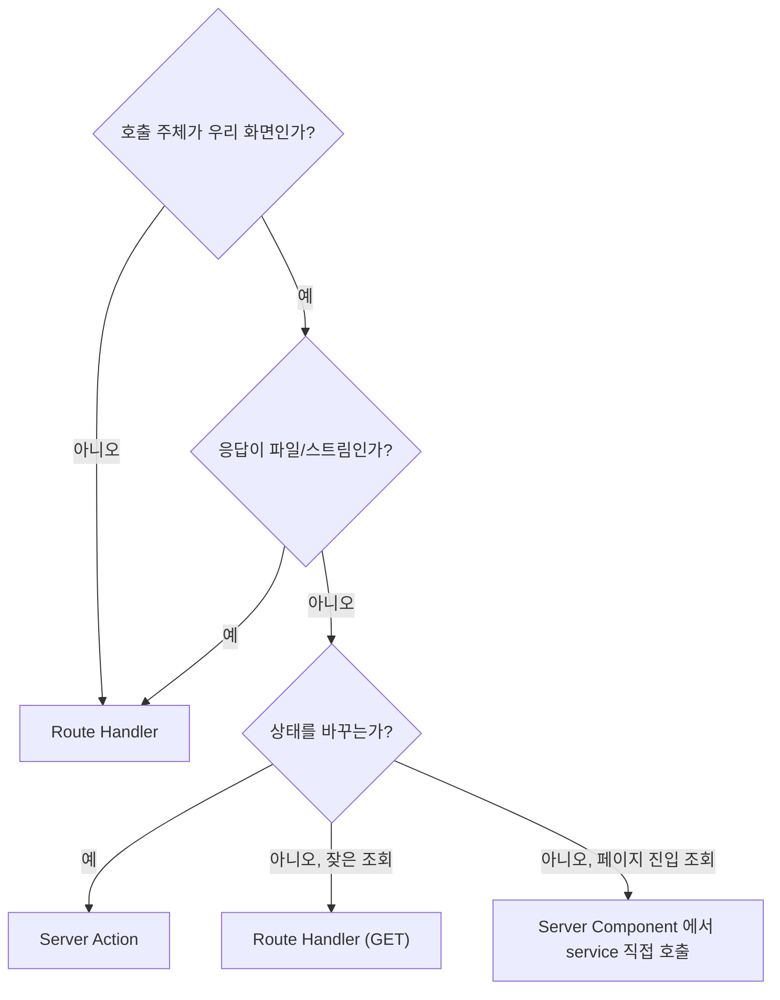
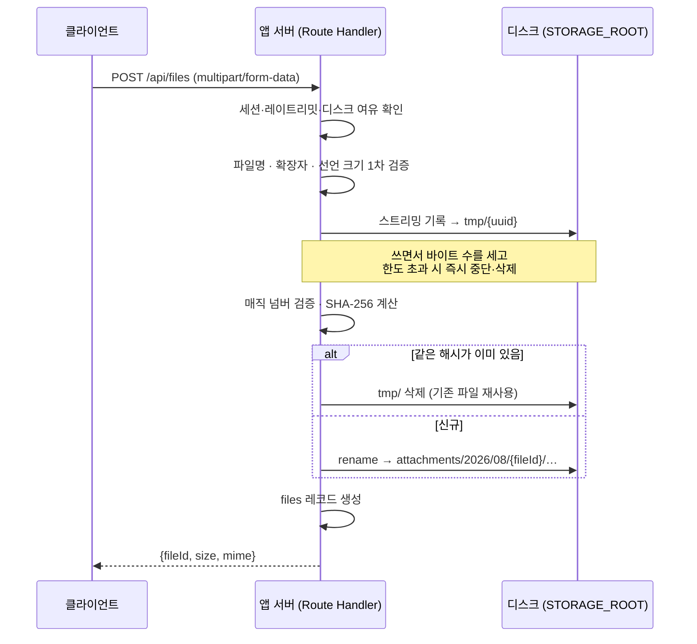

# 05. API 설계

| 항목 | 내용 |
| --- | --- |
| 문서 ID | DEV-05 |
| 버전 | v0.6 |
| 상태 | Draft |
| 최종 수정 | 2026-08-28 |

---

## 5.1 Server Action vs Route Handler

Next.js App Router에서는 두 가지 방법이 있습니다. **판단 기준을 먼저 고정**합니다.

| 상황 | 선택 |
| --- | --- |
| 우리 화면에서 폼을 제출한다 | **Server Action** |
| 우리 화면에서 버튼 하나로 상태를 바꾼다 | **Server Action** |
| 파일을 스트리밍해서 내려준다 | **Route Handler** |
| 외부 시스템이 호출한다 (웹훅, 헬스체크) | **Route Handler** |
| 클라이언트에서 검색어를 치는 중 실시간으로 조회한다 | **Route Handler** (GET) |
| 워커·스크립트에서 호출한다 | **service 직접 호출** (HTTP 거치지 않음) |



---

## 5.2 공통 규약

### Server Action 결과 형식

Server Action은 예외를 던지지 않고 **결과 객체**를 반환합니다. 화면에서 분기하기 쉽게 하기 위해서입니다.

```ts
export type ActionResult<T = void> =
  | { ok: true; data: T }
  | { ok: false; code: ErrorCode; message: string; fieldErrors?: Record<string, string[]> };
```

### Route Handler 응답 형식

```jsonc
// 성공
{ "data": { /* ... */ }, "meta": { "nextCursor": "clx...", "hasMore": true } }

// 실패
{ "error": { "code": "FORBIDDEN", "message": "접근 권한이 없습니다." } }
```

### 에러 코드

| 코드 | HTTP | 의미 |
| --- | :---: | --- |
| `UNAUTHENTICATED` | 401 | 로그인이 필요함 |
| `ACCOUNT_PENDING` | 403 | 승인 대기 상태 |
| `ACCOUNT_BLOCKED` | 403 | 거부·정지·탈퇴 상태 |
| `FORBIDDEN` | 403 | 역할·소유권 부족 |
| `NOT_FOUND` | 404 | 대상 없음 |
| `VALIDATION_ERROR` | 422 | 입력 검증 실패 (`fieldErrors` 포함) |
| `DUPLICATE` | 409 | 중복 (아이디, URL, owner/repo) |
| `INVALID_STATE` | 409 | **대상의 상태가 이 동작을 허용하지 않음** (`DEC-039`). 「PENDING 이 아닌 계정을 승인」·「이미 처리됨」 — 입력은 정확했고 **대상이 달라진 것**이라 `VALIDATION_ERROR`(422)에 넣지 않는다 |
| `RATE_LIMITED` | 429 | 요청 과다 (`Retry-After` 헤더) |
| `PAYLOAD_TOO_LARGE` | 413 | 업로드 용량 초과 |
| `UPSTREAM_ERROR` | 502 | 외부 API 실패 (GitHub 등) |
| `INTERNAL_ERROR` | 500 | 서버 오류 |
| `LAST_ADMIN` | 409 | 마지막 관리자 보호 위반 |

> 사용자에게는 `message` 만 보여줍니다. 스택·SQL·내부 경로는 노출하지 않습니다. (`NFR-SEC-016`)

### 페이지네이션

**커서 기반**만 사용합니다. OFFSET은 쓰지 않습니다. (`NFR-PERF-001`)

| 파라미터 | 설명 |
| --- | --- |
| `cursor` | 직전 응답의 `meta.nextCursor` |
| `limit` | 기본 20, 최대 100 |

커서는 `{createdAt}_{id}` 를 base64로 인코딩한 문자열입니다.

### 목록 공통 쿼리 파라미터

| 파라미터 | 예 | 설명 |
| --- | --- | --- |
| `q` | `rag` | 검색어 |
| `type` | `GITHUB_REPO` | 콘텐츠 타입 |
| `category` | `ai-tools` | 카테고리 slug |
| `tags` | `mcp,agent` | 태그 (AND 조건) |
| `author` | `clx…` | 작성자 ID |
| `from` / `to` | `2026-01-01` | 등록 기간 |
| `status` | `PUBLISHED` | 상태 (EDITOR+ 만 지정 가능) |
| `sort` | `latest` | `latest` / `popular` / `bookmarked` / `title` |

### 레이트 리밋

| 대상 | 제한 |
| --- | --- |
| 로그인 | 계정 5회/10분, IP 20회/10분 |
| 회원가입 | IP 5회/시간 |
| 자료 등록 | 사용자 30회/시간 |
| URL 메타 수집 | 사용자 60회/시간 |
| 아카이브 실행 | 사용자 10회/일 |
| 검색 | 사용자 120회/분 |
| 일반 API | 사용자 300회/분 |

초과 시 429 + `Retry-After`.

---

## 5.3 인증 (자체 구현 — `DEC-030`)

**Auth.js 를 쓰지 않으므로 `/api/auth/[...nextauth]` 핸들러가 없습니다.**
로그인·로그아웃도 다른 폼과 같은 **Server Action** 입니다 (`DEC-009` 판단 기준 그대로).

| ID | 액션 | 권한 | 설명 |
| --- | --- | --- | --- |
| ~~API-001~~ | ~~`/api/auth/[...nextauth]`~~ | — | **폐기** — Auth.js 미도입 (`DEC-030`). 번호는 재사용하지 않는다 |
| API-002 | `signUpAction` | GUEST | 회원가입 신청 (`FR-AUTH-001`) |
| API-003 | `checkUsernameAction` | GUEST | **아이디** 중복 확인 (`FR-AUTH-002`) |
| **API-004** | `signInAction` | GUEST | 로그인 — 시도 제한 확인 → Argon2id 검증 → **세션 재발급** → 쿠키 설정 |
| **API-005** | `signOutAction` | 로그인 | 로그아웃 — `sessions` 행 삭제 + Redis 무효화 + 쿠키 제거 |
| API-006 | `changePasswordAction` | 로그인 | 비밀번호 변경. **성공 시 본인의 다른 세션을 모두 끊는다** |
| **API-007** | `revokeSessionAction` | 본인 | 활성 세션 개별 종료 (`FR-USER-006`) |
| API-008 | `createApiKeyAction` | MEMBER+ | API 키 발급 — **응답에만 전체 키를 담고 저장하지 않는다** (`FR-USER-008`) |
| API-009 | `revokeApiKeyAction` | 본인 / ADMIN | API 키 폐기 |

> 비밀번호 재설정·이메일 인증 액션은 없습니다. 메일을 쓰지 않으므로(`DEC-015`)
> 분실 시 관리자가 초기화합니다 (`API-066`).

---

## 5.4 자료 (Resource)

### Server Actions

| ID | 액션 | 권한 | 설명 |
| --- | --- | --- | --- |
| API-010 | `createResourceAction` | MEMBER+ | 자료 등록 (`FR-RES-004`) |
| API-011 | `updateResourceAction` | 소유자 / EDITOR+ | 자료 수정 |
| API-012 | `deleteResourceAction` | 소유자 / EDITOR+ | 소프트 삭제 |
| API-013 | `restoreResourceAction` | EDITOR+ | 복구 |
| API-014 | `purgeResourceAction` | ADMIN | 영구 삭제 |
| API-015 | `saveDraftAction` | MEMBER+ | 임시 저장 |
| API-016 | `toggleBookmarkAction` | MEMBER+ | 북마크 토글 |
| API-017 | `addRelationAction` / `removeRelationAction` | 소유자 / EDITOR+ | 자료 간 연결 |
| API-018 | `changeStatusAction` | 소유자 / EDITOR+ | `PUBLISHED` ↔ `ARCHIVED` |

### Route Handlers

| ID | 메서드 · 경로 | 권한 | 설명 |
| --- | --- | --- | --- |
| API-020 | `GET /api/resources` | MEMBER+ | 목록 (필터·커서). 무한 스크롤용 |
| API-021 | `GET /api/resources/:id` | MEMBER+ | 단건 조회 |
| API-022 | `GET /api/search` | MEMBER+ | 통합 검색 (커맨드 팔레트용) |
| API-023 | `POST /api/resources/preview-url` | MEMBER+ | URL 메타 미리보기 (`FR-RES-005`) |
| API-024 | `GET /api/resources/check-duplicate` | MEMBER+ | URL 중복 확인 (`FR-RES-011`) |
| API-025 | `POST /api/resources/:id/view` | MEMBER+ | 조회수 기록 (Redis 버퍼) |

**API-023 URL 메타 미리보기**

```jsonc
// 요청
{ "url": "https://github.com/modelcontextprotocol/servers" }

// 응답
{
  "data": {
    "detectedType": "GITHUB_REPO",
    "title": "modelcontextprotocol/servers",
    "summary": "Model Context Protocol Servers",
    "thumbnailUrl": null,
    "detail": { "owner": "modelcontextprotocol", "repo": "servers", "stars": 12345, "license": "MIT" },
    "duplicate": { "exists": false }
  }
}
```

- 3초 안에 응답하지 못하면 `detectedType` 과 `duplicate` 만 채워 반환하고, 나머지는 백그라운드 Job으로 넘깁니다
- SSRF 방어: 사설 IP 대역 차단 (`NFR-SEC-010`)

---

## 5.5 GitHub 연동

| ID | 액션 / 경로 | 권한 | 설명 |
| --- | --- | --- | --- |
| API-030 | `refreshGithubMetaAction` | 소유자 / EDITOR+ | 저장소 메타 재수집 |
| API-031 | `startArchiveAction` | 소유자 / EDITOR+ | 아카이브 작업 등록 (`FR-GH-003`) |
| API-032 | `GET /api/resources/:id/archive` | MEMBER+ | 아카이브 다운로드 (스트림 응답, `Range` 지원) |
| API-033 | `GET /api/github/rate-limit` | ADMIN | 남은 API 호출 수 조회 |

**API-032 동작**

`API-042` 와 같은 다운로드 흐름을 씁니다 (5.6절). 아카이브 파일을 찾아 스트림으로 내려줍니다.
파일명은 `{owner}-{repo}-{sha7}.tar.gz` 형태로 내려 사용자가 무엇을 받았는지 알 수 있게 합니다.

---

## 5.6 파일

| ID | 액션 / 경로 | 권한 | 설명 |
| --- | --- | --- | --- |
| API-040 | `POST /api/files` | MEMBER+ | **파일 업로드** (multipart 스트리밍) |
| API-042 | `GET /api/files/:id` | MEMBER+ | **다운로드** (스트림 응답, `Range` 지원) |
| API-043 | `deleteFileAction` | 소유자 / EDITOR+ | 첨부 삭제 |

> MinIO를 쓰지 않으므로(`DEC-019`) **presigned URL 방식이 없습니다.** 파일이 앱 서버를 통과합니다.
> `API-041 confirmUploadAction` 은 presigned 흐름 전용이라 폐기했습니다. 번호는 재사용하지 않습니다.

### 업로드 흐름



**왜 Server Action이 아니라 Route Handler인가:** Server Action은 본문 크기 제한이 작아
대용량 파일 업로드에 맞지 않습니다. 파일은 Route Handler에서 **스트리밍으로** 받습니다.
([DEC-009](../03.의사결정_및_미해결사항/01_의사결정_기록.md) 판단 기준의 "파일" 갈래)

**업로드 규칙**

| 규칙 | 내용 |
| --- | --- |
| 파서 | busboy 등 **스트리밍 멀티파트 파서**. `request.formData()` 로 통째로 버퍼링하지 않는다 |
| 크기 제한 | 헤더의 선언 크기와 **실제 기록 바이트 수를 모두** 확인한다. 초과 시 즉시 중단하고 `tmp/` 를 지운다 |
| 검증 순서 | 확장자 → MIME → **매직 넘버**. 세 개가 모두 일치해야 통과 (`NFR-SEC-009`) |
| 저장 위치 | 항상 `tmp/{uuid}` 에 먼저 쓰고, 검증 후 `rename` 한다. 같은 볼륨이라 원자적이다 |
| 실패 정리 | 예외·연결 끊김 시 `tmp/` 파일을 반드시 삭제한다 (`finally`) |
| 미완료 파일 | 스케줄 작업이 24시간 지난 `tmp/` 를 청소한다 |
| 디스크 | `DISK_MIN_FREE_GB` 미만이면 업로드를 거부한다 → `DISK_FULL` |

### 다운로드 흐름 (API-042 · API-032)

| 단계 | 내용 |
| --- | --- |
| 1 | 세션 확인 — **로그인하지 않으면 파일에 접근할 수 없다** |
| 2 | `files` 레코드 조회 (없으면 404) |
| 3 | 키 검증 — `path.resolve(STORAGE_ROOT, key)` 가 루트 아래인지 확인 |
| 4 | `Range` 헤더가 있으면 부분 응답(206), 없으면 전체(200) |
| 5 | `createReadStream` 을 그대로 응답 본문으로 흘려보낸다 |

응답 헤더:

```
Content-Type: application/octet-stream        (또는 화이트리스트된 실제 MIME)
Content-Disposition: attachment; filename*=UTF-8''<원본파일명>
Content-Length / Content-Range
Accept-Ranges: bytes
X-Content-Type-Options: nosniff
Cache-Control: private, no-store
```

> **`Range` 를 지원하는 이유:** 아카이브가 최대 500MB입니다. 다운로드가 끊겼을 때
> 처음부터 다시 받게 하면 개발 PC의 대역과 디스크를 반복해서 낭비합니다.

---

## 5.7 분류 · 컬렉션

| ID | 액션 / 경로 | 권한 | 설명 |
| --- | --- | --- | --- |
| API-050 | `GET /api/categories` | MEMBER+ | 카테고리 트리 (Redis 캐시) |
| API-051 | `GET /api/tags` | MEMBER+ | 태그 자동완성 |
| API-052 | `createCollectionAction` | MEMBER+ | 컬렉션 생성 |
| API-053 | `updateCollectionAction` | 소유자 / EDITOR+ | 컬렉션 수정 |
| API-054 | `deleteCollectionAction` | 소유자 / EDITOR+ | 컬렉션 삭제 |
| API-055 | `addToCollectionAction` / `removeFromCollectionAction` | 소유자 / EDITOR+ | 자료 담기·빼기 |
| API-056 | `reorderCollectionAction` | 소유자 / EDITOR+ | 순서 변경 |

---

## 5.8 관리자

| ID | 액션 / 경로 | 권한 | 설명 |
| --- | --- | --- | --- |
| API-079 | `revokeMemberApiKeysAction` | ADMIN | 회원 API 키 강제 폐기 (`FR-ADM-016`) |
| API-060 | `GET /api/admin/members` | ADMIN | 회원 목록 (필터·정렬) |
| API-061 | `approveMembersAction` | ADMIN | 승인 (단건·일괄, 최대 50) |
| API-062 | `rejectMemberAction` | ADMIN | 거부 (사유 필수) |
| API-063 | `suspendMemberAction` | ADMIN | 정지 (사유 필수) + 세션 전체 삭제 |
| API-064 | `reactivateMemberAction` | ADMIN | 정지 해제 |
| API-065 | `changeRoleAction` | ADMIN | 역할 변경 + 세션 갱신 |
| API-066 | `resetMemberPasswordAction` | ADMIN | 임시 비밀번호 발급 |
| API-067 | `forceWithdrawAction` | ADMIN | 강제 탈퇴 |
| API-070 | `updateCategoryAction` 외 | EDITOR+ | 카테고리 CRUD·정렬 |
| API-071 | `mergeTagsAction` | EDITOR+ | 태그 병합 |
| API-072 | `updateContentTypeSettingAction` | ADMIN | 타입 노출 설정 |
| API-073 | `GET /api/admin/jobs` | ADMIN | 작업 목록 |
| API-074 | `retryJobAction` / `cancelJobAction` | ADMIN | 작업 재실행·취소 |
| API-075 | `GET /api/admin/audit-logs` | ADMIN | 감사 로그 조회 |
| API-076 | `GET /api/admin/audit-logs/export` | ADMIN | CSV 내보내기 |
| API-077 | `updateSystemSettingAction` | ADMIN | 시스템 설정 변경 |
| API-078 | `GET /api/admin/stats` | ADMIN | 대시보드 통계 (Redis 캐시 5분) |

**API-061/062/063/064/065 공통 규칙** (`DEC-036`)

- 이 액션들은 **하나의 전이 함수**(`member.service`)를 부릅니다. `users.status`·`users.role` 을
  쓰는 곳은 그 함수뿐입니다 — 상태 변경과 세션 무효화가 갈라지지 않게 하기 위해서입니다.
- 전이 함수는 트랜잭션을 열고 **`pg_advisory_xact_lock`** 을 잡은 뒤 **트랜잭션 안에서**
  마지막 관리자를 재판정합니다 → 위반 시 `LAST_ADMIN`. **판정 시점과 반영 시점이 갈라지면
  두 관리자가 동시에 서로를 강등해 관리자가 0명이 됩니다.**
- 세션 «행» 삭제는 **같은 트랜잭션**, 캐시 무효화(세대 INCR)는 **커밋 후** (`DEC-035`).
- 감사 로그·알림은 **service 가** 남깁니다 (`DEC-038`).
- **일괄 처리는 부분 성공**입니다 (`DEC-039`) — 건별 트랜잭션, `ActionResult<BulkResult>`.

---

## 5.9 시스템

| ID | 경로 | 권한 | 설명 |
| --- | --- | --- | --- |
| API-090 | `GET /api/health` | 전체 | 앱·DB·Redis·스토리지 상태 (`NFR-AVAIL-002`) |
| API-091 | `GET /api/notifications` | MEMBER+ | 내 알림 목록 |
| API-092 | `markNotificationReadAction` | MEMBER+ | 읽음 처리 |

---

## 5.10 구현 규칙

### 모든 Server Action 진입부 형태

```ts
'use server';

export async function updateResourceAction(
  input: UpdateResourceInput
): Promise<ActionResult<{ id: string }>> {
  // 1) 인증 · 인가 — 가장 먼저
  const actor = await requireActor();                    // 미인증/비활성이면 throw
  // 2) 입력 검증 — 클라이언트 검증을 신뢰하지 않는다
  const parsed = updateResourceSchema.safeParse(input);
  if (!parsed.success) return validationError(parsed.error);
  // 3) 소유권 · 역할 검사
  await assertCanEditResource(actor, parsed.data.id);
  // 4) 비즈니스 로직은 service 로 위임 — **감사 로그·알림도 service 가 한다**
  const result = await resourceService.update(parsed.data, actor);
  // 5) 캐시 무효화
  revalidatePath(`/resources/${result.type}/${result.slug}`);
  revalidatePath('/resources');
  return { ok: true, data: { id: result.id } };
}
```

이 **5단계** 순서를 모든 액션에서 지킵니다. 코드 리뷰 시 확인 항목입니다.

> **감사 로그·알림이 액션에 없는 이유** (`DEC-038`): 같은 «자료 등록»이 Server Action ·
> Ingest Route Handler(`API-104`) · 워커 · 스크립트 **네 경로**로 들어옵니다. 진입부에 두면
> 네 번 써야 하고 **한 곳은 반드시 빠집니다.** `FR-AUDIT-001` 의 «예외 없이 기록»은
> **모든 경로가 반드시 지나가는 지점**에서만 보장됩니다.
>
> 게다가 **액션에서는 애초에 쓸 수 없습니다** — `auth.service.signIn` 은
> `USER_SIGNIN_FAILED`·`USER_SIGNIN_BLOCKED` 를 구분해 남기는데 액션은 `AppError` 하나만
> 받습니다. 「비밀번호는 맞았는데 정지 상태였다」를 액션은 알 수 없습니다.
>
> 「service 는 요청 컨텍스트를 쓰지 않는다」(`DEV-06 · 6.6절`)는 깨지지 않습니다 —
> `ip`·`userAgent` 는 **`Actor` 에 실려 파라미터로** 들어옵니다.

> **1단계를 «어차피 proxy 가 막았을 것»이라며 건너뛰면 안 됩니다.** Server Action 은 별도 라우트가
> 아니라 그 경로로 들어오는 POST 라서, `matcher` 가 제외한 경로면 `proxy` 를 건너뜁니다.
> **액션 진입부가 유일한 인가 방어선**입니다 (`DEC-031`, [REQ-02 · 2.9절](../01.요구사항/02_사용자_권한_정책.md)).

### 금지 사항

| 금지 | 이유 |
| --- | --- |
| Server Action 안에서 Prisma 직접 호출 | 로직이 액션에 갇혀 워커에서 재사용할 수 없다 |
| 인가 검사 없이 시작하는 액션 | 액션은 사실상 공개 엔드포인트다 |
| 클라이언트 검증만 믿기 | 요청은 조작될 수 있다 |
| 예외 메시지를 그대로 사용자에게 전달 | 내부 구조가 노출된다 |
| 목록 API에서 `include` 남발 | N+1과 과다 페이로드 |
| `revalidatePath('/')` 남용 | 전체 캐시가 날아간다. 영향 경로만 무효화한다 |

---

## 5.11 Ingest API (CLI 수집)

QueenBee MCP 서버가 호출하는 HTTP API입니다. 설계 배경은 [DEV-08 자료 수집 파이프라인](08_자료수집_파이프라인.md). (`DEC-012`)

### 인증

```
Authorization: Bearer qb_live_<32자>
```

키 검증을 마치면 **웹 요청과 동일한 `actor` 컨텍스트**를 만들어 같은 service 계층으로 합류합니다.
별도 인가 경로를 만들지 않습니다. (`NFR-SEC-018`)

### 엔드포인트

| ID | 메서드 · 경로 | 스코프 | 설명 |
| --- | --- | --- | --- |
| API-100 | `GET /api/ingest/content-types` | `resources:read` | 타입 목록 + **타입별 JSON Schema** (`FR-CLI-002`) |
| API-101 | `GET /api/ingest/search` | `resources:read` | 자료 검색 (`FR-CLI-003`) |
| API-102 | `GET /api/ingest/resources/:id` | `resources:read` | 자료 상세 |
| API-103 | `GET /api/ingest/duplicate?url=…` | `resources:read` | 중복 확인 (`FR-CLI-004`) |
| API-104 | `POST /api/ingest/resources` | `resources:write` | 자료 등록 (`FR-CLI-005`) |
| API-105 | `PATCH /api/ingest/resources/:id` | `resources:write` | 자료 수정 (`FR-CLI-006`) |
| API-106 | `GET /api/ingest/taxonomy` | `resources:read` | 카테고리 트리 + 인기 태그 (`FR-CLI-007`) |
| API-107 | `POST /api/ingest/resources/:id/archive` | `archive:run` | 아카이브 작업 요청 (`FR-CLI-008`) |
| API-108 | `GET /api/ingest/whoami` | (스코프 무관) | 키 소유자·역할·스코프 확인. 설정 점검용 |

### API-100 응답 예시

```jsonc
{
  "data": [
    {
      "code": "AI_MATERIAL",
      "label": "AI 자료",
      "description": "논문·아티클·영상·모델·서비스 소개",
      "detailSchema": {            // zod → JSON Schema 로 생성
        "type": "object",
        "required": ["materialKind"],
        "properties": {
          "materialKind": { "enum": ["PAPER","ARTICLE","VIDEO","MODEL","SERVICE","COURSE"] },
          "sourceName":   { "type": "string" },
          "publishedAt":  { "type": "string", "format": "date" },
          "keyPoints":    { "type": "string" },
          "applicability":{ "type": "string", "description": "사내 적용 아이디어. 비워두지 말 것" }
        }
      }
    }
  ]
}
```

> 스키마를 **서버가 생성해 내려주므로** 콘텐츠 타입이 늘어도 MCP 서버 코드를 고칠 필요가 없습니다.
> ([REQ-04 · 4.9절](../01.요구사항/04_콘텐츠_도메인_모델.md))

### API-104 동작

1. 키 검증 → `actor` 생성
2. 공통 + 타입별 zod 스키마로 검증 (**웹과 같은 스키마**)
3. URL 정규화 후 중복 확인 → 중복이면 `409 DUPLICATE` + 기존 자료 정보
4. 비밀값 패턴 검사 (`NFR-SEC-008`)
5. `createResource(input, actor, { via: 'MCP' })` 호출
   → `source_channel = MCP` (**검수 상태 같은 것은 붙이지 않는다** — `DEC-029`)
6. 후속 작업 큐 등록 (`FETCH_URL_META` / `FETCH_GITHUB_META`)
7. 감사 로그 (`via=MCP`, `api_key_id`)

```jsonc
// 응답
{
  "data": {
    "id": "clx…",
    "url": "http://localhost:3100/resources/ai-material/rag-eval-…",
    "queuedJobs": ["FETCH_URL_META"]
  }
}
```

### 추가 에러 코드

| 코드 | HTTP | 의미 |
| --- | :---: | --- |
| `KEY_INVALID` | 401 | 키가 없거나 형식이 맞지 않음 |
| `KEY_REVOKED` | 401 | 폐기된 키 |
| `KEY_EXPIRED` | 401 | 만료된 키 |
| `SCOPE_INSUFFICIENT` | 403 | 스코프 부족 |
| `DISK_FULL` | 507 | 디스크 여유 부족으로 업로드·아카이브 거부 (`NFR-BACKUP-007`) |
| `ARCHIVE_QUOTA_EXCEEDED` | 507 | 아카이브 총량 상한(100GB) 초과 (`DEC-022`) |

### 레이트 리밋

| 대상 | 제한 |
| --- | --- |
| Ingest 읽기 (검색·조회·중복확인) | 키당 300회/분 |
| Ingest 쓰기 (등록·수정) | 키당 60회/시간 |
| 아카이브 요청 | 키당 10회/일 |

### 규칙

| 규칙 | 이유 |
| --- | --- |
| 서버는 **자동 재시도를 유도하지 않는다** | 등록은 부작용이 있다. 실패 응답은 명확한 사유와 함께 한 번만 준다 |
| 검증 실패는 필드별로 상세히 돌려준다 | 에이전트가 고쳐서 다시 시도할 수 있어야 한다 |
| 중복은 오류가 아니라 정보다 | `409` 와 함께 기존 자료를 담아 준다. 판단은 호출자 몫 |
| 확인 못 한 값은 받지 않는다 | 스타 수·라이선스 등은 워커가 채운다. 추측값이 들어오면 오염된다 |
| 응답에 자료 URL을 포함한다 | 사람이 바로 열어 확인할 수 있어야 한다 |

---

## 5.12 외부 API 연동 (GitHub)

| 항목 | 정책 |
| --- | --- |
| 클라이언트 | `octokit` (REST) |
| 인증 | `GITHUB_TOKEN` (서버 전용). 미설정 시 미인증 호출로 동작하되 rate limit 경고 |
| 호출 지점 | **워커에서만.** 요청 처리 중 직접 호출 금지 (`NFR-PERF-006`) |
| rate limit | 잔여 100 미만이면 신규 수집 작업을 리셋 시각 이후로 지연 |
| 캐싱 | 저장소 메타는 DB에 저장하고 주 1회 갱신 |
| 실패 처리 | 404 → `is_gone=true`, 403(rate limit) → 재시도 예약, 그 외 → 3회 재시도 후 `FAILED` |
| 아카이브 | `GET /repos/{owner}/{repo}/tarball/{ref}` 응답 스트림을 **디스크로 바로 흘려보낸다** (메모리 적재 금지). 받는 중 크기를 세어 상한 초과 시 중단·삭제 |

---

## 5.13 변경 이력

| 날짜 | 버전 | 내용 |
| --- | --- | --- |
| 2026-08-28 | v0.1 | 최초 작성 |
| 2026-08-28 | v0.2 | **Ingest API 절 신설**(5.11, `API-100~108`), API 키 액션 추가(`API-008`·`009`), 아이디 기반으로 인증 액션 개정, 메일 기반 액션 제거 |
| 2026-08-28 | v0.3 | **MinIO 제외**(`DEC-019`) — 5.6 파일 절 재작성. presigned 방식 폐기, 스트리밍 업로드(`API-040`)·스트림 다운로드(`API-042`·`API-032`)로 전환. `API-041` 폐기 |
| 2026-08-28 | v0.4 | `ARCHIVE_QUOTA_EXCEEDED` 에러 코드 추가 (`DEC-022`) |
| 2026-08-28 | v0.5 | **검수 폐기 반영**(`DEC-029`) — `API-104` 동작·응답에서 `needsReview` 제거 |
| 2026-08-28 | v0.6 | **5.3 인증 절 재작성**(`DEC-030`) — Auth.js 미도입으로 **`API-001` 폐기**, 로그인·로그아웃을 Server Action(`API-004`·`API-005`)으로 신설, 세션 개별 종료(`API-007`) 추가. 5.10 액션 6단계가 **유일한 인가 방어선**임을 명시(`DEC-031`) |
