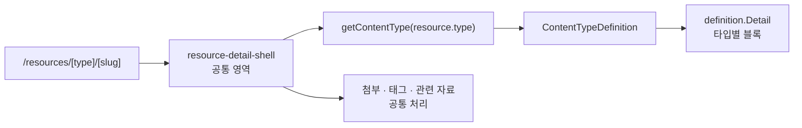
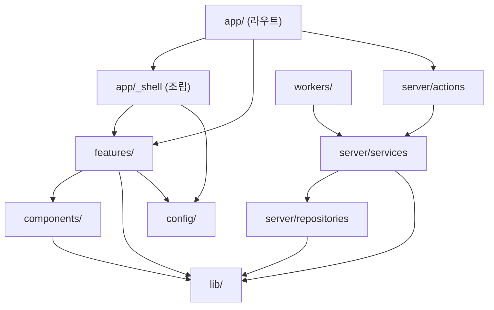
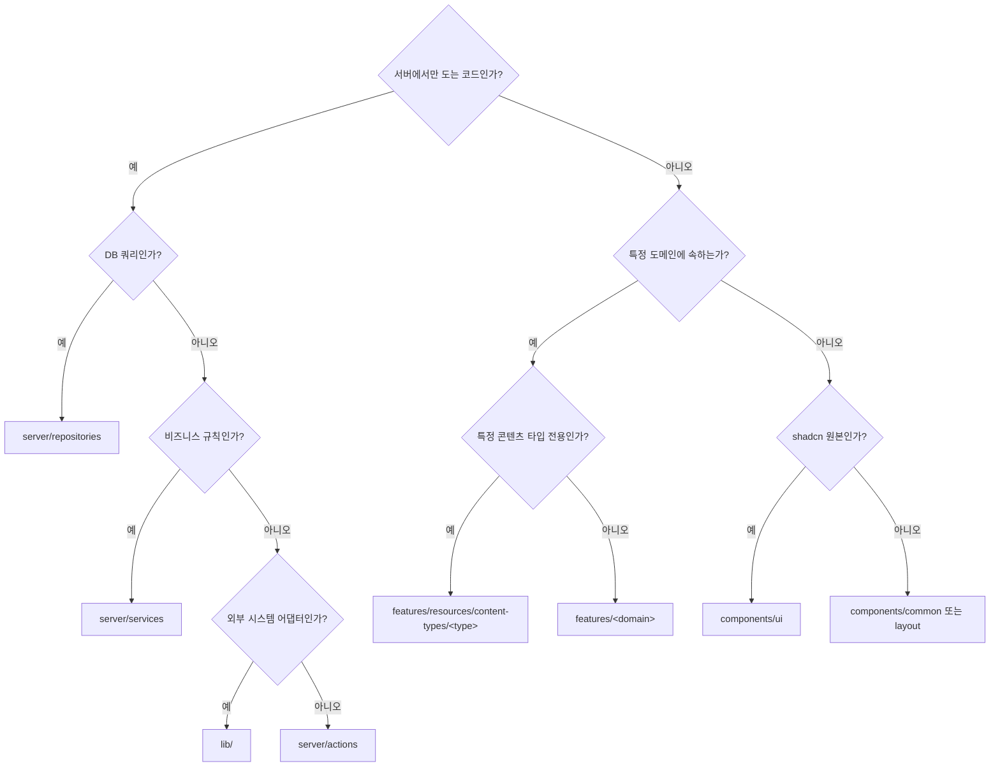

# 06. 폴더 구조 규약

| 항목 | 내용 |
| --- | --- |
| 문서 ID | DEV-06 |
| 버전 | v0.4 |
| 상태 | Draft |
| 최종 수정 | 2026-08-28 |

> "콘텐츠를 계속 추가할 수 있으니 폴더 구조를 신경 써 달라"는 요구에 대한 **실행 규약**입니다.
> 개념 설계는 [REQ-04 콘텐츠 도메인 모델](../01.요구사항/04_콘텐츠_도메인_모델.md)에 있습니다.

---

## 6.1 저장소 최상위

```
doi_dev_team/
├─ _docs/                      # 문서 (이 폴더)
│  ├─ README.md                # ★ 세션 시작 진입점
│  ├─ 01.요구사항/
│  ├─ 02.개발설계/
│  ├─ 03.의사결정_및_미해결사항/
│  ├─ 99.memory/               # 작업 기록 (memory_NN.md)
│  └─ _viewer/                 # 정적 문서 뷰어
├─ project/                    # 애플리케이션 (npm workspaces 루트)
│  ├─ src/                     #   Next.js 앱
│  ├─ prisma/
│  └─ packages/
│     └─ mcp-server/           #   @queenbee/mcp — Claude Code 용 MCP 서버
├─ docker/                     # 컨테이너 구성
│  ├─ docker-compose.dev.yml   #   1단계: postgres · redis 2개만 (DEC-013 · DEC-019)
│  ├─ docker-compose.yml       #   2단계: web · worker · proxy 포함 (DEC-001)
│  ├─ web.Dockerfile
│  ├─ caddy/Caddyfile          #   2단계에서만 사용
│  └─ backup/backup.ps1        #   1단계는 Windows 작업 스케줄러로 실행
├─ .env.example
└─ README.md
```

---

## 6.2 애플리케이션 구조

```
project/
├─ prisma/
│  ├─ schema.prisma
│  ├─ migrations/
│  └─ seed.ts
├─ public/
├─ src/
│  ├─ app/                     # 라우트 — "어떤 URL이 있는가"만 담당
│  ├─ components/              # 도메인과 무관한 공용 UI
│  ├─ features/                # 도메인 기능 — 대부분의 코드가 여기 있다
│  ├─ server/                  # 서버 전용 계층 (actions · services · repositories)
│  ├─ lib/                     # 기술 어댑터 (db · redis · storage · github …)
│  ├─ config/                  # 상수 · 네비게이션 · 정책 값
│  ├─ hooks/                   # 공용 React 훅
│  ├─ types/                   # 전역 타입
│  ├─ mocks/                   # ※ UI 우선 단계 전용 목 데이터 (아래 참고)
│  ├─ styles/
│  ├─ workers/                 # BullMQ 워커 진입점
│  └─ proxy.ts                 # Next.js 16 — 구 middleware.ts
├─ packages/
│  └─ mcp-server/              # @queenbee/mcp — Claude Code 용 MCP 서버
├─ tests/
│  ├─ unit/
│  └─ e2e/
├─ package.json                # workspaces: ["packages/*"]
└─ tsconfig.json
```

### `src/mocks` — UI 우선 단계 전용

DB 없이 화면부터 확인하기 위한 **한시적 폴더**입니다. `src/mocks/index.ts` 하나에
회원 · 자료 · 컬렉션 · 작업 · 감사 로그 · 알림을 모아 두고, 라우트가 직접 import 합니다.

| 규칙 | 이유 |
| --- | --- |
| `components/` 는 `mocks` 를 import 하지 않는다 | 공용 UI가 목 데이터에 묶이면 실데이터로 못 바꾼다 |
| 화면은 목 데이터를 **prop 으로 받는 컴포넌트**에 넘긴다 | 나중에 서버 조회로 갈아끼우는 지점이 라우트 한 곳으로 모인다 |
| 타입은 `src/types` 를 그대로 쓴다 | 실제 스키마와 어긋나면 교체 비용이 커진다 |
| **M2(데이터 계층)에서 폴더째 삭제한다** | `server/repositories` 가 자리를 대신한다 |

### `packages/mcp-server` — QueenBee MCP 서버

Claude Code가 자식 프로세스로 실행하는 **stdio MCP 서버**입니다. 서버에 배포되지 않고 **개발자 PC에서 돕니다.**
설계는 [DEV-08 · 8.3절](08_자료수집_파이프라인.md).

```
packages/mcp-server/
├─ src/
│  ├─ index.ts               # 진입점. stdio 전송 연결
│  ├─ client.ts              # Ingest API HTTP 클라이언트 (fetch + API 키 헤더)
│  ├─ tools/
│  │  ├─ list-content-types.ts
│  │  ├─ search.ts
│  │  ├─ get-resource.ts
│  │  ├─ check-duplicate.ts
│  │  ├─ create-resource.ts
│  │  ├─ update-resource.ts
│  │  ├─ list-taxonomy.ts
│  │  └─ archive-github.ts
│  ├─ errors.ts              # HTTP 오류 → 사람이 읽을 안내 문구
│  └─ env.ts                 # QUEENBEE_URL · QUEENBEE_API_KEY 검증
├─ skills/
│  └─ queenbee-collect/
│     └─ SKILL.md            # 수집 절차·품질 규칙 (FR-CLI-009)
├─ package.json
└─ README.md                 # 설치·설정 방법 (팀원이 읽는다)
```

**규칙**

| 규칙 | 이유 |
| --- | --- |
| **비즈니스 로직을 두지 않는다** | 검증·중복·권한은 서버가 판단한다. 두 곳에 규칙이 생기면 어긋난다 |
| 앱 코드를 import 하지 않는다 | 독립 패키지다. Prisma·DB에 접근하지 않는다 |
| 도구 목록을 하드코딩하지 않는 부분 | 콘텐츠 타입은 `list-content-types` 로 **서버에서 받아온다** |
| 자동 재시도 금지 | 등록은 부작용이 있다 ([DEV-08 · 8.3절](08_자료수집_파이프라인.md)) |
| 오류 문구는 사람이 읽을 수 있게 | 에이전트가 사용자에게 그대로 전달한다 |

---

## 6.3 `src/app` — 라우트

**라우트 폴더에는 화면 조립만 둡니다.** 로직은 `features` 와 `server` 에 있습니다.

```
src/app/
├─ layout.tsx                       # 루트 (폰트 · 테마 · Toaster)
├─ page.tsx                         # / → 로그인 여부에 따라 리다이렉트
├─ globals.css
│
├─ _shell/                          # ★ 라우팅에서 제외되는 조립 코드 (private folder)
│  ├─ sidebar.tsx                   #   메뉴 조립 — icon 이 함수라 클라이언트에서 조립
│  └─ breadcrumb-labels.ts          #   동적 세그먼트 라벨 맵
│
├─ (public)/                        # 비로그인 영역
│  ├─ layout.tsx                    # 중앙 정렬 카드 레이아웃
│  ├─ login/page.tsx                # SCR-001
│  ├─ signup/
│  │  ├─ page.tsx                   # SCR-002
│  │  └─ complete/page.tsx          # SCR-002-1 신청 완료
│  ├─ pending/page.tsx              # SCR-003
│  └─ change-password/page.tsx      # 관리자가 초기화한 비밀번호 변경 (DEC-014)
│                                   # 비밀번호 **재설정(메일)** 화면은 없음 (DEC-015)
│
├─ (service)/                       # 로그인 + ACTIVE
│  ├─ layout.tsx                    # dashboard-01 기반 사이드바 레이아웃
│  ├─ dashboard/page.tsx            # SCR-101
│  ├─ resources/
│  │  ├─ page.tsx                   # SCR-111 전체 목록
│  │  ├─ new/page.tsx               # SCR-113 등록
│  │  └─ [type]/
│  │     ├─ page.tsx                # SCR-111 타입별 목록
│  │     └─ [slug]/
│  │        ├─ page.tsx             # SCR-112 상세
│  │        └─ edit/page.tsx        # SCR-113 수정
│  ├─ search/page.tsx               # SCR-121
│  ├─ collections/
│  │  ├─ page.tsx                   # SCR-131
│  │  └─ [slug]/page.tsx            # SCR-132
│  ├─ bookmarks/page.tsx            # SCR-133
│  └─ me/page.tsx                   # SCR-141
│
├─ (admin)/                         # 로그인 + ACTIVE + ADMIN
│  ├─ layout.tsx
│  └─ admin/
│     ├─ page.tsx                   # SCR-201
│     ├─ members/
│     │  ├─ page.tsx                # SCR-211
│     │  └─ [id]/page.tsx           # SCR-212
│     ├─ resources/page.tsx         # SCR-221
│     ├─ taxonomy/page.tsx          # SCR-231
│     ├─ jobs/page.tsx              # SCR-241
│     ├─ audit-logs/page.tsx        # SCR-251
│     └─ settings/page.tsx          # SCR-261
│
├─ api/
│  ├─ auth/[...nextauth]/route.ts
│  ├─ health/route.ts
│  ├─ resources/…
│  ├─ files/…
│  ├─ search/route.ts
│  ├─ ingest/                       # ★ CLI 수집 진입점 (API 키 인증)
│  │  ├─ content-types/route.ts     #   API-100
│  │  ├─ search/route.ts            #   API-101
│  │  ├─ duplicate/route.ts         #   API-103
│  │  ├─ resources/route.ts         #   API-104
│  │  ├─ resources/[id]/route.ts    #   API-102 · API-105
│  │  ├─ taxonomy/route.ts          #   API-106
│  │  └─ whoami/route.ts            #   API-108
│  └─ admin/…
│
├─ 403/page.tsx
├─ not-found.tsx
└─ error.tsx
```

**규칙**

| 규칙 | 설명 |
| --- | --- |
| `page.tsx` 는 30줄 안팎 | 데이터를 불러와 feature 컴포넌트에 넘기는 정도 |
| 라우트 그룹으로 레이아웃 분리 | `(public)` / `(service)` / `(admin)` |
| 여러 feature 를 엮는 조립 코드는 `app/_shell/` | `features/A → features/B` 금지(6.9절)를 지키면서 조립할 자리 |
| 각 폴더에 `loading.tsx` 배치 | Skeleton 표시 |
| `error.tsx` 는 영역별로 | 사용자에게 보여줄 문구가 다르다 |
| 타입별 화면을 새로 만들지 않는다 | `[type]` 동적 세그먼트 + 레지스트리로 처리 |

---

## 6.4 `src/features` — 도메인 기능

**여기가 이 프로젝트의 중심입니다.** 기능 하나에 필요한 것을 폴더 하나에 모읍니다.

```
src/features/
├─ auth/
│  ├─ components/          # login-form, signup-form, pending-notice
│  ├─ schema.ts            # zod 스키마 (클라이언트·서버 공유)
│  ├─ hooks/
│  └─ utils.ts
│
├─ resources/              # 자료 공통
│  ├─ components/
│  │  ├─ resource-card.tsx
│  │  ├─ resource-browser.tsx      # 필터 · 정렬 · 페이지네이션 · 빈 상태
│  │  ├─ resource-form.tsx         # 공통 필드 + 타입별 폼 슬롯
│  │  ├─ type-detail.tsx           # 공통 영역 + 타입별 상세 슬롯
│  │  ├─ delete-resource-dialog.tsx
│  │  ├─ badges.tsx · detail-row.tsx · external-link-button.tsx
│  │  └─ quick-add-url.tsx         # FR-RES-005 URL → 타입 자동 추정
│  ├─ content-types/       # ★ 콘텐츠 타입 레지스트리 (6.5절)
│  ├─ nav.ts               # 레지스트리 → 사이드바 메뉴 그룹
│  ├─ search-items.ts      # 레지스트리 → 명령 팔레트 항목
│  ├─ schema.ts
│  ├─ constants.ts
│  └─ utils/
│     ├─ normalize-url.ts
│     └─ detect-type.ts
│
├─ dashboard/              # 서비스 대시보드 위젯 (추이 차트 등)
├─ search/
├─ collections/
├─ bookmarks/
├─ api-keys/               # API 키 발급·목록·폐기 UI (마이페이지 보안 탭)
├─ members/                # 관리자 회원 관리
├─ admin-dashboard/
├─ taxonomy/               # 카테고리 · 태그
├─ jobs/
├─ audit/
├─ notifications/
└─ settings/
```

**규칙**

| 규칙 | 설명 |
| --- | --- |
| feature 는 서로 직접 import 하지 않는다 | 공유가 필요하면 `components/common` 또는 `lib` 로 올린다 |
| feature 안에서만 쓰는 것은 밖으로 내보내지 않는다 | 각 feature 는 `index.ts` 로 공개 API를 정한다 |
| 폼 검증 스키마는 feature 안에 둔다 | 클라이언트·서버가 같은 파일을 import 한다 |
| 서버 전용 로직은 여기 두지 않는다 | `server/` 로 간다 |

---

## 6.5 `content-types` — 확장의 핵심

**새 콘텐츠 타입은 이 폴더에 폴더 하나를 추가하는 것으로 끝나야 합니다.**

```
src/features/resources/content-types/
├─ index.ts                      # 레지스트리 + getContentType() · listContentTypes()
│                                #   · getContentTypeBySlug() · detectTypeFromUrl()
│                                #   ★ 새 타입은 여기 한 줄
├─ types.ts                      # ContentTypeDefinition 인터페이스
│
├─ ai-material/
│  ├─ meta.ts                    # 코드 · slug · 라벨 · 아이콘 · 배지색 · 정렬 · 노출 여부
│  ├─ schema.ts                  # zod 상세 스키마
│  ├─ form.tsx                   # 등록·수정 폼 (타입 전용 필드만)
│  ├─ card.tsx                   # 목록 카드 하단 영역
│  ├─ detail.tsx                 # 상세 화면 블록
│  ├─ repository.ts              # 상세 테이블 전용 쿼리 (선택)
│  └─ index.ts                   # ContentTypeDefinition 조립
│
├─ github-repo/
│  ├─ … (동일 구성)
│  └─ enrich.ts                  # 등록 시 메타 자동 수집 훅
│
├─ mcp-server/
├─ skill/
├─ dev-note/
└─ prompt/                       # 6번째 타입 — 확장성 검증용으로 실제 추가해 봤다
```

> **`meta.ts` 와 `index.ts` 를 나누는 이유:** `meta` 는 직렬화 가능한 값만 담고,
> `index` 가 여기에 `Card`·`Detail`·`Form` 컴포넌트를 붙여 정의를 완성합니다.
> 서버에서 목록·메뉴를 만들 때는 컴포넌트(함수)를 클라이언트로 넘길 수 없으므로
> **`ContentTypeMeta` 만 넘깁니다.**

### 지켜야 할 것

| 규칙 | 이유 |
| --- | --- |
| 타입 분기(`if (type === …)`)는 **레지스트리 밖에서 금지** | 분기가 코드 전체로 번지는 것을 막는다 |
| 공통 컴포넌트는 `getContentType(type)` 으로 정의를 얻어 렌더한다 | 새 타입이 자동으로 붙는다 |
| 타입 폴더는 다른 타입 폴더를 import 하지 않는다 | 타입 간 결합을 막는다 |
| 타입 폴더는 공통 컴포넌트를 import 해도 된다 | 단방향 의존은 허용 |

### 렌더링 흐름



---

## 6.6 `src/server` — 서버 전용 계층

```
src/server/
├─ actions/                 # Server Actions (인가 · 검증 · 캐시 무효화)
│  ├─ auth.actions.ts
│  ├─ resource.actions.ts
│  ├─ member.actions.ts
│  ├─ collection.actions.ts
│  └─ admin.actions.ts
│
├─ services/                # 비즈니스 로직 — 여기에만 규칙을 둔다
│  ├─ auth.service.ts
│  ├─ user.service.ts
│  ├─ resource.service.ts
│  ├─ github.service.ts
│  ├─ file.service.ts
│  ├─ search.service.ts
│  ├─ notification.service.ts
│  ├─ audit.service.ts
│  └─ job.service.ts
│
├─ repositories/            # Prisma 쿼리만
│  ├─ user.repository.ts
│  ├─ resource.repository.ts
│  └─ …
│
├─ auth/                    # Auth.js 설정 · 가드
│  ├─ config.ts
│  ├─ guards.ts             # requireActiveUser · requireRole · assertCanEdit…
│  ├─ session.ts            # 세션 조회 · 강제 만료
│  └─ api-key.ts            # API 키 검증 → actor 컨텍스트 생성 (웹과 같은 형태)
│
└─ queue/
   ├─ queues.ts             # 큐 정의
   ├─ enqueue.ts            # 작업 등록 헬퍼
   └─ jobs/                 # 작업별 처리기
      ├─ fetch-github-meta.job.ts
      ├─ archive-github.job.ts
      └─ …
```

### 계층 책임

| 계층 | 해도 되는 것 | 하면 안 되는 것 |
| --- | --- | --- |
| `actions` | 인가, 입력 검증, service 호출, 캐시 무효화, 감사 로그 | Prisma 직접 호출, 비즈니스 규칙 |
| `services` | 비즈니스 규칙, 트랜잭션, 여러 repository 조합 | `next/headers`·`cookies` 사용, HTTP 응답 조립 |
| `repositories` | Prisma 쿼리, 정렬·페이징 | 비즈니스 판단 |

> **service 가 요청 컨텍스트를 쓰지 않는 이유:** 워커(`src/workers`)에서 같은 service를 그대로 재사용하기 위해서입니다.
> 필요한 사용자 정보는 `actor` 파라미터로 넘겨받습니다.

---

## 6.7 `src/components` — 공용 UI

```
src/components/
├─ ui/                      # shadcn 생성물. 직접 수정 최소화
├─ layout/                  # app-sidebar · site-header · nav-user · brand-mark
│                           #   theme-provider · theme-toggle · command-palette
└─ common/                  # 도메인 무관 조합 컴포넌트
   ├─ page-header.tsx
   ├─ breadcrumbs.tsx       # 경로 → 빵부스러기. 동적 라벨은 prop 으로 받는다
   ├─ empty-state.tsx
   ├─ error-state.tsx
   ├─ page-skeleton.tsx
   ├─ confirm-dialog.tsx
   ├─ data-table.tsx        # TanStack Table 래퍼
   ├─ markdown-viewer.tsx
   ├─ table-of-contents.tsx # markdown-viewer 와 같은 id 규칙을 공유한다
   ├─ markdown-editor.tsx
   ├─ copy-button.tsx
   ├─ stat-card.tsx
   ├─ tag-input.tsx
   └─ file-uploader.tsx
```

> `breadcrumbs.tsx` 가 `components` 에 있는 이유: 경로에서 빵부스러기를 만드는 일 자체는
> 도메인을 모릅니다. 자료 제목·회원 이름 같은 **동적 세그먼트 라벨은 `app/_shell` 에서
> 만들어 prop 으로 넘깁니다.** 그래야 `components → features` 금지(6.9절)를 지킵니다.
>
> `markdown-viewer` 는 `rehype-sanitize` 가 제목 id 에 `user-content-` 접두사를 붙입니다.
> 목차가 같은 규칙을 쓰도록 `HEADING_ID_PREFIX` 를 내보내고 `table-of-contents` 가 가져다 씁니다.
> **접두사 규칙을 양쪽에 복사하지 마세요.**

`common` 에 둘지 `features` 에 둘지 애매하면 기준은 하나입니다.
**"자료 도메인을 몰라도 쓸 수 있는가?"** → 그렇다면 `common`.

---

## 6.8 `src/lib` · `src/config` · `src/workers`

```
src/lib/
├─ db.ts                    # PrismaClient 싱글턴 + 소프트 삭제 확장
├─ redis.ts                 # ioredis 싱글턴
├─ storage/                 # 파일 저장 (DEC-019)
│  ├─ index.ts              #   드라이버 팩토리 — 호출부는 이것만 쓴다
│  ├─ types.ts              #   StorageDriver 인터페이스
│  ├─ local.ts              #   로컬 파일시스템 구현 (현재 유일)
│  ├─ keys.ts               #   키 생성 규칙
│  └─ safe-path.ts          #   경로 이탈 방어 (NFR-SEC-009)
├─ github.ts                # octokit 래퍼 · rate limit 처리
├─ logger.ts                # pino
├─ disk.ts                  # 디스크 여유 확인 (NFR-BACKUP-007)
├─ env.ts                   # zod 환경 변수 검증 (기동 시 실패하면 종료)
├─ cache.ts                 # Redis 캐시 헬퍼 (get-or-set · 무효화)
├─ rate-limit.ts
├─ errors.ts                # AppError · ErrorCode
├─ result.ts                # ActionResult 헬퍼
├─ cursor.ts                # 커서 인코딩·디코딩
└─ utils.ts                 # cn() 등

src/config/
├─ navigation.ts            # 정적 사이드바 메뉴 + 빵부스러기 세그먼트 라벨
│                           #   ※ 타입별 자료 메뉴는 레지스트리가 만든다 (config → features 금지)
├─ constants.ts             # 업로드 제한 · 페이지 크기 등
├─ roles.ts                 # 역할 · 권한 상수
└─ site.ts                  # 서비스명 · 설명 · 역할 라벨

src/workers/
├─ index.ts                 # 워커 진입점 (컨테이너 실행 대상)
└─ scheduler.ts             # repeatable job 등록
```

---

## 6.9 의존 방향



**절대 금지**

| 금지 | 이유 |
| --- | --- |
| `lib` → `features` | 저수준이 고수준을 알면 순환이 생긴다 |
| `components` → `features`·`mocks` | 공용 UI가 도메인에 묶인다 |
| `config` → `features` | 메뉴 정의가 도메인을 알면 순환이 생긴다 |
| `features/A` → `features/B` | 기능 간 결합. 공유는 위로 올린다 |
| `repositories` → `services` | 계층 역전 |
| 클라이언트 컴포넌트 → `server/`·`lib/db` | 서버 코드가 번들에 섞인다 |

> **여러 feature 를 엮어야 할 때:** 조립은 `app/` 또는 `app/_shell/` 에서 합니다.
> 사이드바는 `config/navigation`(정적 메뉴) + `features/resources/nav`(타입 메뉴)를
> `app/_shell/sidebar.tsx` 가 합칩니다. 빵부스러기도 같은 방식입니다.
> **이 규칙은 스크립트로 검사할 수 있어야 합니다** — 위반 0건을 CI 게이트로 둡니다(`NFR-MAINT-002`).

> `server/` 파일 최상단에는 `import 'server-only';` 을 넣어 클라이언트 유입을 빌드 타임에 차단합니다.

---

## 6.10 네이밍 규칙

| 대상 | 규칙 | 예 |
| --- | --- | --- |
| 폴더 | kebab-case | `content-types/github-repo` |
| 컴포넌트 파일 | kebab-case | `resource-card.tsx` |
| 컴포넌트 이름 | PascalCase | `ResourceCard` |
| 훅 | `use-` 접두 파일, `useXxx` 이름 | `use-resource-filters.ts` |
| Server Action 파일 | `*.actions.ts` | `resource.actions.ts` |
| Server Action 이름 | `동사 + 명사 + Action` | `createResourceAction` |
| Service 파일 | `*.service.ts` | `github.service.ts` |
| Repository 파일 | `*.repository.ts` | `resource.repository.ts` |
| 타입·인터페이스 | PascalCase, `I` 접두 금지 | `ResourceListItem` |
| zod 스키마 | `xxxSchema` | `createResourceSchema` |
| 상수 | UPPER_SNAKE_CASE | `MAX_UPLOAD_BYTES` |
| 테스트 | `*.test.ts` / `*.spec.ts` | |

### 경로 별칭 (`tsconfig.json`)

```jsonc
{
  "compilerOptions": {
    "paths": {
      "@/*":           ["./src/*"],
      "@/app/*":       ["./src/app/*"],
      "@/components/*":["./src/components/*"],
      "@/features/*":  ["./src/features/*"],
      "@/server/*":    ["./src/server/*"],
      "@/lib/*":       ["./src/lib/*"],
      "@/config/*":    ["./src/config/*"],
      "@/types/*":     ["./src/types/*"]
    }
  }
}
```

상대 경로 `../../..` 는 사용하지 않습니다. 같은 폴더 안(`./`)만 상대 경로를 허용합니다.

---

## 6.11 작업 체크리스트

### 새 콘텐츠 타입을 추가할 때

- [ ] `src/types` — `ResourceType` 유니온 + 상세 타입 추가
- [ ] `prisma/schema.prisma` — `ResourceType` enum에 코드 추가
- [ ] `prisma/schema.prisma` — 상세 모델 추가 (`resourceId` PK 겸 FK)
- [ ] `npx prisma migrate dev --name add_<type>`
- [ ] `content-types/<type>/meta.ts` — 라벨·아이콘·배지색
- [ ] `content-types/<type>/schema.ts` — zod 스키마
- [ ] `content-types/<type>/form.tsx`
- [ ] `content-types/<type>/card.tsx`
- [ ] `content-types/<type>/detail.tsx`
- [ ] `content-types/<type>/index.ts` — 정의 조립
- [ ] `content-types/index.ts` — 레지스트리 등록
- [ ] `prisma/seed.ts` — `content_type_settings` 기본값
- [ ] (선택) URL 자동 판별 `detectFromUrl` 구현
- [ ] (선택) 메타 자동 수집 `enrich.ts` + 워커 작업

**이 목록 밖의 파일을 고쳐야 한다면 구조가 잘못된 것입니다.** 그 지점을 공통 코드로 끌어올리세요.

> 2026-08-28 에 6번째 타입(`PROMPT`)을 실제로 추가해 확인했습니다.
> 사이드바 · 목록 · 검색 팔레트 · 관리자 타입 목록에 **손대지 않고** 자동으로 붙었습니다.

### 새 기능(feature)을 추가할 때

- [ ] `features/<name>/` 폴더 생성 (`components` · `schema.ts` · `index.ts`)
- [ ] 필요한 라우트를 `app/(service|admin)/` 에 추가
- [ ] `server/services/<name>.service.ts` 작성
- [ ] `server/repositories/<name>.repository.ts` 작성
- [ ] `server/actions/<name>.actions.ts` 작성 (6단계 규칙 준수 — [DEV-05 · 5.10절](05_API_설계.md))
- [ ] 권한 매트릭스 갱신 ([REQ-02 · 2.5절](../01.요구사항/02_사용자_권한_정책.md))
- [ ] 감사 로그 대상이면 `audit.service` 연결
- [ ] 사이드바 메뉴 필요 시 `config/navigation.ts` 갱신
- [ ] 요구사항 문서(`_docs/01.요구사항`) 갱신 (`NFR-MAINT-007`)

### 파일을 어디에 둘지 헷갈릴 때



---

## 6.12 변경 이력

| 날짜 | 버전 | 내용 |
| --- | --- | --- |
| 2026-08-28 | v0.1 | 최초 작성 |
| 2026-08-28 | v0.2 | **`packages/mcp-server` 신설**(`DEC-012`), `app/api/ingest/` 라우트 추가, `server/auth/api-key.ts`·`features/api-keys/` 추가, 비밀번호 재설정 라우트 제거(`DEC-014`), docker 구성을 1단계/2단계로 분리(`DEC-013`) |
| 2026-08-28 | v0.3 | `lib/storage.ts` → **`lib/storage/` 드라이버 구조**로 변경(`DEC-019`), dev 컨테이너 2개로 축소 |
| 2026-08-28 | v0.4 | UI 우선 단계 구현 반영: **`src/mocks/` 규약 신설**(M2에서 삭제), **`app/_shell/` 조립 계층 신설**(`features/A → features/B` 금지를 지키는 자리), `components/common` 실제 목록 갱신(`breadcrumbs`·`table-of-contents`·`stat-card`), `config → features` 금지 명문화, `middleware.ts` → `proxy.ts`(Next.js 16), `(public)` 라우트에 `signup/complete`·`change-password` 추가 |
