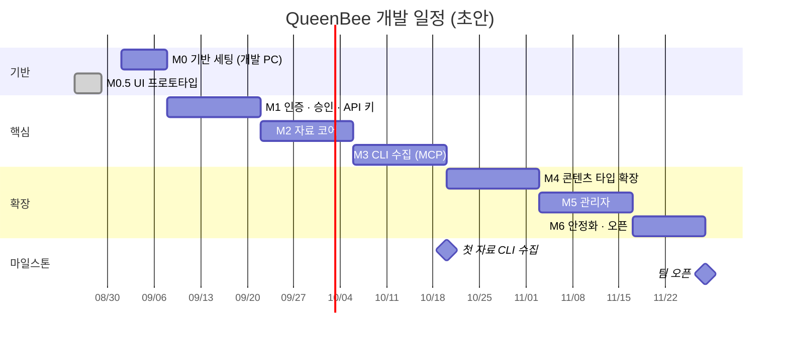

# 07. 개발 로드맵

| 항목 | 내용 |
| --- | --- |
| 문서 ID | DEV-07 |
| 버전 | v0.9 |
| 상태 | Draft |
| 최종 수정 | 2026-08-29 |

> 일정은 **소수 인원(1~2명) 파트타임 개발**을 가정한 초안입니다.
> 실행 환경은 1단계 개발 PC입니다 (`DEC-013`).

---

## 7.1 마일스톤 개요

자료 수집의 주력 경로가 **Claude Code CLI**(`DEC-012`)이므로, CLI 수집을 앞쪽에 배치했습니다.
자료가 실제로 쌓여야 나머지 기능의 가치를 확인할 수 있기 때문입니다.

| # | 마일스톤 | 기간(주) | 핵심 산출물 | 완료 조건(DoD) |
| --- | --- | :---: | --- | --- |
| M0 | 기반 세팅 (개발 PC) | 1 | 실행되는 빈 앱 + 로컬 인프라 | `npm run dev` 로 뜨고 `/api/health` 가 모두 `ok` |
| **M0.5** | **UI 프로토타입** ✅ | 1 | 목 데이터로 도는 화면 전부 | **완료** — 아래 7.2.1절 |
| M1 | 인증 · 승인 | 2 | 아이디 로그인 · 승인 · API 키 | 가입→승인→로그인 E2E 통과, API 키 발급 동작 |
| M2 | 자료 코어 | 2 | 자료 CRUD · 분류 · 검색 | AI 자료 등록·검색·상세 동작 |
| M3 | **CLI 수집** | 2 | MCP 서버 · Ingest API · Skill | **Claude Code에서 "찾아서 등록해줘"가 동작** |
| M4 | 콘텐츠 타입 확장 | 2 | GitHub · MCP · Skill · 노트 · 아카이브 | 타입 5종 동작, 아카이브 성공 |
| M5 | 관리자 | 2 | 회원·자료·분류·설정 | 관리자 P0 전체 동작 |
| M6 | 안정화 · 오픈 | 1.5 | 테스트 · 백업 · 운영 문서 | 백업 복구 리허설 통과, 팀 오픈 |
| | **합계** | **12.5주** | | |

---

## 7.2 M0 — 기반 세팅 (개발 PC) · 1주

### 인프라 (Docker Desktop)

| 작업 | 내용 |
| --- | --- |
| Docker Desktop 설치 | WSL2 백엔드 확인 |
| 데이터 경로 생성 | `E:\queenbee-data\postgres`, `E:\queenbee-data\files` (`DEC-016`) |
| `docker-compose.dev.yml` 작성 | `postgres` · `redis` **2개만**. web/worker는 호스트 실행, 파일은 로컬 디스크 (`DEC-019`) |
| 포트 확인 | `5432` · `6379` · `3100` 충돌 여부 |
| 파일 저장소 준비 | `STORAGE_ROOT` 하위 `tmp/` 생성 + 쓰기 권한 확인. **저장소 폴더 밖에 둔다** |
| 절전 해제 | 서버로 쓰는 동안 PC 절전·최대 절전 끄기 |

### 애플리케이션

| 작업 | 산출물 |
| --- | --- |
| Next.js 프로젝트 생성 (TS · Tailwind · App Router · `src/`) | `project/` |
| npm workspaces 설정 (`packages/*`) | `package.json` |
| shadcn 초기화 + `login-03` + `dashboard-01` 설치 | `components/ui/`, 블록 파일 |
| 블록 파일을 폴더 규약에 맞게 재배치, **샘플 데이터 제거** | [DEV-06](06_폴더_구조_규약.md) 준수 |
| ESLint · Prettier · lint-staged · tsconfig paths | 설정 파일 |
| `.gitattributes` (`* text=auto eol=lf`) | Windows 줄바꿈 대응 |
| Prisma 초기화 + `User` 모델 + 첫 마이그레이션 | `prisma/` |
| `lib/env.ts` 환경 변수 검증 | 실패 시 즉시 종료 |
| `lib/db.ts` · `redis.ts` · `logger.ts` · `storage/`(드라이버) | 어댑터 계층 |
| `/api/health` 구현 (DB · Redis · 스토리지 · **디스크 여유**) | `NFR-BACKUP-007` |
| README 작성 (이 PC에서 띄우는 방법) | |

**DoD**
- [ ] `docker compose -f docker/docker-compose.dev.yml up -d` 로 2개 컨테이너 정상
- [ ] `npm run dev` 로 앱이 뜨고 `http://localhost:3100` 접속
- [ ] `/api/health` 가 `db·redis·storage·disk` 모두 `ok`
- [ ] 로그인 화면(디자인만)과 대시보드 레이아웃이 보인다
- [ ] `npm run lint` · `npm run typecheck` 통과

---

## 7.2.1 M0.5 — UI 프로토타입 ✅ 완료 (2026-08-28)

> **왜 순서를 바꿨나:** "화면을 눈으로 먼저 보고 싶다"는 요구가 있었습니다.
> DB·인증 없이 **목 데이터**(`src/mocks`)로 전 화면을 먼저 만들었습니다.
> 덕분에 문서에만 있던 규약(레지스트리 확장성·의존 방향·빵부스러기)을 **글이 아니라 코드로 검증**했습니다.

| 만든 것 | 비고 |
| --- | --- |
| 공개 3화면 + 서비스 10화면 + 관리자 8화면 | `SCR-001`~`SCR-902` 전부 |
| **콘텐츠 타입 레지스트리 6종** | `PROMPT` 를 6번째로 추가해 확장성 검증 ([REQ-04 · 4.9절](../01.요구사항/04_콘텐츠_도메인_모델.md)) |
| 목 세션 전환기 | 권한별 화면 차이를 눈으로 확인 (관리자/편집자/일반) |
| 마크다운 렌더 + 목차 | `rehype-sanitize` 화이트리스트, XSS 4종 차단 확인 (`NFR-SEC-007`) |
| 공통 빵부스러기 | 동적 세그먼트 라벨 치환 포함 |
| 의존 방향 검사 스크립트 | `components→features`·`features/A→features/B`·`config→features` **위반 0건** |

**여기서 안 한 것 (M1 이후로 넘김)**

| 안 한 것 | 넘어간 곳 |
| --- | --- |
| DB · Prisma · 실제 조회 | M2 — `src/mocks` 폴더째 삭제하고 `server/repositories` 로 교체 |
| 실제 인증 · 비밀번호 해시 | M1 — 쿠키 목 세션을 **자체 세션**으로 교체 (`DEC-030`) |
| Server Action 의 실제 처리 | M1~M5 — 지금은 화면 전이만 |
| 조회 이력(최근 본 자료) | M3 이후 |

---

## 7.3 M1 — 인증 · 승인 · API 키 · 2주

| 작업 | 관련 요구사항 |
| --- | --- |
| **자체 세션 구현** — 토큰 발급·해시 저장·조회·폐기 (`server/auth/session.ts`) | `DEC-030`, `FR-AUTH-006` |
| 로그인·로그아웃 Server Action (`API-004`·`API-005`) | `DEC-030`, `DEC-014`, `FR-AUTH-009` |
| 회원가입 폼 + 서버 액션 + 아이디 중복 검사 | `FR-AUTH-001`, `002` |
| 비밀번호 해시(Argon2id) · 정책 검증 | `NFR-SEC-001`, `FR-AUTH-004` |
| 계정 상태 머신 · 상태별 분기 | `FR-AUTH-007` |
| `proxy.ts` **낙관적 검사** + 레이아웃·액션 인가 가드 | `DEC-031`, [REQ-02 · 2.9절](../01.요구사항/02_사용자_권한_정책.md) |
| **`features/auth/schema.ts` — zod 스키마 첫 도입** | `NFR-SEC-006` |
| 로그인 상태 유지 (세션 쿠키 · 유휴 만료) | `FR-AUTH-008` |
| 마이페이지 — 프로필 조회 · 비밀번호 변경 · 내 활동 | `FR-USER-001`, `003`, `004` |
| 활성 세션 목록 + 개별 종료 (`API-007`) | `FR-USER-006` |
| 승인 대기 화면 (`상태 새로고침` 포함) | `SCR-003` |
| 관리자 회원 목록 + 승인/거부 (최소 기능) | `FR-ADM-002`, `004` |
| 세션 강제 만료 (Redis 세션 인덱스) | `DEC-030` |
| 인앱 알림 기반 구조 + 알림함 | `FR-NOTI-001`, `002`, `003` |
| 감사 로그 기반 구조 (`via` 포함) | `FR-AUDIT-001` |
| 로그인 시도 제한 | `FR-AUTH-012` |
| 최초 관리자 시드 + 비밀번호 변경 강제 | `FR-AUTH-011` |
| `reserved_usernames` + 아이디 중복 검사 양쪽 조회 | `DEC-021`, `FR-AUTH-002` |
| **API 키 발급·폐기 + 검증 로직** | `FR-USER-008`, `NFR-SEC-017` |

**DoD**
- [ ] E2E: 가입 → 승인 대기 → 관리자 승인 → 로그인 → 대시보드
- [ ] E2E: 일반 회원이 `/admin` 접근 시 `/403`
- [ ] E2E: 관리자가 정지하면 해당 사용자가 즉시 로그아웃되고 **API 키도 무효화**된다
- [ ] 인가 가드 단위 테스트 통과
- [ ] 관리자 비밀번호 재설정 절차를 운영 문서에 기록 ([DCS-02 · 2.4절](../03.의사결정_및_미해결사항/02_미해결사항.md))

---

## 7.4 M2 — 자료 코어 · 2주

| 작업 | 관련 요구사항 |
| --- | --- |
| `resources` 스키마 + 검색 인덱스 마이그레이션 | [DEV-02 · 2.5절](02_데이터_모델.md) |
| 콘텐츠 타입 레지스트리 골격 + `AI_MATERIAL` 1종 | [REQ-04 · 4.9절](../01.요구사항/04_콘텐츠_도메인_모델.md) |
| **타입 1종을 폼 → zod → service → Prisma 까지 관통시켜 확장성 검증** | `M0.5` 는 화면 쪽만 증명했다 (아래 주의) |
| `content_type_settings` 조회 + 사이드바 병합 | `DEC-032`, `FR-ADM-014` |
| 자료 등록 · 수정 · 삭제 · 복구 | `FR-RES-004~008` |
| 자료 목록 (카드/테이블, 필터, 정렬, 커서 페이징) | `FR-RES-001`, `002`, `FR-SRCH-003~005` |
| 자료 상세 + 마크다운 렌더링 | `FR-RES-003`, `015` |
| 카테고리 · 태그 **사용** (목록·검색 필터, 등록 폼 선택, 상세 표시) — 편집은 `M5` | `FR-SRCH-006`, `007` |
| 통합 검색 (PG FTS + trgm) + 헤더 검색바 | `FR-SRCH-001`, `002` |
| 북마크 | `FR-COLL-001`, `002` |
| 중복 감지 · URL 정규화 | `FR-RES-011` |
| 조회수 (Redis 버퍼) | `FR-RES-014` |
| 공통 상태 컴포넌트 (빈/로딩/오류) | `NFR-A11Y-006` |

**DoD**
- [x] AI 자료를 등록하고 목록·검색·상세에서 확인할 수 있다
- [x] 필터·정렬·페이징이 모두 동작한다
- [x] 자료 1만 건 더미로 목록 P95 500ms 이내 확인 — **17ms** (`npm run bench:list`)
- [x] **`src/mocks/` 폴더를 지웠다** ([DEV-06 · 6.2절](06_폴더_구조_규약.md))
- [x] 관리자가 타입 노출을 끄면 사이드바에서 사라진다 (`DEC-032` 병합 동작 확인)
- [x] **작업표의 요구사항이 코드에 인용된다** — `npm run check:fr` (`DEC-049`)
- [x] **DB 를 비우면 화면도 빈다** — `npm run verify:empty-db` (하드코딩이 화면 파일로 이사하지 않았다)

> **DoD 앞의 다섯 항목만으로 닫으려 했다가 `P0` 규격 셋을 놓쳤습니다.**
> `FR-SRCH-004`(북마크순)·`FR-SRCH-003`(기간 필터)·`FR-RES-014`(조회수 중복 제외).
> 셋 다 **이 작업표에 있는데** DoD 는 성능과 기전만 물었습니다.
> **여섯 번째 항목이 그래서 생겼습니다** — 「DoD 통과 ≠ 규격 충족」(`DEC-049`).
>
> 일곱 번째도 같은 부류입니다. `src/mocks/` 를 지우고 「목 부채 0」이라고 셌지만
> 그 게이트는 **import 형태**를 셌고, `SUBCATEGORIES` 는 `admin/taxonomy/page.tsx`
> 안으로, `CATEGORIES` 는 `config/site.ts` 로 **이사해 있었습니다.**
> 확인하는 법을 「`@/mocks` import 가 0인가」에서 **「데이터를 치우면 화면도 비는가」**
> 로 바꿨습니다 — 문법이 아니라 성질을 보므로 어떤 모양의 하드코딩이든 걸립니다.

> **주의 — `M0.5` 가 증명한 범위.** UI 프로토타입에서 `PROMPT` 를 추가했을 때 사이드바·목록·
> 검색 팔레트가 자동으로 붙은 것은 사실이지만, 그건 **화면 쪽 확장성**입니다.
> **zod 스키마 · service · Prisma 상세 테이블은 아직 한 번도 통과하지 않았습니다.**
> M2에서 타입 1종을 끝까지 관통시켜 보기 전에는 «폴더 하나 + 레지스트리 한 줄» 이
> 증명된 것이 아닙니다. `API-100`(zod → JSON Schema)이 M3의 전제라 여기서 막히면 M3가 밀립니다.

---

## 7.5 M3 — CLI 수집 (MCP) · 2주 ★

**이 마일스톤이 이 시스템의 핵심 가치입니다.** ([DEV-08](08_자료수집_파이프라인.md))

| 작업 | 관련 요구사항 |
| --- | --- |
| Ingest API 라우트 (`/api/ingest/*`) | `API-100~108` |
| API 키 인증 미들웨어 → `actor` 컨텍스트 | `NFR-SEC-018` |
| 콘텐츠 타입 → JSON Schema 변환·캐시 | `FR-CLI-002` |
| 중복 확인 엔드포인트 (웹과 같은 정규화) | `FR-CLI-004` |
| `source_channel` 반영 | `FR-CLI-005` |
| **`packages/mcp-server` 구현** (도구 8종) | `FR-CLI-001`, `003`, `005~008` |
| 오류 → 사람이 읽을 문구 변환 | [DEV-08 · 8.3절](08_자료수집_파이프라인.md) |
| **`queenbee-collect` Skill 작성** (등록·중복·실패 건수 보고 포함) | `FR-CLI-009`, `010` |
| 키 단위 레이트리밋 | [DEV-05 · 5.11절](05_API_설계.md) |
| 마이페이지 API 키 화면 + MCP 설정 스니펫 | `SCR-141` |

**DoD**
- [x] Claude Code에 `@queenbee/mcp` 를 설정하고 도구 8종이 보인다 — `npm run verify:p7-mcp` 가 **stdio 로 서버를 띄워** `tools/list` 를 부릅니다. 함수를 직접 부르면 프로토콜·스키마·`isError`·stdout 오염이 전부 안 보입니다
- [x] **"○○ 관련 자료 찾아서 등록해줘" 한 마디로 자료가 등록된다** — 도구 입력은 `detail` 이 중첩된 모양(`DEV-08 · 8.3`)이고 서버는 평평한 본문을 받으므로, 그 번역이 `client.flatten` **한 곳**에 있습니다
- [x] 중복 URL은 등록되지 않고 기존 자료를 안내한다 — `409` 문구뿐 아니라 **본문에 자료를 실어** 보냅니다. 문장을 파싱하게 두면 문구를 다듬는 순간 에이전트가 깨집니다
- [x] 등록된 자료가 `source_channel = MCP` 로 구분된다
- [x] 감사 로그에 `via=MCP` 와 키 정보가 남는다
- [x] 폐기한 키로는 즉시 실패한다 — 문구에 **다음에 할 일**(「마이페이지에서 발급」)이 들어 있는지까지 봅니다. 에이전트가 그 문장을 사용자에게 그대로 전달합니다
- [x] `queenbee-collect` Skill 자체를 QueenBee에 등록한다 (자기 참조) — `npm run seed:collect-skill`. `SKILL.md` 가 원본이고 다시 돌리면 본문이 파일과 같아집니다(두 번 돌려도 한 건)

> **여기서 잡은 것** — `NFR-SEC-008`(비밀값 유입 차단)이 **한 줄도 없었습니다.**
> `DEV-05 · 5.11` 의 `API-104` 절차 4번에 적혀 있고 `M3` 작업표에는 없어서, 표만
> 보면 「없는 줄도 모르고」 닫힙니다. 웹 폼과 MCP 가 **같은 service 를 지나므로**
> (`NFR-SEC-018`) 검사도 `resource.write` 한 곳에 두었습니다 — 라우트에 뒀다면
> 폼으로 붙여넣은 토큰은 그냥 저장됐을 것이고, 사람이 붙여넣을 확률이 에이전트보다
> 낮지 않습니다.

---

## 7.6 M4 — 콘텐츠 타입 확장 · 2주

> **착수 전에 확인할 것 (`P4` 에서 넘어옴)**
>
> - **`github_repos(owner, repo)` 유니크**(`REQ-04 · CT-GITHUB_REPO`) — `DEC-050` 이 판정했습니다. `DEC-047` 과 **같은 조작이지만 다른 이유**입니다: 그쪽은 「정책이 허용이라서」, 이쪽은 **「제약이 정책보다 넓어서」**. `github_repos` 에는 `deleted_at` 이 없어 그 유니크는 **원리적으로 소프트 삭제를 볼 수 없습니다** — 지웠다 다시 등록하면 30일간 영원히 `P2002` 입니다.
> - **`resource.write.writeDetail` 이 `if (type !== "AI_MATERIAL") throw` 입니다.** 타입을 추가하며 **그 자리를 분기로 키우게 되면 설계가 틀린 것**입니다. `DEC-051` 이 「그래프 경계마다 표 하나」로 판정했습니다.
> - **타입 전용 폼 5종에 `name` 속성이 하나도 없습니다.** `FormData` 로 받으므로 `name` 없는 입력은 **오류 없이 사라집니다** — 「사용자가 안 적었다」와 구별되지 않습니다. `id` 만 있고 `name` 이 없는 것은 화면에서 멀쩡해 보입니다.
> - **`z.coerce.number()` 는 `Number("") = 0` 입니다.** `ai-material/schema.ts` 의 `readingTime` 은 지금 폼에 칸이 없어 잠복 상태지만, 칸을 붙이는 순간 빈 칸이 `0` 이 되어 `min(1)` 에서 터집니다 — `publishedAt` 처럼 **빈 문자열을 `undefined` 로** 떨어뜨려야 합니다.
> - **`Object.fromEntries(new FormData(...))` 는 같은 `name` 이 여럿이면 마지막 하나만 남깁니다.** `clientSupport`·`targetClients` 를 체크박스 묶음으로 만들면 값 하나만 저장되고 **오류는 안 납니다.**
> **`M4` 는 두 페이즈가 나눠 닫습니다.** 타입 5종은 `P5`, GitHub·파일·워커는 `P6`
> 입니다. 그래서 작업표도 둘로 나눕니다 — 안 나누면 `P5` 를 닫을 때
> `npm run check:fr` 이 `FR-GH-*`·`FR-FILE-*`(전부 `P0`)를 「빠졌다」고 잡는데,
> 그건 아직 만들 차례가 아닙니다. `M2` 의 「카테고리·태그」 행을 쪼갠 것과 같은
> 서식입니다 (`DEC-049`).

### 7.6.1 M4.1 — 타입 5종 (`P5`)

| 작업 | 관련 요구사항 |
| --- | --- |
| 타입별 목록 (`/resources/{type}`) | `FR-TYPE-001` |
| 타입별 등록 폼 + 검증 규칙 | `FR-TYPE-002` |
| 타입별 상세 렌더러 | `FR-TYPE-003` |
| `AI_MATERIAL` (자료 형식·출처·발행일·요약) | `FR-TYPE-004` |
| `GITHUB_REPO` 타입 — **등록·표시까지.** 메타 수집은 `P6` | `FR-TYPE-005` |
| `MCP_SERVER` 타입 (설정 복사, 환경변수 표) | `FR-TYPE-006` |
| `SKILL` 타입 | `FR-TYPE-007` |
| `DEV_NOTE` · `PROMPT` 타입 | `REQ-04 · CT-DEV_NOTE`, `CT-PROMPT` (전용 FR 없음) |
| 타입을 코드로 추가하면 목록·폼·상세가 자동 연결된다 | `FR-TYPE-008` |
| URL 빠른 등록 (웹, 타입 자동 판별) | `FR-RES-005` |

**DoD**
- [x] **타입 6종을 폼으로 등록**하고 목록·검색·상세에서 확인할 수 있다
- [x] 상세 테이블에 **행이 생기고 값이 폼에 넣은 것과 같다** — 「행이 생긴다」로는 부족하다. `toDetail()` 이 없는 행에 기본값을 만들어 주므로 **화면은 거짓말을 한다**
- [x] **수정에서 칸을 비우면 DB 에서도 비워진다** — `upsert.update` 의 `undefined` 함정
- [x] `writeDetail` 에 타입 이름이 **분기로** 나오지 않는다 (표의 키로는 나온다)
- [x] `DETAIL_SCHEMAS` 의 **`| null` 이 사라졌다** — 일곱 번째 타입을 빠뜨리면 컴파일 오류
- [x] 폼의 `name` 이 zod 키와 맞고, **렌더된 HTML 에 그 name 이 실제로 있다**
- [x] `npm run check:fr` — 이 표의 요구사항 대조

### 7.6.2 M4.2 — GitHub · 파일 · 워커 (`P6`)

| 작업 | 관련 요구사항 |
| --- | --- |
| GitHub 메타 수집 (octokit, rate limit 처리) | `FR-GH-001`, `002` |
| BullMQ 큐 · 워커 프로세스 기동 | [DEV-01 · 1.5절](01_시스템_아키텍처.md) |
| 소스 아카이브 다운로드 → **디스크로 스트리밍** | `FR-GH-003` |
| 아카이브 다운로드 (**스트림 + `Range`**) + 디스크 임계 확인 | `FR-GH-004`, `NFR-BACKUP-007` |
| 파일 첨부 업로드 (**스트리밍 멀티파트**) + 경로 이탈 방어 | `FR-FILE-001~004`, `NFR-SEC-009` |
| 자료 간 연결 | `FR-RES-012` |
| 메타 수동 갱신 · 릴리스 정보 · 토큰 상태 표시 | `FR-GH-005`, `006`, `008` |
| 원본 소실 감지 (사라지면 아카이브를 강조) | `FR-GH-007` |
| 첨부 이미지 미리보기 · 스토리지 사용량 | `FR-FILE-005`, `006` |
| 휴지통 복구 | `FR-RES-008` |

**DoD**
- [x] GitHub URL 하나로 등록 → **메타가 자동으로 채워진다** (스타·언어·라이선스·토픽·README)
- [x] 아카이브·첨부가 **스트리밍**으로 오가고 디스크 임계·총량에서 거부된다
- [x] 첨부가 **확장자 + MIME + 매직 넘버** 3중 검증을 지난다 (`NFR-SEC-009`)
- [x] 파일이 **로그인·권한을 거친 요청으로만** 내려가고 `attachment` + `nosniff` 다 (`NFR-SEC-020`·`021`)
- [x] `npm run check:fr M4.2` — 이 표의 요구사항 대조
- [x] **화면으로 확인** — 상세에서 메타가 보이고 첨부를 올렸다 받는다 (`npm run verify:p6`)

> **마지막 항목이 `P4` 부터 살아 있던 결함을 찾았습니다.** 한국어 제목의 자료는
> `params.slug` 가 퍼센트 인코딩된 채로 들어와 **URL 로 열리지 않았습니다.**
> ASCII slug 는 인코딩해도 자기 자신이라 문제가 없었고, `P4`·`P5` 검증이 전부
> service 를 직접 불렀기 때문에 세 페이즈를 지나 살아 있었습니다 —
> `7.11` 의 「service 를 직접 부른 것은 화면 검증이 아니다」가 그 뜻입니다.

> **`M4` DoD 중 「CLI 에서 새 타입을 자동으로 인식한다」는 `P7`** 입니다
> (`API-100` 이 zod → JSON Schema 를 내려줍니다). 여기 두면 `P6` 이 못 닫습니다.

---

## 7.7 M5 — 관리자 · 2주

| 작업 | 관련 요구사항 |
| --- | --- |
| 관리자 대시보드 (승인·실패작업·디스크 배너) | `FR-ADM-001` |
| 회원 관리 전체 + API 키 강제 폐기 | `FR-ADM-002~009`, `016` |
| 자료 관리 · 휴지통 (영구 삭제 포함) | `FR-ADM-010`, `011`, `FR-RES-009` |
| 분류 관리 (카테고리 트리, 태그 병합) | `FR-ADM-012`, `013` |
| 콘텐츠 타입 노출 설정 | `FR-ADM-014` |
| 시스템 설정 (가입·업로드·디스크·GitHub·수집) | `FR-ADM-015` |
| 감사 로그 조회 (경로 필터 포함) | `FR-AUDIT-002` |
| 작업 모니터 | `SCR-241` |
| 컬렉션 · 마이페이지 잔여 기능 (프로필 수정 · 본인 탈퇴) | `FR-COLL-003~006`, `FR-USER-002`, `007` |
| 스케줄 작업 (메타 갱신·링크 확인·휴지통 정리·디스크 확인) | [REQ-04 · 4.8절](../01.요구사항/04_콘텐츠_도메인_모델.md) |
| 보존 배치 — 탈퇴 계정 익명화 · 감사 로그 정리 · 토큰 만료 경고 | `DEC-021`, `DEC-020` |
| 아카이브 총량 게이지 + 상한 차단 | `DEC-022` |

**DoD**
- [x] 관리자 P0 기능 전체 동작 — `npm run verify:p8` 100건. **service 와 화면(HTTP) 두 층**으로 봅니다: 기능이 도는가와 **그 기능에 닿을 수 있는가**. `P8` 이전 상태가 정확히 후자의 실패였습니다(service 는 있는데 버튼이 `disabled`)
- [x] 마지막 관리자 보호가 강등·정지·탈퇴 모두에서 작동 — `WITHDRAW` 를 새로 넣었지만 판정식은 안 늘렸습니다. `removesActiveAdmin` 이 `spec.next !== "ACTIVE"` 로 보므로 **새 전이가 자동으로 그물에 걸립니다**
- [x] 모든 관리자 행위가 감사 로그에 남는다 — 분류·태그·타입·시스템 설정까지 `SETTING_UPDATE` 로. 영구 삭제는 **행이 사라지므로 제목을 `summary` 에 스냅샷**으로 남깁니다
- [x] 스케줄 작업 3종 + 보존 배치 (`DEC-060`·`DEC-061`) — 크론 없이 「밀린 것을 돌려라」 한 함수를 **관리자 버튼과 `npm run maintenance`** 가 함께 부릅니다
- [x] 마이페이지 잔여 — 프로필 수정(`FR-USER-002`)·본인 탈퇴(`FR-USER-007`). 알림 수신 설정(`FR-USER-005`, `P2`)은 저장할 테이블이 없어 **`disabled` 로 둡니다**
- [x] 아카이브 총량 게이지 + 상한 차단 (`DEC-022`) — 게이지와 차단이 `storage.service` 의 **같은 숫자**를 봅니다
- [ ] **사내망 개방** (`DEC-023`) — Windows 방화벽 인바운드 허용, `APP_URL` 을 PC IP로 변경,
      팀원에게 접속 주소·가입 방법 안내. 이 시점부터 2단계 이관을 검토한다

> **여기서 잡은 것 셋**
>
> ① **`REQ-02` 권한 매트릭스가 표 안에서 서로를 부정하고 있었습니다** — 첫 줄이
> 「관리자 페이지 진입 `EDITOR` ❌」인데 아래 네 줄이 `EDITOR` 에게 ✅·⚠️ 를 줬습니다
> (`OPEN-016` 은 그중 한 줄만 본 것이었습니다). 여는 쪽을 실제로 만들어 봤더니
> **그룹 레이아웃이 먼저 스트리밍돼 `ADMIN` 전용 화면의 차단이 `307` → `200`** 이
> 됐습니다 — `redirect()` 는 응답이 시작된 뒤에는 상태 코드를 못 바꿉니다 (`DEC-057`).
>
> ② **설정 화면이 거짓말을 할 뻔했습니다.** `lib/env.ts` 의 `MAX_UPLOAD_BYTES` 는
> 모듈 로드 시 한 번 계산됩니다 — 저장은 되는데 업로드는 옛 값에서 막히는 상태.
> 파생 상수를 없애고 **읽는 쪽이 `settings.service` 를 지나게** 했습니다 (`DEC-059`).
>
> ③ **`check-deps` 가 세 번 잡았습니다.** ㉠ 관리·컬렉션 화면이 `features/resources` 의
> `TypeBadge` 를 가져다 썼습니다(`features/A → features/B`) — 표현만
> `components/common` 으로 올리고 레지스트리 조회는 서버가 합니다.
> ㉡ 보존 배치가 `users` 를 직접 썼습니다. ㉢ 탈퇴가 `api_keys` 를 직접 썼습니다.
> 뒤 둘은 **그 테이블을 소유한 파일로** 옮겼습니다 — 계정의 생애를 아는 곳이
> 하나여야 상태 전이와 익명화가 서로 모르는 일이 안 생깁니다.
>
> ④ **「0건」으로 통과할 뻔했습니다.** 스케줄 셋을 처음 돌렸을 때 전부 `DONE`
> 이었지만 결과가 `{checked: 0}`·`{purged: 0}` 이었습니다 — DB 에 대상이
> 없었기 때문입니다. 「돌았다」와 「일했다」는 다릅니다 (`DEC-044`). 대상을
> 만들어 두고 다시 돌렸고, 그때 **404 를 `GONE` 으로 못 잡는 것**도 드러났습니다
> (테스트 URL 이 로그인 뒤에 있어 `/login` 으로 따라갔습니다).
>
> ⑤ **`verify:p6` 이 깨졌는데 코드는 멀쩡했습니다.** 「처리기가 없으면 `FAILED`」를
> `CHECK_LINK` 로 시험하고 있었는데 `P8` 이 그 처리기를 만들었습니다 —
> **검사의 전제가 낡은 것**입니다. 아직 처리기가 없는 타입으로 옮겼습니다.

---

## 7.8 M6 — 안정화 · 오픈 · 1.5주

| 작업 | 관련 요구사항 |
| --- | --- |
| E2E 6종 완성 | `NFR-MAINT-004` |
| 부하 테스트 (k6, 동시 20명) | `NFR-PERF-005` |
| 접근성 점검 | [DEV-04 · 4.9절](04_UI_디자인_가이드.md) |
| 보안 점검 (권한 우회, SSRF, 업로드, **API 키**) | `NFR-SEC-*` |
| ~~백업 자동화 + **복구 리허설**~~ **완료** — `npm run backup` · `npm run restore`. 리허설이 **실제 복구와 같은 스크립트**를 쓰고, 잘린 덤프로 던져 실패도 확인 | `NFR-BACKUP-001`~`005` |
| ~~운영 문서~~ **완료** — [OPS-01 운영 안내](../04.운영/01_운영_안내.md) | `_docs` 추가 |
| **초기 자료 40건 수집** (주제 8개 × 5건, CLI) | `DEC-026` |
| 온보딩 컬렉션 1개 구성 (주제 ⑧ 사내 규약·온보딩) | `DEC-026` |
| 사용 가이드 + MCP 설정 안내 · 팀 교육 | |
| 자료 임시 저장 (`DRAFT` 로 저장 · 작성자만 조회) | `FR-RES-010` |
| ~~자료 변경 이력~~ **완료** — 감사 로그를 자료 각도로. 이력 테이블을 새로 만들지 않았다 | `FR-RES-013` |
| ~~작업 완료·실패 알림~~ **완료** — 요청자에게. 요청자 없는 배치는 «실패»만 알린다 | `FR-NOTI-004` |
| 이용 통계 · 인기 자료 (관리자) | `FR-AUDIT-003`, `004` |
| 첨부 이미지 썸네일 — **`P6`·`P8` 에서 두 번 미룬 것** | `FR-FILE-005` |
| 알림 수신 설정 · 컬렉션 공유 링크 | `FR-USER-005`, `FR-COLL-007` |
| 내보내기 — 자료·감사 로그 (CSV) | `FR-RES-016`, `FR-AUDIT-005` |
| 검색어 로그 | `FR-SRCH-008` |

> **아래 여덟 행은 `P8` 을 닫으며 «작업표 어디에도 없던» 것을 옮겨 온 것입니다**
> (`OPEN-017` 해소). `check:fr` 이 이제 **요구사항 대장(`REQ-03`)과 작업표의
> 차집합**을 냅니다 — 번호를 한 행에서 빼고 아무 데도 안 넣으면 조용히
> 사라지던 자리였고, 실측 결과 **24건**이 그 상태였습니다(그중 `P0` 일곱).
>
> `P0` 일곱은 전부 **이미 만들어져 있었고** 표에서만 빠져 있었습니다 —
> 각자 만든 마일스톤(`M1`·`M2`·`M5`)으로 되돌렸습니다.
> 여기 남은 것은 **진짜로 안 만든 `P1`·`P2`** 입니다.

**DoD**
- [ ] E2E 6종 통과
- [x] 백업본으로 복구 성공 — `npm run restore` 가 임시 DB 에 넣어 **테이블 28 · 계정 1 · 카테고리 27** 을 확인. 관리자 계정이 없으면 실패로 봅니다(데이터가 돌아와도 못 들어가면 복구가 아닙니다)
- [ ] 보안 체크리스트 전 항목 확인
- [ ] **팀 오픈**

### 필수 E2E 시나리오

1. 회원가입 → 승인 대기 → 관리자 승인 → 로그인 → 대시보드
2. 자료 검색 → 필터 → 상세 → 북마크
3. GitHub URL 등록 → 메타 수집 → 아카이브 실행 → 다운로드
4. 권한 없는 사용자가 `/admin` 접근 시 차단
5. 관리자 정지 → 해당 사용자 즉시 로그아웃 + API 키 무효
6. **API 키로 Ingest 등록 → 목록에 즉시 노출 → `source_channel = MCP` 로 구분**

---

## 7.9 착수 전 준비 체크리스트

### 결정

- [x] 실행 환경 — 개발 PC (`DEC-013`)
- [x] 파일 보관 위치 — 이 PC 디스크 (`DEC-016`)
- [x] 외부 공개 여부 — 하지 않음 (`DEC-017`)
- [x] 인증 방식 — 아이디 + 비밀번호 (`DEC-014`)
- [x] 알림 — 인앱만 (`DEC-015`)
- [x] 자료 접근 범위 — 승인 회원 전원 (`DEC-018`)
- [x] GitHub 토큰 주체 — 조직 fine-grained PAT (`DEC-020`)
- [x] 아카이브 정책 — 선택 실행 + 총량 100GB (`DEC-022`)
- [x] 데이터 보존 — 계정 1년 후 익명화, 감사 로그 1년 (`DEC-021`)
- [x] 팀 개방 시점 — M5 완료 후 (`DEC-023`)
- [x] 백업 위치 — 같은 PC의 다른 드라이브 (`DEC-024`)
- [x] 초기 시딩 — 주제 8개 × 5건 (`DEC-026`)
- [x] **세션·인증 구현 방식 — Auth.js 미도입, 자체 세션** (`DEC-030`)
- [x] **`proxy` 의 역할 — 낙관적 검사 전용** (`DEC-031`)
- [x] **콘텐츠 타입 설정의 단일 출처 — 표현=코드 / 운영=DB** (`DEC-032`)
- [ ] **조직 GitHub 계정에서 PAT 발급** (M3 전까지 — `DEC-020` 실행 항목)
- [ ] QueenBee 로고·파비콘

> **미해결 항목이 0건입니다.** 결정이 아니라 **실행**만 남았습니다. → [DCS-02](../03.의사결정_및_미해결사항/02_미해결사항.md)

### 환경

- [x] Node.js 설치 (v24.19.0) · npm 11.17.0 · git 2.55.0
- [x] `E:\queenbee-data\files\{tmp,attachments,archives}` 생성 — **여유 146.4GB** (권장 100GB 충족)
- [ ] **Docker Desktop 기동** — CLI(v29.7.2)는 설치돼 있으나 **엔진이 꺼져 있다.** `P1` 착수 조건
- [ ] Claude Code MCP 설정 파일 위치 확인 (`P7` 전까지)
- [ ] Windows 절전 설정 해제 (팀 개방 전까지)

### 저장소 (`P0` 에서 완료)

- [ ] 브랜치 전략 합의 (`main` + `feature/*`) — 현재 `main` 직접 커밋 중
- [x] `.env.example` 작성 (저장소 루트)
- [x] 루트 `.gitignore` 신설 (`.env*` · `queenbee-data/`)
- [x] `project/package.json` 에 **`workspaces: ["packages/*"]`** 추가
- [x] `tsconfig.json paths` 를 [DEV-06 · 6.10절](06_폴더_구조_규약.md) 의 **7개 별칭**으로 확장
- [x] **의존 방향 검사 스크립트** `project/scripts/check-deps.mjs` 커밋 + `npm run check:deps`
- [x] CI (`.github/workflows/ci.yml`) — typecheck · lint · check:deps · format:check · build
- [x] **`npm run verify`** 신설 — 페이즈 완료 판정 명령
- [x] Prettier 도입 + 전체 포맷 정규화 (별도 커밋)

---

## 7.10 리스크

| 리스크 | 영향 | 대응 |
| --- | --- | --- |
| **개발 PC가 꺼지면 서비스 중단** | 팀원이 못 씀 | M5 완료 후 사내망 개방(`DEC-023`). 그 뒤 불편이 반복되면 2단계 이관 |
| **디스크 용량 부족** | 아카이브 실패 | 여유 감시 + 임계치 미만 시 차단(`NFR-BACKUP-007`) + 아카이브 총량 100GB 상한(`DEC-022`) |
| CLI 등록 품질 편차 | 자료 신뢰도 저하 | **`queenbee-collect` Skill 의 품질 규칙이 유일한 방어선**이다 — 검수 절차를 두지 않기로 했으므로(`DEC-029`) 등록 시점에 걸러야 한다. 한 대화 10건 상한(`FR-CLI-009`)도 같은 목적 |
| MCP 서버와 서버 스키마 불일치 | 등록 실패 | 스키마를 **서버에서 받아온다**. MCP 서버에 하드코딩 금지 |
| **zod 계층이 아직 없다** | `API-100`(zod → JSON Schema)이 M3의 전제인데 근거가 비어 있다 | **M2에서 타입 1종을 폼→zod→service→Prisma 로 관통**시켜 확인한다. 여기서 막히면 M3 전체가 밀린다 |
| **일정 12.5주는 낙관적이다** | 1인 기준. M1에 자체 세션 구현이 얹혔고 M3는 API 8종+MCP 패키지+Skill 을 2주에 담고 있다 | 마일스톤 단위로 재추정한다. **M5 팀 개방(`DEC-023`)이 늦어지는 것을 먼저 받아들인다** |
| 콘텐츠 타입 추상화 과설계 | 개발 지연 | M2에서 1종만 만들고 M4에서 2번째를 붙일 때 구조를 검증 |
| GitHub API rate limit | 수집 실패 | 토큰 사용 + 큐 지연 처리 + 캐싱 |
| 관리자 비밀번호 분실 | 복구 불가 | 시드 스크립트 재설정 절차를 M1에서 문서화 |
| 한국어 검색 정확도 | 검색 불만 | trgm 병행, 태그·카테고리 필터로 보완. 전환 기준은 `DEC-007` |
| 자료가 쌓이지 않음 | 시스템 사장 | **M3에서 CLI 수집이 되면 초기 자료를 빠르게 채운다** |

---

## 7.11 페이즈 단위 진행 (실행 계획)

마일스톤(`M0`~`M6`)은 **무엇을 만드는가**를 나눈 것이고, 페이즈(`P0`~`P9`)는 **어떤 순서로
손을 대는가**를 나눈 것입니다. 페이즈 하나가 한 번의 «개발 → 리뷰 → 승인» 주기입니다.

### 페이즈가 끝났다는 기준

| 원칙 | 내용 |
| --- | --- |
| **깨진 채로 끝내지 않는다** | 페이즈 끝에서 `npm run verify` 가 통과하고 **화면이 뜬다** |
| **도메인 단위로 넘긴다** | 목 데이터 → 실데이터 전환은 화면이 아니라 **도메인** 단위. 한 도메인은 한 번에 완전히 넘어간다 |
| **검증 가능한 DoD** | "동작한다"가 아니라 **실행해서 확인할 수 있는 문장**으로 적는다 |

### 페이즈 목록

| P | 이름 | 마일스톤 | 끝났다는 기준 (DoD) |
| :---: | --- | :---: | --- |
| **P0** | 저장소 골격 · 개발 규약 | `M0` | `npm run verify` 통과 (typecheck · lint · check:deps · build) |
| **P1** | 데이터 계층 | `M0` | `/api/health` 가 `db`·`redis`·`storage`·`disk` 모두 `ok` |
| **P2** | 인증 · 세션 | `M1` | 실계정으로 로그인해 대시보드 진입. **목 세션 제거** |
| **P3** | 회원 · 승인 · 감사 · API 키 | `M1` | E2E: 가입→승인→로그인 / `/admin` 차단 / **정지 시 즉시 로그아웃 + API 키 무효화** |
| **P4** | 자료 코어 (`AI_MATERIAL` 1종 관통) | `M2` | **`src/mocks/` 삭제.** 등록·목록·검색·상세·북마크가 실데이터로 동작 |
| **P5** ✅ | 콘텐츠 타입 5종 확장 | `M4.1` | **타입 6종을 폼으로 등록**하고 상세 테이블에 **값이 그대로** 들어간다 (7.6.1) |
| **P6** ✅ | 파일 · GitHub · 워커 | `M4.2` | GitHub URL 등록 → 메타 수집 → 아카이브 → 다운로드 (7.6.2) |
| **P7** ✅ | CLI 수집 (MCP) | `M3` | Claude Code 에서 «찾아서 등록해줘» 한 마디로 등록된다 |
| **P8** 🟨 | 관리자 전체 | `M5` | 관리자 P0 기능 전체가 실데이터로 동작 |
| **P9** | 안정화 · 오픈 | `M6` | E2E 6종 통과 + 백업 복구 리허설 통과 |

> **이 표의 DoD 는 «요약»이고 정본은 각 마일스톤 절(7.1~7.9)입니다.**
> `P3` 를 닫을 때 이 표에서 「+ API 키 무효화」가 빠져 있어 **API 키 절반을 놓칠 뻔했습니다** —
> 같은 사실을 두 곳에 두고 한쪽을 축약하면서 조항 하나가 사라진 것입니다.
> 페이즈를 닫을 때는 **마일스톤 절의 DoD 체크리스트를 보십시오.**

> **`M3`(CLI)와 `M4`(타입·파일)의 순서를 바꿨습니다** — `P5`·`P6` 을 `P7` 앞에 둡니다.
> **근거:** `API-100` 은 **모든 타입의 zod 스키마**를 JSON Schema 로 내려주는 것이고,
> `FR-CLI-008`(아카이브 요청)은 **아카이브 인프라가 있어야** 동작합니다.
> 타입 1종·파일 없음 상태에서 CLI를 먼저 만들면 두 번 만들게 됩니다.
> (아키텍처 · 시니어 개발자 합의 — `2026-08-28`)

### 페이즈마다 도는 주기

| 역할 | 하는 일 |
| --- | --- |
| **아키텍처** | 페이즈 범위 확정 · 설계 결정(`DEC`) · **최종 승인**. 문서와 코드가 어긋나면 여기서 잡는다 |
| **시니어 개발자** | 서버 계층(`server/`·`lib/`·`prisma/`) 구현. **아키텍처와 함께 의사결정에 참여한다** |
| **프론트 개발자** | `app/`·`features/`·`components/` 구현. 접근성·상태(빈·로딩·오류) 책임 |
| **코드리뷰어** | 페이즈 산출물 리뷰 — 정확성 · 의존 방향 · 계층 책임 · 문서 정합. **지적이 남으면 다음 페이즈로 못 넘어간다** |

> **의사결정은 아키텍처와 시니어 개발자가 함께** 합니다. 확정한 것은 `DCS-01` 에 `DEC` 로 남기고,
> 페이즈 안에서만 유효한 판단은 메모리(`99.memory`)에 남깁니다.

### 리뷰 체크리스트 (코드리뷰어)

- [ ] `npm run verify` 통과 — typecheck · lint · **check:deps** · **check:guards** · build
- [ ] **화면은 화면으로 확인했는가** — service 를 직접 불러 본 것은 화면 검증이 아니다
      (`P2` 에서 폼이 액션을 부르지 않는 것을 놓쳤다 — 메모리 `[018]` C1)
- [ ] 의존 방향 위반 0건 (`DEV-06 · 6.9`)
- [ ] 계층 책임 준수 — action 은 Prisma 직접 호출 금지, service 는 `next/headers` 금지 (`DEV-06 · 6.6`)
- [ ] 액션 6단계 순서 (`DEV-05 · 5.10`) — **인가가 1단계인가**
- [ ] 화면당 `h1` 하나 (`DEV-04 · 4.9`), 이모지 아이콘 0건 (`DEV-04 · 4.5`)
- [ ] 빈·로딩·오류 상태가 정의돼 있는가 (`NFR-A11Y-006`)
- [ ] 문서를 같은 커밋에서 갱신했는가 (`NFR-MAINT-007`)

---

## 7.12 개발 규칙 요약

| 항목 | 규칙 |
| --- | --- |
| 브랜치 | `main` 보호. `feature/<이슈>` → PR → 리뷰 → squash merge |
| 커밋 | Conventional Commits (`feat:`, `fix:`, `docs:`, `refactor:`, `chore:`) |
| PR 크기 | 변경 400줄 이내 권장. 넘으면 분할 |
| CI | lint · typecheck · unit test 통과해야 머지 |
| 마이그레이션 | PR에 마이그레이션 파일 포함. 수동 DDL 금지 |
| 문서 | 요구사항이 바뀌면 같은 PR에서 `_docs` 갱신 (`NFR-MAINT-007`) |
| 메모리 | 작업 단위가 끝나면 `_docs/99.memory/` 에 기록 |

---

## 7.13 변경 이력

| 날짜 | 버전 | 내용 |
| --- | --- | --- |
| 2026-08-28 | v0.1 | 최초 작성 (M0~M6, 사내 서버 전제) |
| 2026-08-28 | v0.2 | 실행 환경을 **개발 PC**로 변경(`DEC-013`·`DEC-016`), **M3 CLI 수집 마일스톤 신설**(`DEC-012`), M1에 API 키 추가, 아이디 기반 인증 반영(`DEC-014`), 메일 관련 작업 제거(`DEC-015`) |
| 2026-08-28 | v0.3 | **MinIO 제외**(`DEC-019`) — M0 컨테이너 2개로 축소, M4 파일 작업을 스트리밍 방식으로 변경 |
| 2026-08-28 | v0.4 | 미해결 9건 결정 반영 — M1에 아이디 점유 처리(`DEC-021`), M5 DoD에 **사내망 개방**(`DEC-023`)·보존 배치·아카이브 상한, M6에 초기 자료 40건(`DEC-026`). 착수 전 체크리스트를 **실행 항목만** 남기도록 갱신 |
| 2026-08-28 | v0.5 | **`M0.5` UI 프로토타입 마일스톤 신설(완료 기록)** — 화면을 먼저 만들어 레지스트리 확장성·의존 방향을 코드로 검증했다. M4 타입 목록에 `PROMPT` 추가, `middleware.ts` → `proxy.ts`(Next.js 16) |
| 2026-08-28 | v0.6 | **검수 폐기 반영**(`DEC-029`) — M3·M5·M6 작업표와 DoD, E2E 시나리오 ⑥에서 검수 항목 제거. **«CLI 등록 품질 편차» 위험의 완화책이 Skill 품질 규칙 하나로 줄었다**는 점을 위험표에 명시 |
| 2026-08-28 | v0.7 | 착수 전 검토 반영 — M1 작업표를 **자체 세션 구현**으로 교체(`DEC-030`)하고 `proxy` 항목을 낙관적 검사로 정정(`DEC-031`), zod 첫 도입·활성 세션 관리 추가. M2에 **«타입 1종을 폼→zod→service→Prisma 로 관통»** 과 `content_type_settings` 병합(`DEC-032`) 추가, DoD 에 «`M0.5` 가 증명한 것은 화면 쪽뿐» 주의 명시. 착수 체크리스트에 **workspaces · tsconfig 별칭 · 의존 검사 스크립트 커밋 · CI** 추가 |
| 2026-08-28 | v0.8 | **7.11 페이즈 단위 진행 신설** — `P0`~`P9` 와 «개발 → 코드리뷰 → 아키텍처 승인» 주기, 역할 분담, 리뷰 체크리스트. **`M3`(CLI)를 `M4`(타입·파일) 뒤로 옮겼다** — `API-100` 은 전 타입 zod 가, `FR-CLI-008` 은 아카이브 인프라가 있어야 한다 |
| 2026-08-29 | v0.9 | **`M2` 작업표 「카테고리 · 태그」 행을 「사용」으로 좁힘**(`DEC-049`) — 편집은 `M5` 의 「분류 관리」 행이 이미 갖고 있다. `FR-ADM-014` 가 `M2`·`M5` 에 두 번 들어 있는 것과 같은 서식. **페이즈 DoD 에 「작업표 요구사항 대조」 추가** — `npm run check:fr` 가 `verify` 에서 돈다 |
