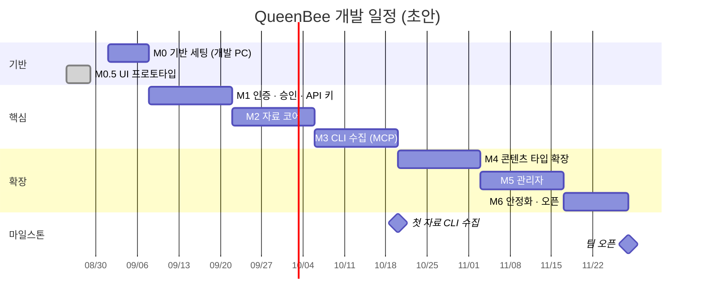

# 07. 개발 로드맵

| 항목 | 내용 |
| --- | --- |
| 문서 ID | DEV-07 |
| 버전 | v0.5 |
| 상태 | Draft |
| 최종 수정 | 2026-08-28 |

> 일정은 **소수 인원(1~2명) 파트타임 개발**을 가정한 초안입니다.
> 실행 환경은 1단계 개발 PC입니다 (`DEC-013`).

---

## 7.1 마일스톤 개요

자료 수집의 주력 경로가 **Claude Code CLI**(`DEC-012`)이므로, CLI 수집을 앞쪽에 배치했습니다.
자료가 실제로 쌓여야 나머지 기능의 가치를 확인할 수 있기 때문입니다.

| # | 마일스톤 | 기간(주) | 핵심 산출물 | 완료 조건(DoD) |
| --- | --- | :---: | --- | --- |
| M0 | 기반 세팅 (개발 PC) | 1 | 실행되는 빈 앱 + 로컬 인프라 | `npm run dev` 로 뜨고 `/api/health` 가 모두 `ok` |
| **M0.5** | **UI 프로토타입** ✅ | 1 | 목 데이터로 도는 화면 전부 | **완료** — 아래 7.2.1절 |
| M1 | 인증 · 승인 | 2 | 아이디 로그인 · 승인 · API 키 | 가입→승인→로그인 E2E 통과, API 키 발급 동작 |
| M2 | 자료 코어 | 2 | 자료 CRUD · 분류 · 검색 | AI 자료 등록·검색·상세 동작 |
| M3 | **CLI 수집** | 2 | MCP 서버 · Ingest API · Skill | **Claude Code에서 "찾아서 등록해줘"가 동작** |
| M4 | 콘텐츠 타입 확장 | 2 | GitHub · MCP · Skill · 노트 · 아카이브 | 타입 5종 동작, 아카이브 성공 |
| M5 | 관리자 | 2 | 회원·자료·분류·설정·검수 | 관리자 P0 전체 동작 |
| M6 | 안정화 · 오픈 | 1.5 | 테스트 · 백업 · 운영 문서 | 백업 복구 리허설 통과, 팀 오픈 |
| | **합계** | **12.5주** | | |

---

## 7.2 M0 — 기반 세팅 (개발 PC) · 1주

### 인프라 (Docker Desktop)

| 작업 | 내용 |
| --- | --- |
| Docker Desktop 설치 | WSL2 백엔드 확인 |
| 데이터 경로 생성 | `E:\queenbee-data\postgres`, `E:\queenbee-data\files` (`DEC-016`) |
| `docker-compose.dev.yml` 작성 | `postgres` · `redis` **2개만**. web/worker는 호스트 실행, 파일은 로컬 디스크 (`DEC-019`) |
| 포트 확인 | `5432` · `6379` · `3100` 충돌 여부 |
| 파일 저장소 준비 | `STORAGE_ROOT` 하위 `tmp/` 생성 + 쓰기 권한 확인. **저장소 폴더 밖에 둔다** |
| 절전 해제 | 서버로 쓰는 동안 PC 절전·최대 절전 끄기 |

### 애플리케이션

| 작업 | 산출물 |
| --- | --- |
| Next.js 프로젝트 생성 (TS · Tailwind · App Router · `src/`) | `project/` |
| npm workspaces 설정 (`packages/*`) | `package.json` |
| shadcn 초기화 + `login-03` + `dashboard-01` 설치 | `components/ui/`, 블록 파일 |
| 블록 파일을 폴더 규약에 맞게 재배치, **샘플 데이터 제거** | [DEV-06](06_폴더_구조_규약.md) 준수 |
| ESLint · Prettier · lint-staged · tsconfig paths | 설정 파일 |
| `.gitattributes` (`* text=auto eol=lf`) | Windows 줄바꿈 대응 |
| Prisma 초기화 + `User` 모델 + 첫 마이그레이션 | `prisma/` |
| `lib/env.ts` 환경 변수 검증 | 실패 시 즉시 종료 |
| `lib/db.ts` · `redis.ts` · `logger.ts` · `storage/`(드라이버) | 어댑터 계층 |
| `/api/health` 구현 (DB · Redis · 스토리지 · **디스크 여유**) | `NFR-BACKUP-007` |
| README 작성 (이 PC에서 띄우는 방법) | |

**DoD**
- [ ] `docker compose -f docker/docker-compose.dev.yml up -d` 로 2개 컨테이너 정상
- [ ] `npm run dev` 로 앱이 뜨고 `http://localhost:3100` 접속
- [ ] `/api/health` 가 `db·redis·storage·disk` 모두 `ok`
- [ ] 로그인 화면(디자인만)과 대시보드 레이아웃이 보인다
- [ ] `npm run lint` · `npm run typecheck` 통과

---

## 7.2.1 M0.5 — UI 프로토타입 ✅ 완료 (2026-08-28)

> **왜 순서를 바꿨나:** "화면을 눈으로 먼저 보고 싶다"는 요구가 있었습니다.
> DB·인증 없이 **목 데이터**(`src/mocks`)로 전 화면을 먼저 만들었습니다.
> 덕분에 문서에만 있던 규약(레지스트리 확장성·의존 방향·빵부스러기)을 **글이 아니라 코드로 검증**했습니다.

| 만든 것 | 비고 |
| --- | --- |
| 공개 3화면 + 서비스 10화면 + 관리자 8화면 | `SCR-001`~`SCR-902` 전부 |
| **콘텐츠 타입 레지스트리 6종** | `PROMPT` 를 6번째로 추가해 확장성 검증 ([REQ-04 · 4.9절](../01.요구사항/04_콘텐츠_도메인_모델.md)) |
| 목 세션 전환기 | 권한별 화면 차이를 눈으로 확인 (관리자/편집자/일반) |
| 마크다운 렌더 + 목차 | `rehype-sanitize` 화이트리스트, XSS 4종 차단 확인 (`NFR-SEC-007`) |
| 공통 빵부스러기 | 동적 세그먼트 라벨 치환 포함 |
| 의존 방향 검사 스크립트 | `components→features`·`features/A→features/B`·`config→features` **위반 0건** |

**여기서 안 한 것 (M1 이후로 넘김)**

| 안 한 것 | 넘어간 곳 |
| --- | --- |
| DB · Prisma · 실제 조회 | M2 — `src/mocks` 폴더째 삭제하고 `server/repositories` 로 교체 |
| 실제 인증 · 비밀번호 해시 | M1 — 쿠키 목 세션을 Auth.js 로 교체 |
| Server Action 의 실제 처리 | M1~M5 — 지금은 화면 전이만 |
| 조회 이력(최근 본 자료) | M3 이후 |

---

## 7.3 M1 — 인증 · 승인 · API 키 · 2주

| 작업 | 관련 요구사항 |
| --- | --- |
| Auth.js v5 Credentials(**아이디**) + Prisma Adapter | `FR-AUTH-006`, `DEC-014` |
| 회원가입 폼 + 서버 액션 + 아이디 중복 검사 | `FR-AUTH-001`, `002` |
| 비밀번호 해시(Argon2id) · 정책 검증 | `NFR-SEC-001` |
| 계정 상태 머신 · 상태별 분기 | `FR-AUTH-007` |
| `proxy.ts` 3계층 가드 (Next.js 16 — 구 `middleware.ts`) | [REQ-02 · 2.9절](../01.요구사항/02_사용자_권한_정책.md) |
| 승인 대기 화면 (`상태 새로고침` 포함) | `SCR-003` |
| 관리자 회원 목록 + 승인/거부 (최소 기능) | `FR-ADM-002`, `004` |
| 세션 강제 만료 (Redis 세션 인덱스) | `DEC-005` |
| 인앱 알림 기반 구조 | `FR-NOTI-001`, `002` |
| 감사 로그 기반 구조 (`via` 포함) | `FR-AUDIT-001` |
| 로그인 시도 제한 | `FR-AUTH-012` |
| 최초 관리자 시드 + 비밀번호 변경 강제 | `FR-AUTH-011` |
| `reserved_usernames` + 아이디 중복 검사 양쪽 조회 | `DEC-021`, `FR-AUTH-002` |
| **API 키 발급·폐기 + 검증 로직** | `FR-USER-008`, `NFR-SEC-017` |

**DoD**
- [ ] E2E: 가입 → 승인 대기 → 관리자 승인 → 로그인 → 대시보드
- [ ] E2E: 일반 회원이 `/admin` 접근 시 `/403`
- [ ] E2E: 관리자가 정지하면 해당 사용자가 즉시 로그아웃되고 **API 키도 무효화**된다
- [ ] 인가 가드 단위 테스트 통과
- [ ] 관리자 비밀번호 재설정 절차를 운영 문서에 기록 ([DCS-02 · 2.4절](../03.의사결정_및_미해결사항/02_미해결사항.md))

---

## 7.4 M2 — 자료 코어 · 2주

| 작업 | 관련 요구사항 |
| --- | --- |
| `resources` 스키마 + 검색 인덱스 마이그레이션 | [DEV-02 · 2.5절](02_데이터_모델.md) |
| 콘텐츠 타입 레지스트리 골격 + `AI_MATERIAL` 1종 | [REQ-04 · 4.9절](../01.요구사항/04_콘텐츠_도메인_모델.md) |
| 자료 등록 · 수정 · 삭제 · 복구 | `FR-RES-004~008` |
| 자료 목록 (카드/테이블, 필터, 정렬, 커서 페이징) | `FR-RES-001`, `FR-SRCH-003~005` |
| 자료 상세 + 마크다운 렌더링 | `FR-RES-003`, `015` |
| 카테고리 · 태그 | `FR-SRCH-006`, `007` |
| 통합 검색 (PG FTS + trgm) | `FR-SRCH-001` |
| 북마크 | `FR-COLL-001`, `002` |
| 중복 감지 · URL 정규화 | `FR-RES-011` |
| 조회수 (Redis 버퍼) | `FR-RES-014` |
| 공통 상태 컴포넌트 (빈/로딩/오류) | `NFR-A11Y-006` |

**DoD**
- [ ] AI 자료를 등록하고 목록·검색·상세에서 확인할 수 있다
- [ ] 필터·정렬·페이징이 모두 동작한다
- [ ] 자료 1만 건 더미로 목록 P95 500ms 이내 확인

---

## 7.5 M3 — CLI 수집 (MCP) · 2주 ★

**이 마일스톤이 이 시스템의 핵심 가치입니다.** ([DEV-08](08_자료수집_파이프라인.md))

| 작업 | 관련 요구사항 |
| --- | --- |
| Ingest API 라우트 (`/api/ingest/*`) | `API-100~108` |
| API 키 인증 미들웨어 → `actor` 컨텍스트 | `NFR-SEC-018` |
| 콘텐츠 타입 → JSON Schema 변환·캐시 | `FR-CLI-002` |
| 중복 확인 엔드포인트 (웹과 같은 정규화) | `FR-CLI-004` |
| `source_channel` · `needs_review` 반영 | `FR-RES-017` |
| **`packages/mcp-server` 구현** (도구 8종) | `FR-CLI-001`, `003`, `005~008` |
| 오류 → 사람이 읽을 문구 변환 | [DEV-08 · 8.3절](08_자료수집_파이프라인.md) |
| **`queenbee-collect` Skill 작성** | `FR-CLI-009` |
| 검수 대기 배지·필터·해제 | `FR-RES-017` |
| 키 단위 레이트리밋 | [DEV-05 · 5.11절](05_API_설계.md) |
| 마이페이지 API 키 화면 + MCP 설정 스니펫 | `SCR-141` |

**DoD**
- [ ] Claude Code에 `@queenbee/mcp` 를 설정하고 도구 8종이 보인다
- [ ] **"○○ 관련 자료 찾아서 등록해줘" 한 마디로 자료가 등록된다**
- [ ] 중복 URL은 등록되지 않고 기존 자료를 안내한다
- [ ] 등록된 자료에 `검수 대기` 배지가 붙고 필터로 걸러진다
- [ ] 감사 로그에 `via=MCP` 와 키 정보가 남는다
- [ ] 폐기한 키로는 즉시 실패한다
- [ ] `queenbee-collect` Skill 자체를 QueenBee에 등록한다 (자기 참조)

---

## 7.6 M4 — 콘텐츠 타입 확장 · 2주

| 작업 | 관련 요구사항 |
| --- | --- |
| `GITHUB_REPO` 타입 구현 | `FR-TYPE-005` |
| GitHub 메타 수집 (octokit, rate limit 처리) | `FR-GH-001`, `002` |
| BullMQ 큐 · 워커 프로세스 기동 | [DEV-01 · 1.5절](01_시스템_아키텍처.md) |
| 소스 아카이브 다운로드 → **디스크로 스트리밍** | `FR-GH-003` |
| 아카이브 다운로드 (**스트림 + `Range`**) + 디스크 임계 확인 | `FR-GH-004`, `NFR-BACKUP-007` |
| 파일 첨부 업로드 (**스트리밍 멀티파트**) + 경로 이탈 방어 | `FR-FILE-001~004`, `NFR-SEC-009` |
| `MCP_SERVER` 타입 (설정 복사, 환경변수 표) | `FR-TYPE-006` |
| `SKILL` 타입 | `FR-TYPE-007` |
| `DEV_NOTE` 타입 | — |
| `PROMPT` 타입 | `REQ-04 · CT-PROMPT` |
| URL 빠른 등록 (웹, 타입 자동 판별) | `FR-RES-005` |
| 자료 간 연결 | `FR-RES-012` |

**DoD**
- [ ] 타입 5종이 웹·CLI 양쪽에서 모두 동작
- [ ] GitHub URL 하나로 등록 → 메타 자동 채움 → 아카이브 성공
- [ ] **CLI에서 새 타입을 자동으로 인식한다** (MCP 서버 코드 수정 없이)
- [ ] 새 타입 추가 체크리스트만으로 6번째 타입을 추가할 수 있음을 리뷰에서 확인

---

## 7.7 M5 — 관리자 · 2주

| 작업 | 관련 요구사항 |
| --- | --- |
| 관리자 대시보드 (승인·검수·실패작업·디스크 배너) | `FR-ADM-001` |
| 회원 관리 전체 + API 키 강제 폐기 | `FR-ADM-002~009`, `016` |
| 자료 관리 · 휴지통 | `FR-ADM-010`, `011` |
| 분류 관리 (카테고리 트리, 태그 병합) | `FR-ADM-012`, `013` |
| 콘텐츠 타입 노출 설정 | `FR-ADM-014` |
| 시스템 설정 (가입·업로드·디스크·GitHub·수집) | `FR-ADM-015` |
| 감사 로그 조회 (경로 필터 포함) | `FR-AUDIT-002` |
| 작업 모니터 | `SCR-241` |
| 컬렉션 · 마이페이지 잔여 기능 | `FR-COLL-003~006`, `FR-USER-*` |
| 스케줄 작업 (메타 갱신·링크 확인·휴지통 정리·디스크 확인) | [REQ-04 · 4.8절](../01.요구사항/04_콘텐츠_도메인_모델.md) |
| 보존 배치 — 탈퇴 계정 익명화 · 감사 로그 정리 · 토큰 만료 경고 | `DEC-021`, `DEC-020` |
| 아카이브 총량 게이지 + 상한 차단 | `DEC-022` |

**DoD**
- [ ] 관리자 P0 기능 전체 동작
- [ ] 마지막 관리자 보호가 강등·정지·탈퇴 모두에서 작동
- [ ] 모든 관리자 행위가 감사 로그에 남는다
- [ ] 미검수 자료 건수가 대시보드에 보인다
- [ ] **사내망 개방** (`DEC-023`) — Windows 방화벽 인바운드 허용, `APP_URL` 을 PC IP로 변경,
      팀원에게 접속 주소·가입 방법 안내. 이 시점부터 2단계 이관을 검토한다

---

## 7.8 M6 — 안정화 · 오픈 · 1.5주

| 작업 | 관련 요구사항 |
| --- | --- |
| E2E 6종 완성 | `NFR-MAINT-004` |
| 부하 테스트 (k6, 동시 20명) | `NFR-PERF-005` |
| 접근성 점검 | [DEV-04 · 4.9절](04_UI_디자인_가이드.md) |
| 보안 점검 (권한 우회, SSRF, 업로드, **API 키**) | `NFR-SEC-*` |
| 백업 자동화 (Windows 작업 스케줄러) + **복구 리허설** | `NFR-BACKUP-005` |
| 운영 문서 (기동·정지·백업·관리자 비밀번호 복구) | `_docs` 추가 |
| **초기 자료 40건 수집** (주제 8개 × 5건, CLI) + 검수 | `DEC-026` |
| 온보딩 컬렉션 1개 구성 (주제 ⑧ 사내 규약·온보딩) | `DEC-026` |
| 사용 가이드 + MCP 설정 안내 · 팀 교육 | |

**DoD**
- [ ] E2E 6종 통과
- [ ] 백업본으로 복구 성공
- [ ] 보안 체크리스트 전 항목 확인
- [ ] **팀 오픈**

### 필수 E2E 시나리오

1. 회원가입 → 승인 대기 → 관리자 승인 → 로그인 → 대시보드
2. 자료 검색 → 필터 → 상세 → 북마크
3. GitHub URL 등록 → 메타 수집 → 아카이브 실행 → 다운로드
4. 권한 없는 사용자가 `/admin` 접근 시 차단
5. 관리자 정지 → 해당 사용자 즉시 로그아웃 + API 키 무효
6. **API 키로 Ingest 등록 → 검수 대기 표시 → 검수 해제**

---

## 7.9 착수 전 준비 체크리스트

### 결정

- [x] 실행 환경 — 개발 PC (`DEC-013`)
- [x] 파일 보관 위치 — 이 PC 디스크 (`DEC-016`)
- [x] 외부 공개 여부 — 하지 않음 (`DEC-017`)
- [x] 인증 방식 — 아이디 + 비밀번호 (`DEC-014`)
- [x] 알림 — 인앱만 (`DEC-015`)
- [x] 자료 접근 범위 — 승인 회원 전원 (`DEC-018`)
- [x] GitHub 토큰 주체 — 조직 fine-grained PAT (`DEC-020`)
- [x] 아카이브 정책 — 선택 실행 + 총량 100GB (`DEC-022`)
- [x] 데이터 보존 — 계정 1년 후 익명화, 감사 로그 1년 (`DEC-021`)
- [x] 팀 개방 시점 — M5 완료 후 (`DEC-023`)
- [x] 백업 위치 — 같은 PC의 다른 드라이브 (`DEC-024`)
- [x] 초기 시딩 — 주제 8개 × 5건 (`DEC-026`)
- [ ] **조직 GitHub 계정에서 PAT 발급** (M3 전까지 — `DEC-020` 실행 항목)
- [ ] QueenBee 로고·파비콘

> **미해결 항목이 0건입니다.** 결정이 아니라 **실행**만 남았습니다. → [DCS-02](../03.의사결정_및_미해결사항/02_미해결사항.md)

### 환경

- [ ] Docker Desktop 설치 (WSL2)
- [ ] `E:\queenbee-data\` 생성 및 **디스크 여유 확인** (최소 100GB 권장)
- [ ] Node.js LTS 설치
- [ ] Claude Code 설치 및 MCP 설정 파일 위치 확인
- [ ] Windows 절전 설정 해제

### 저장소

- [ ] 브랜치 전략 합의 (`main` + `feature/*`)
- [ ] `.env.example` 작성
- [ ] `.gitignore` 확인 (`.env`, `node_modules`, `.next`, `queenbee-data`)

---

## 7.10 리스크

| 리스크 | 영향 | 대응 |
| --- | --- | --- |
| **개발 PC가 꺼지면 서비스 중단** | 팀원이 못 씀 | M5 완료 후 사내망 개방(`DEC-023`). 그 뒤 불편이 반복되면 2단계 이관 |
| **디스크 용량 부족** | 아카이브 실패 | 여유 감시 + 임계치 미만 시 차단(`NFR-BACKUP-007`) + 아카이브 총량 100GB 상한(`DEC-022`) |
| CLI 등록 품질 편차 | 자료 신뢰도 저하 | `needs_review` 표시 + Skill의 품질 규칙 + 미검수 건수 노출 |
| MCP 서버와 서버 스키마 불일치 | 등록 실패 | 스키마를 **서버에서 받아온다**. MCP 서버에 하드코딩 금지 |
| 콘텐츠 타입 추상화 과설계 | 개발 지연 | M2에서 1종만 만들고 M4에서 2번째를 붙일 때 구조를 검증 |
| GitHub API rate limit | 수집 실패 | 토큰 사용 + 큐 지연 처리 + 캐싱 |
| 관리자 비밀번호 분실 | 복구 불가 | 시드 스크립트 재설정 절차를 M1에서 문서화 |
| 한국어 검색 정확도 | 검색 불만 | trgm 병행, 태그·카테고리 필터로 보완. 전환 기준은 `DEC-007` |
| 자료가 쌓이지 않음 | 시스템 사장 | **M3에서 CLI 수집이 되면 초기 자료를 빠르게 채운다** |

---

## 7.11 개발 규칙 요약

| 항목 | 규칙 |
| --- | --- |
| 브랜치 | `main` 보호. `feature/<이슈>` → PR → 리뷰 → squash merge |
| 커밋 | Conventional Commits (`feat:`, `fix:`, `docs:`, `refactor:`, `chore:`) |
| PR 크기 | 변경 400줄 이내 권장. 넘으면 분할 |
| CI | lint · typecheck · unit test 통과해야 머지 |
| 마이그레이션 | PR에 마이그레이션 파일 포함. 수동 DDL 금지 |
| 문서 | 요구사항이 바뀌면 같은 PR에서 `_docs` 갱신 (`NFR-MAINT-007`) |
| 메모리 | 작업 단위가 끝나면 `_docs/99.memory/` 에 기록 |

---

## 7.12 변경 이력

| 날짜 | 버전 | 내용 |
| --- | --- | --- |
| 2026-08-28 | v0.1 | 최초 작성 (M0~M6, 사내 서버 전제) |
| 2026-08-28 | v0.2 | 실행 환경을 **개발 PC**로 변경(`DEC-013`·`DEC-016`), **M3 CLI 수집 마일스톤 신설**(`DEC-012`), M1에 API 키 추가, 아이디 기반 인증 반영(`DEC-014`), 메일 관련 작업 제거(`DEC-015`) |
| 2026-08-28 | v0.3 | **MinIO 제외**(`DEC-019`) — M0 컨테이너 2개로 축소, M4 파일 작업을 스트리밍 방식으로 변경 |
| 2026-08-28 | v0.4 | 미해결 9건 결정 반영 — M1에 아이디 점유 처리(`DEC-021`), M5 DoD에 **사내망 개방**(`DEC-023`)·보존 배치·아카이브 상한, M6에 초기 자료 40건(`DEC-026`). 착수 전 체크리스트를 **실행 항목만** 남기도록 갱신 |
| 2026-08-28 | v0.5 | **`M0.5` UI 프로토타입 마일스톤 신설(완료 기록)** — 화면을 먼저 만들어 레지스트리 확장성·의존 방향을 코드로 검증했다. M4 타입 목록에 `PROMPT` 추가, `middleware.ts` → `proxy.ts`(Next.js 16) |
