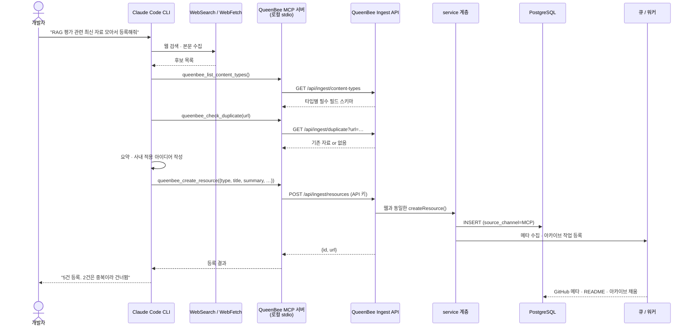
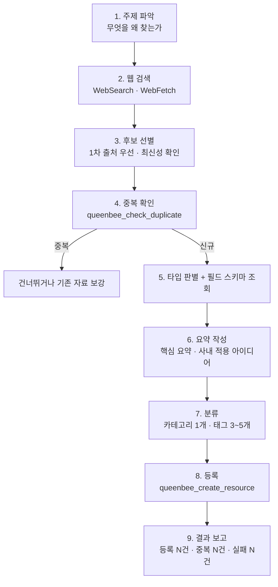
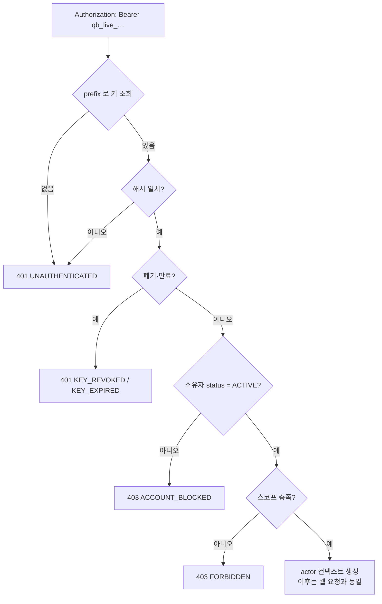

# 08. 자료 수집 파이프라인

| 항목 | 내용 |
| --- | --- |
| 문서 ID | DEV-08 |
| 버전 | v0.2 |
| 상태 | Draft |
| 최종 수정 | 2026-08-28 |

> **자료 수집의 주력 경로는 Claude Code CLI 입니다.** (`DEC-012`)
> 사람이 웹 폼을 채우는 대신, CLI에서 검색·조사한 결과를 QueenBee MCP 서버를 통해 등록합니다.
> 웹 UI 등록도 그대로 유지합니다 — 두 경로 모두 **같은 서비스 계층**을 씁니다.

---

## 8.1 왜 CLI 인가

| 웹 폼으로 등록할 때 | CLI로 등록할 때 |
| --- | --- |
| 사람이 검색하고, 읽고, 요약을 직접 쓴다 | 에이전트가 검색·수집·요약 초안까지 만든다 |
| 자료 1건에 5~10분 | 여러 건을 한 대화에서 처리 |
| 요약 품질이 사람 컨디션에 좌우된다 | 형식이 일정하다 (핵심 요약·사내 적용 아이디어) |
| 중복 확인을 눈으로 한다 | 등록 전에 도구로 조회해 확인한다 |

QueenBee가 저장하는 것 자체가 **MCP 서버와 Skill** 이므로, 수집 경로를 MCP + Skill로 만드는 것은
그 자체가 사내 표준 사용 사례가 됩니다.

---

## 8.2 전체 흐름



### 핵심 원칙

| 원칙 | 이유 |
| --- | --- |
| **Ingest API는 웹과 같은 service 계층을 쓴다** | 검증·중복 감지·감사 로그가 한 곳에만 있어야 한다. 경로마다 규칙이 갈라지면 데이터가 오염된다 |
| **MCP 서버는 얇은 클라이언트다** | 비즈니스 로직을 두지 않는다. HTTP 호출 + 입출력 정리만 한다 |
| **에이전트는 DB에 직접 접근하지 않는다** | 인가·감사·정합성을 서버가 통제한다 |
| **등록 주체는 사람이다** | API 키는 개인 발급. 감사 로그에 실제 사용자로 기록되고, 그 사람의 역할을 넘지 못한다 |
| **무거운 작업은 서버가 한다** | GitHub 메타 수집·아카이브는 큐로 넘긴다. CLI는 기다리지 않는다 |

---

## 8.3 QueenBee MCP 서버

### 배포 형태

| 항목 | 내용 |
| --- | --- |
| 패키지 | `@queenbee/mcp` (사내 배포. npm 레지스트리 미사용 시 tarball 또는 저장소 경로 실행) |
| 위치 | `project/packages/mcp-server/` — npm workspace 패키지 ([DEV-06 · 6.2절](06_폴더_구조_규약.md)) |
| 전송 | **stdio** — 개발자 PC에서 Claude Code가 자식 프로세스로 실행 |
| 서버 컨테이너 아님 | QueenBee 서버에 배포되는 것이 아니라 **사용자 쪽에서 도는 클라이언트**다 |
| 의존 | QueenBee Ingest API (HTTP) 하나뿐 |

### 설정 예시 (Claude Code)

```json
{
  "mcpServers": {
    "queenbee": {
      "command": "npx",
      "args": ["-y", "@queenbee/mcp"],
      "env": {
        "QUEENBEE_URL": "http://localhost:3100",
        "QUEENBEE_API_KEY": "qb_live_xxxxxxxxxxxx"
      }
    }
  }
}
```

> `QUEENBEE_URL` 은 실행 환경에 따라 다릅니다. 1단계(개발 PC)는 `http://localhost:3100`,
> 2단계(사내 서버) 주소는 이관 시점에 정합니다 (`DEC-028`). → [DEV-01 · 1.10절](01_시스템_아키텍처.md)

### 제공 도구

| 도구 | 용도 | 필요 스코프 |
| --- | --- | --- |
| `queenbee_list_content_types` | 콘텐츠 타입 목록과 **타입별 필수/선택 필드 스키마** 조회 | `resources:read` |
| `queenbee_search` | 기존 자료 검색 (키워드·타입·태그) | `resources:read` |
| `queenbee_get_resource` | 자료 상세 조회 | `resources:read` |
| `queenbee_check_duplicate` | URL 정규화 후 중복 여부 확인 | `resources:read` |
| `queenbee_create_resource` | 자료 등록 | `resources:write` |
| `queenbee_update_resource` | 자료 수정 (본인 등록분 또는 EDITOR 이상) | `resources:write` |
| `queenbee_list_taxonomy` | 카테고리 트리·인기 태그 조회 | `resources:read` |
| `queenbee_archive_github` | GitHub 소스 아카이브 작업 요청 | `archive:run` |

**`queenbee_list_content_types` 가 왜 필요한가:**
에이전트가 타입별 필수 필드를 모르면 등록이 실패하거나 빈 자료가 쌓입니다.
서버가 zod 스키마에서 생성한 JSON Schema를 그대로 내려주면, 에이전트가 무엇을 채워야 하는지 스스로 알 수 있습니다.
타입이 늘어도 MCP 서버를 고칠 필요가 없습니다. ([REQ-04 · 4.9절](../01.요구사항/04_콘텐츠_도메인_모델.md))

### 도구 입출력 예시

```jsonc
// queenbee_check_duplicate
// 입력
{ "url": "https://github.com/modelcontextprotocol/servers" }
// 출력
{
  "duplicate": true,
  "resource": { "id": "clx…", "title": "MCP Servers", "type": "GITHUB_REPO",
                "url": "http://localhost:3100/resources/github-repo/mcp-servers" }
}
```

```jsonc
// queenbee_create_resource
// 입력
{
  "type": "AI_MATERIAL",
  "title": "RAG 평가 프레임워크 비교",
  "summary": "RAGAS·TruLens·DeepEval 세 도구의 지표와 도입 비용을 비교한 아티클",
  "url": "https://example.com/rag-eval",
  "category": "ai-tools",
  "tags": ["rag", "evaluation"],
  "detail": {
    "materialKind": "ARTICLE",
    "sourceName": "Example Blog",
    "publishedAt": "2026-08-10",
    "language": "EN",
    "keyPoints": "- RAGAS는 …\n- TruLens는 …",
    "applicability": "드론 촬영 메타데이터 검색 품질 측정에 RAGAS 지표 적용 검토"
  }
}
// 출력
{ "id": "clx…", "url": "http://localhost:3100/resources/ai-material/rag-…",
  "queuedJobs": ["FETCH_URL_META"] }
```

### 오류 처리

| 상황 | MCP 서버 동작 |
| --- | --- |
| API 키 없음·만료·폐기 | 도구 호출 실패. **"마이페이지에서 API 키를 발급하세요"** 안내 문구 반환 |
| 계정이 `SUSPENDED` | 401 그대로 전달. 재시도하지 않는다 |
| 중복 URL (`DUPLICATE`) | 오류가 아니라 **기존 자료 정보**를 반환한다. 에이전트가 판단하게 한다 |
| 검증 실패 (`VALIDATION_ERROR`) | 어떤 필드가 왜 틀렸는지 그대로 전달한다. 에이전트가 고쳐서 재시도할 수 있어야 한다 |
| 서버 연결 불가 | 재시도하지 않고 즉시 실패. "QueenBee 서버가 실행 중인지 확인하세요" |
| 레이트리밋 | `Retry-After` 를 문구에 포함해 반환. 자동 재시도 금지 |

> **자동 재시도를 넣지 않는 이유:** 등록은 부작용이 있는 작업입니다.
> 실패를 조용히 재시도하면 중복 등록이 생깁니다. 판단은 에이전트와 사람에게 맡깁니다.

---

## 8.4 수집 Skill

MCP 도구만 있으면 에이전트는 "무엇을 채울 수 있는지"는 알지만 "어떻게 채워야 좋은지"는 모릅니다.
수집 절차와 품질 기준은 **Skill** 로 정의해 저장소에 둡니다.

| 항목 | 내용 |
| --- | --- |
| Skill 이름 | `queenbee-collect` |
| 위치 | `project/packages/mcp-server/skills/queenbee-collect/SKILL.md` |
| 배포 | 팀원이 자기 `~/.claude/skills/` 로 복사하거나 저장소를 참조 |
| 등록 | 이 Skill 자체를 QueenBee에 `CT-SKILL` 자료로 등록한다 (자기 참조) |

### Skill 이 정의하는 것



### 품질 규칙 (Skill 본문에 명시)

| 규칙 | 내용 |
| --- | --- |
| 출처 우선순위 | 공식 문서·논문 원문 > 저자 블로그 > 요약 아티클. **2차 요약 기사만으로 등록하지 않는다** |
| 최신성 | 발행일을 반드시 확인해 채운다. 2년 이상 지난 자료는 `summary` 에 그 사실을 적는다 |
| 요약 | `summary` 는 **한 문장**. 무엇에 대한 자료인지만 적는다 |
| 핵심 요약 | `keyPoints` 는 불릿 3~5개. 원문 문장을 그대로 옮기지 않는다 |
| **사내 적용 아이디어** | `applicability` 는 **비워두지 않는다.** 드론·공간정보·개발팀 맥락에서 어떻게 쓸지 한 줄 이상 |
| 태그 | 3~5개. 새 태그를 만들기 전에 `queenbee_list_taxonomy` 로 기존 태그를 먼저 본다 |
| 추측 금지 | 확인하지 못한 값(스타 수, 라이선스 등)은 비워둔다. **서버 워커가 채운다** |
| 비밀값 금지 | 토큰·키가 본문에 섞이지 않게 한다. 서버가 차단하지만 애초에 넣지 않는다 (`NFR-SEC-008`) |
| 한 번에 등록량 | 한 대화에서 10건을 넘기지 않는다. 한 번에 쏟아부으면 품질이 떨어진다 |

### 프롬프트 예시

```text
# 주제 수집
"MCP 서버 보안 관련 자료 최근 6개월 것으로 찾아서 QueenBee에 등록해줘"

# 저장소 수집
"https://github.com/xxx/yyy 등록하고 아카이브까지 걸어줘"

# 사내 자산 등록
"지금 쓰는 .claude/skills/code-review Skill을 QueenBee에 등록해줘"

# 보강
"QueenBee에서 applicability 비어 있는 AI 자료 찾아서 채워줘"
```

---

## 8.5 CLI 수집분의 취급

**검수하지 않습니다.** 웹으로 등록한 자료와 똑같이 다룹니다 (`DEC-029`).

| 항목 | 내용 |
| --- | --- |
| 구분 | `source_channel = MCP` — 통계와 필터에만 쓴다 |
| 표시 | 자료 상세에 «CLI 수집» 한 줄. 배지는 **콘텐츠 타입 하나뿐**이다 |
| 게시 | 등록 즉시 목록·검색에 나온다. 대기 상태가 없다 |
| 품질 | **등록 시점에 건다.** `queenbee-collect` Skill 의 품질 규칙(8.4절)과 한 대화 10건 상한이 전부다 |
| 잘못된 자료 | 발견한 사람이 고친다. 수정 권한은 등록자 본인과 `EDITOR` 이상 |

> **왜 검수를 두지 않는가:** 승인 큐든 검수 배지든, 누군가 비워야 하는 목록은 결국 비워지지 않습니다.
> `needs_review` 는 «아직 사람이 안 봤다»를 뜻했지만 실제로는 **CLI로 들어왔다**는 사실과 같았고,
> 그건 `source_channel` 이 이미 담고 있었습니다. 같은 정보를 두 컬럼으로 나눠 갖고 있던 셈입니다.
>
> **대신 감수해야 할 것:** 품질 방어선이 Skill 하나로 줄었습니다.
> 자료 신뢰도가 떨어지는 조짐이 보이면 검수가 아니라 **Skill 규칙을 조입니다**
> ([DCS-02 · 2.4절](../03.의사결정_및_미해결사항/02_미해결사항.md) 에서 지켜봅니다).

---

## 8.6 API 키

| 항목 | 정책 |
| --- | --- |
| 발급 | 마이페이지 → 보안 탭. 사용자가 직접 발급 |
| 형식 | `qb_live_<32자 랜덤>` — 발급 직후 **한 번만** 표시 |
| 저장 | 원문 저장 금지. SHA-256 해시 + 앞 8자 prefix만 보관 |
| 개수 | 사용자당 최대 5개 |
| 이름 | 용도 식별용 필수 (예: "노트북 Claude Code") |
| 스코프 | `resources:read` / `resources:write` / `archive:run` — 발급 시 선택 |
| 권한 상한 | **발급한 사용자의 역할을 넘지 못한다.** `MEMBER` 키로 남의 자료를 수정할 수 없다 |
| 만료 | 기본 1년. 무기한 옵션 없음 |
| 폐기 | 사용자 또는 관리자가 즉시 폐기 |
| 자동 무효화 | 계정이 `SUSPENDED`·`WITHDRAWN` 이 되면 그 사용자의 모든 키가 무효 |
| 마지막 사용 | `last_used_at` 기록. 90일 미사용 키는 마이페이지에서 경고 표시 |
| 레이트리밋 | 키 단위 — [DEV-05 · 5.2절](05_API_설계.md) |
| 감사 로그 | 모든 쓰기 작업에 `actor` + `via=MCP` + `api_key_id` 기록 |

### 키 검증 순서



---

## 8.6-a 웹 등록과의 관계

두 경로는 **역할이 다릅니다.** 어느 쪽도 없애지 않습니다. (`DEC-012`)

| 자료 성격 | 주 경로 | 이유 |
| --- | --- | --- |
| AI 자료 (논문·아티클·영상) | **CLI** | 검색·요약을 에이전트가 잘한다 |
| GitHub 저장소 | **CLI** | URL만 넘기면 나머지는 워커가 채운다 |
| MCP 서버 | 둘 다 | 설정 JSON은 손으로 다듬는 편이 정확하다 |
| Skill | 둘 다 | 원문을 그대로 넣는 작업이라 CLI가 편하지만 검토는 웹에서 |
| 개발 노트 | **웹** | 사람이 직접 쓰는 기록이다 |

웹의 URL 빠른 등록(`FR-RES-005`)은 그대로 유지합니다. CLI를 쓰지 않는 사람도 등록할 수 있어야 합니다.

---

## 8.7 만들지 않는 것

| 항목 | 이유 |
| --- | --- |
| 서버 측 자동 크롤링(RSS·뉴스레터 정기 수집) | 수집 판단을 사람이 CLI에서 한다. 자동 수집은 하지 않기로 했다 (`DEC-025`) |
| 에이전트 전용 봇 계정 | 개인 API 키로 충분하다. 봇 계정은 "누가 등록했는지"를 지워버린다 |
| MCP 서버 내부의 요약·판단 로직 | 그건 에이전트가 하는 일이다. MCP 서버는 얇게 유지한다 |
| 원격 HTTP MCP 서버 | stdio 로 충분하다. 원격 전송은 인증·CORS·배포 문제를 새로 만든다 |
| 자동 재시도 | 중복 등록을 만든다 (8.3절) |

---

## 8.8 관련 요구사항

| 요구사항 | 내용 |
| --- | --- |
| `FR-CLI-001~010` | CLI 수집 기능 ([REQ-03 · 3.11절](../01.요구사항/03_기능_요구사항.md)) |
| `FR-USER-008` | API 키 발급·폐기 |
| `DEC-012` | 수집 경로 결정 ([DCS-01](../03.의사결정_및_미해결사항/01_의사결정_기록.md)) |
| `DEC-029` | 자료 검수 폐기 — 8.5절의 근거 |
| `NFR-SEC-017` | API 키 저장·검증 |

---

## 8.9 변경 이력

| 날짜 | 버전 | 내용 |
| --- | --- | --- |
| 2026-08-28 | v0.1 | 최초 작성 |
| 2026-08-28 | v0.2 | **8.5절 재작성 — 검수 폐기**(`DEC-029`). `needs_review` 를 파이프라인 전체(시퀀스·응답 예시·품질 규칙)에서 제거하고, CLI 수집분을 웹 등록분과 동일하게 다루도록 바꿨다 |
